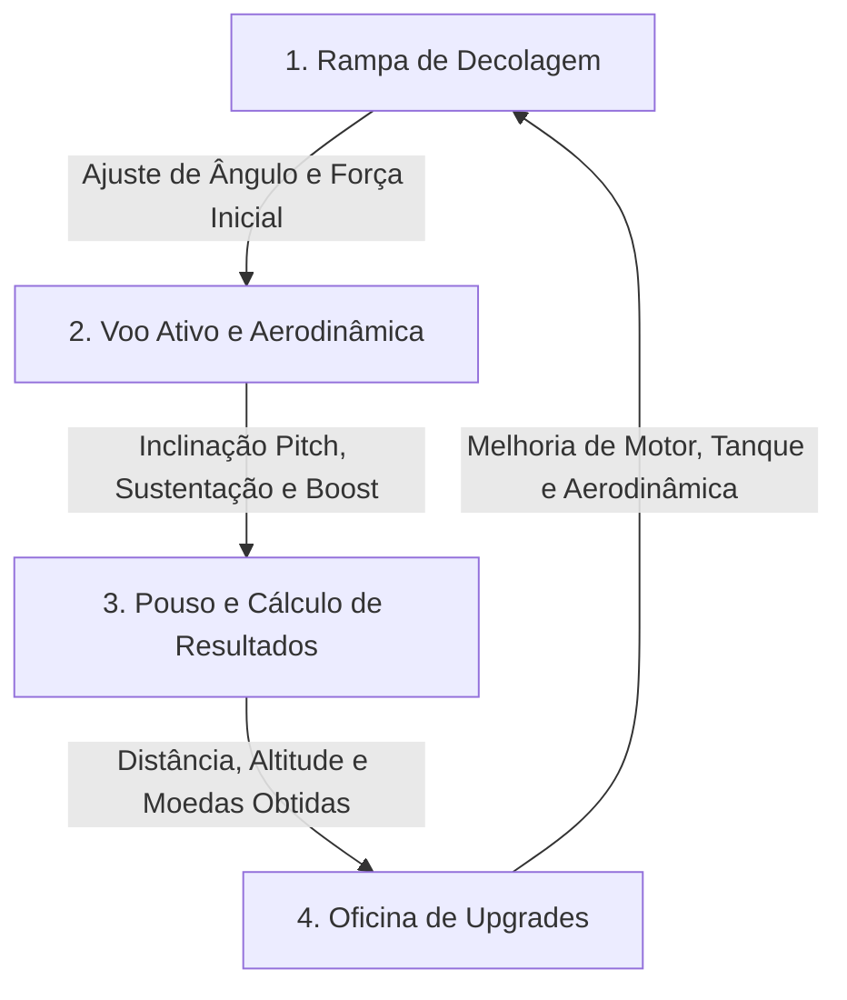
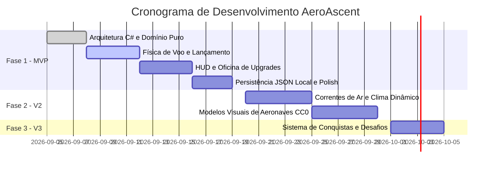

# 📋 PRD (Product Requirements Document) — AeroAscent

> **Nome do Projeto:** AeroAscent (AeroHorizon)  
> **Versão:** 1.0.0  
> **Status:** Aprovado para Desenvolvimento  
> **Público Principal:** Família & Jogadores Casuais (especialmente Ruth, Sofia e Alice)  
> **Stack Tecnológica:** Unity Engine (C# / .NET), Multiplataforma (Windows & Android), Clean Architecture, CC0 Assets (Kenney.nl)

---

## 1. 🎯 Visão Geral do Produto

**AeroAscent** é um jogo multiplataforma (Windows e Android) de simulação e progressão casual no estilo *Flight / Glider Arcade*, desenvolvido em C# com a **Unity Engine**. O jogador comanda o lançamento de uma aeronave leve, gerencia ativamente a sustentação aerodinâmica, altitude e impulsos de combustível (*boost*), explorando paisagens geradas proceduralmente. 

Ao final de cada voo, as métricas de distância percorrida, altitude máxima e itens coletados são convertidas em recursos econômicos para investir em melhorias mecânicas na **Oficina**, possibilitando voos cada vez mais longos, velozes e gratificantes.

### 1.1 Objetivos de Negócio e Filosofia
- **Jogo 100% Livre de Anúncios:** Experiência fluida, sem compras predatórias, sem banners ou interrupções comerciais.
- **Foco na Família:** Diversão acessível, intuitiva e acolhedora para crianças e adultos.
- **Engenharia Robusta:** Arquitetura limpa em C# .NET que separa regras de negócio puras da camada gráfica e de simulação visual da Unity.

---

## 2. 👥 Personas e Público-Alvo

| Persona | Descrição | Motivação Principal |
|---|---|---|
| **Crianças (Ruth, Sofia, Alice)** | Jogadoras que buscam diversão imediata, gráficos coloridos, controles simples e resposta visual imediata ao voar. | Ver o avião voar mais longe, soltar fumaça colorida e comprar melhorias visíveis na oficina. |
| **Jogador Casual / Família** | Jogadores em momentos de descanso que apreciam a física de planar e a sensação de evolução contínua sem estresse de tempo ou penalidades. | Relaxar, bater recordes pessoais de distância e otimizar a aerodinâmica do avião. |

---

## 3. 🔄 Core Loop de Gameplay



1. **Decolagem / Lançamento:** O jogador define o ângulo de disparo ou a força da catapulta/rampa inicial.
2. **Voo Ativo:** Em voo livre, o jogador inclina o nariz do avião (*pitch*) para balancear velocidade horizontal versus sustentação vertical e aciona o propulsor (*boost*) consumindo combustível limitado.
3. **Pouso / Término de Voo:** Ao esgotar a energia cinética e tocar o solo, o sistema calcula a distância total, recordes e moedas ganhas.
4. **Oficina (Evolução):** O jogador investe moedas na melhoria de atributos-chave da aeronave.
5. **Re-lançamento:** O jogador inicia um novo ciclo com uma aeronave com maior potência, menor arrasto e maior capacidade de combustível.

---

## 4. 🏛️ Arquitetura de Software e Modelo de Domínio (C# .NET)

Seguindo as diretrizes do `csharp-dotnet-guidelines` e a Clean Architecture:

```
┌─────────────────────────────────────────────────────────┐
│       Apresentação (Unity Engine - Windows / Android)   │
│  - Controladores MonoBehaviour (ControladorVoo)         │
│  - Interface de Usuário / HUD (Unity UI / Canvas)       │
│  - Efeitos Sonoros, Câmera e Partículas Shuriken        │
└────────────────────────────┬────────────────────────────┘
                             │
┌────────────────────────────▼────────────────────────────┐
│              Aplicação (Casos de Uso C#)                │
│  - LancarAeronaveCasoDeUso                              │
│  - AtualizarFisicaVooCasoDeUso                          │
│  - ComprarMelhoriaCasoDeUso                             │
│  - FinalizarVooCasoDeUso                                │
└────────────────────────────┬────────────────────────────┘
                             │
┌────────────────────────────▼────────────────────────────┐
│                 Domínio (C# Puro .NET)                  │
│  - Entidades: Aeronave, Voo, Oficina, Melhoria          │
│  - Objetos de Valor: Combustivel, Moeda, VetorVoo       │
│  - Interfaces: IRepositorioProgresso, IServicoFisica    │
└────────────────────────────▲────────────────────────────┘
                             │
┌────────────────────────────┴────────────────────────────┐
│               Infraestrutura (Persistência)             │
│  - RepositorioProgressoLocalJson                        │
│  - ServicoSerializacaoJson                              │
│  - ProvedorTempoLocal                                   │
└─────────────────────────────────────────────────────────┘
```

### 4.1 Entidades e Objetos de Valor do Domínio

- **`Aeronave` (Entidade / `class`):** Identificador `Guid Id`, nível atual de motor, nível de aerodinâmica, nível de tanque de combustível e nível de catapulta.
- **`Voo` (Entidade / `class`):** Identificador `Guid Id`, aeronave utilizada, distância percorrida, altitude máxima atingida, moedas coletadas em voo e status (`EmPreparacao`, `EmVoo`, `Pousado`).
- **`Combustivel` (Objeto de Valor / `record`):** Quantidade atual, capacidade máxima e taxa de queima por segundo.
- **`Moeda` (Objeto de Valor / `record`):** Quantia acumulada e operações aritméticas seguras com validação contra saldos negativos.
- **`Melhoria` (Objeto de Valor / `record`):** Tipo (`Motor`, `Aerodinamica`, `TanqueCombustivel`, `Catapulta`), nível atual, multiplicador de eficácia e custo da próxima evolução.

---

## 5. ⚙️ Requisitos Funcionais (RF)

### RF-01 — Sistema de Lançamento Inicial
- **Descrição:** O jogador deve poder lançar a aeronave a partir de uma rampa ou catapulta com força inicial proporcional ao nível da catapulta.
- **Critérios de Aceite:**
  - Dado que o jogador está na tela de lançamento, ao pressionar e soltar o botão de decolagem no momento certo da barra de força, o avião recebe impulso vetorial inicial na direção da rampa.

### RF-02 — Controle de Sustentação e Inclinação (*Pitch*)
- **Descrição:** Durante o voo, o jogador pode controlar a inclinação do nariz da aeronave (para cima ou para baixo).
- **Critérios de Aceite:**
  - Inclinar para cima aumenta a sustentação (ganha altitude), mas aumenta o arrasto e reduz a velocidade horizontal.
  - Inclinar para baixo converte altitude em velocidade horizontal (mergulho).
  - O cálculo da física é desacoplado em `IServicoFisicaVoo`.

### RF-03 — Sistema de Propulsão (*Boost*) e Combustível
- **Descrição:** O jogador pode acionar um propulsor extra mantendo pressionado o botão de *boost*, consumindo a barra de combustível.
- **Critérios de Aceite:**
  - Ao segurar o botão de *boost*, uma força contínua de empuxo para a frente é aplicada e o combustível decresce.
  - Ao esgotar o combustível, o propulsor desativa automaticamente e o botão fica desabilitado.

### RF-04 — Coleta de Moedas e Bônus em Voo
- **Descrição:** O cenário procedural contém moedas flutuantes e anéis de impulso de ar que podem ser coletados durante o voo.
- **Critérios de Aceite:**
  - Passar pela área de colisão de uma moeda adiciona o valor ao total da sessão de voo e emite som/partícula via *Object Pool*.
  - Passar por um anel de ar concede um impulso instantâneo de velocidade sem gastar combustível.

### RF-05 — Detecção de Pouso e Fim de Voo
- **Descrição:** O voo é finalizado quando a aeronave toca o solo e sua velocidade linear atinge zero ou um limiar mínimo de parada.
- **Critérios de Aceite:**
  - Ao parar completamente, a simulação congela o estado de voo e abre a Tela de Resumo de Voo.

### RF-06 — Cálculo de Recompensas e Pontuação
- **Descrição:** A pontuação final da rodada é calculada com base em:
  $$\text{Moedas Ganhas} = \lfloor \text{Distância (m)} \times 0.1 \rfloor + \lfloor \text{Altitude Máxima (m)} \times 0.05 \rfloor + \text{Moedas Coletadas}$$
- **Critérios de Aceite:**
  - A conversão é executada pelo caso de uso `FinalizarVooCasoDeUso` e creditada no saldo do jogador.

### RF-07 — Loja e Oficina de Upgrades
- **Descrição:** O jogador pode gastar suas moedas na Oficina para evoluir 4 categorias:
  1. **Motor:** Aumenta a aceleração e potência do propulsor (*boost*).
  2. **Aerodinâmica:** Reduz o coeficiente de arrasto, fazendo o avião planar mais longe.
  3. **Tanque de Combustível:** Aumenta o volume total de combustível disponível.
  4. **Catapulta:** Aumenta o impulso e a velocidade de saída no lançamento inicial.
- **Critérios de Aceite:**
  - Cada nível possui um custo escalonado: $\text{Custo}(N) = \text{CustoBase} \times (1.5)^{N-1}$.
  - O botão de compra fica desabilitado se o saldo de moedas for insuficiente.

### RF-08 — Persistência de Dados Local (Offline First)
- **Descrição:** O progresso do jogador (saldo de moedas, níveis de melhorias e recorde de distância) deve ser salvo localmente em arquivo JSON.
- **Critérios de Aceite:**
  - O salvamento ocorre de forma atômica e assíncrona (`SalvarProgressoAsync`).
  - Ao abrir o jogo novamente, todos os dados salvos são restaurados com integridade.

---

## 6. ⚡ Requisitos Não-Funcionais (RNF)

| Identificador | Categoria | Especificação |
|---|---|---|
| **RNF-01** | **Performance** | O jogo deve manter **60 FPS** estáveis tanto em dispositivos móveis Android quanto em desktop Windows via Unity (IL2CPP / Vulkan / DirectX). |
| **RNF-02** | **Alocação de Memória** | **Zero alocação de lixo (GC Alloc = 0 bytes)** durante o loop de voo ativo (`Update` / `FixedUpdate`). |
| **RNF-03** | **Padrão de Pooling** | Utilização obrigatória de `ObjectPool<T>` para moedas, anéis de vento, nuvens e partículas visuais. |
| **RNF-04** | **Código Limpo** | Conformidade estrita com o `csharp-dotnet-guidelines` (Clean Architecture, DDD, SOLID, 100% pt-BR). |
| **RNF-05** | **Privacidade e Offline** | O jogo não requer conexão com a internet para nenhuma funcionalidade central e não coleta dados de telemetria de crianças. |
| **RNF-06** | **Tamanho do App** | O pacote final deve ser leve (< 80 MB) aproveitando modelos *Low Poly* otimizados e texturas compartilhadas. |
| **RNF-07** | **Tratamento de Erros** | Exceções de domínio tratadas com classes customizadas (`SaldoInsuficienteException`, `MelhoriaNivelMaximoException`) sem crash na UI. |

---

## 7. 🖥️ Design de Interface (UI/UX)

### 7.1 Telas Principais

1. **Tela Inicial / Oficina (Menu Principal):**
   - Visualização 3D da aeronave no hangar.
   - Indicador do saldo de moedas no topo direito.
   - 4 Cartões de Melhoria (Motor, Aerodinâmica, Tanque, Catapulta) exibindo nível atual, barra de progresso e botão de compra com custo.
   - Botão proeminente **"DECOLAR"**.

2. **HUD de Voo (Durante o Gameplay):**
   - **Topo:** Indicador de distância percorrida em tempo real (ex: `142 m`) e recorde pessoal (`Recorde: 350 m`).
   - **Esquerda:** Altímetro e Velocímetro simplificados.
   - **Direita:** Barra vertical de combustível (*Boost*).
   - **Controles de Toque:**
     - Lado Esquerdo da tela: Manípulo ou toques para subir/descer o bico.
     - Lado Direito da tela: Botão grande de **IMPULSO / BOOST**.

3. **Tela de Fim de Voo (Resumo da Rodada):**
   - Animação de contagem de moedas ganhas.
   - Destaque caso um **Novo Recorde** seja atingido (com confetes visuais).
   - Botão **"Ir para Oficina"** ou **"Voar Novamente"**.

---

## 8. 🗺️ Roadmap de Lançamento



---

## 9. 📦 Padrões de Assets e Recursos Visuais

- **Origem dos Modelos:** Pacotes CC0 da **Kenney.nl** (Kenney Aircraft Kit, Nature Kit, UI Pack).
- **Estilo:** Low Poly com cores chapadas (*flat palette*) vibrantes (céu azul celeste, campos verdejantes, montanhas suaves).
- **Áudio:** Efeitos sonoros estéreo sutis para vento, propulsão de ar e coleta de moedas.

---

*Documento gerado e aprovado em estrita conformidade com os princípios da Constituição do Projeto e as diretrizes de desenvolvimento C# .NET.*
