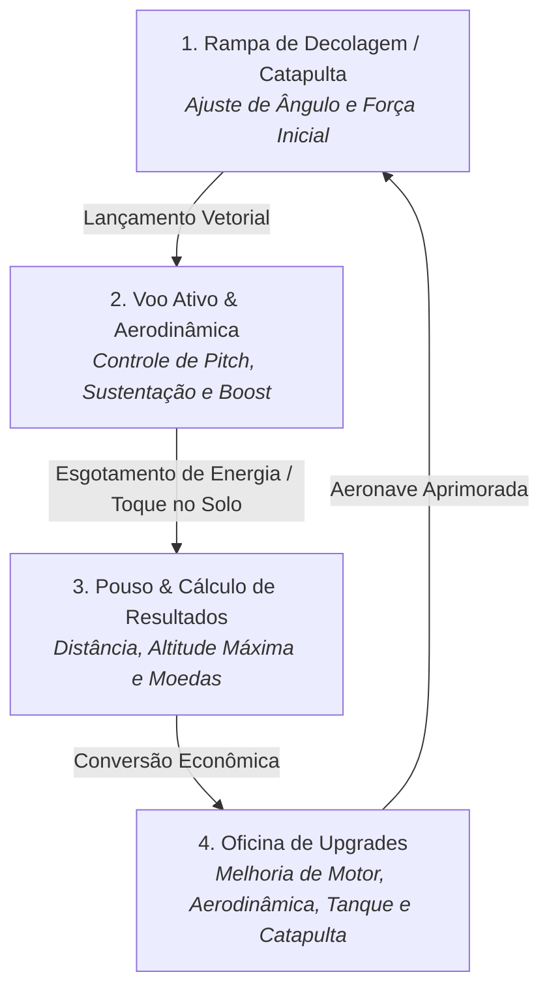

# ✈️ AeroAscent

> **Simulador e Arcade Casual de Voo e Progressão Multiplataforma (Windows & Android)**  
> *Desenvolvido em C# com Unity Engine e Clean Architecture (.NET Standard 2.1 / .NET 8)*

[](#-roadmap-de-especificações-técnicas)
[](https://dotnet.microsoft.com/)
[](https://unity.com/)
[](#-requisitos-não-funcionais-rnf)
[](#-convenções-de-código-e-desenvolvimento)
[](LICENSE)
[](#-filosofia-e-valores)

---

## 📖 Sumário

- [Visão Geral](#-visão-geral)
- [Filosofia e Valores](#-filosofia-e-valores)
- [Core Loop de Gameplay](#-core-loop-de-gameplay)
- [Arquitetura de Software](#-arquitetura-de-software)
  - [Separação de Camadas (Clean Architecture)](#separação-de-camadas-clean-architecture)
  - [Modelo de Domínio (DDD)](#modelo-de-domínio-ddd)
- [Requisitos do Sistema](#-requisitos-do-sistema)
  - [Requisitos Funcionais (RF)](#requisitos-funcionais-rf)
  - [Requisitos Não-Funcionais (RNF)](#requisitos-não-funcionais-rnf)
- [Roadmap de Especificações Técnicas](#-roadmap-de-especificações-técnicas)
- [Estrutura do Repositório](#-estrutura-do-repositório)
- [Compilação e Execução de Testes](#-compilação-e-execução-de-testes)
- [Convenções de Código e Desenvolvimento](#-convenções-de-código-e-desenvolvimento)
- [Identidade Visual e Assets](#-identidade-visual-e-assets)
- [Governança e Checklist](#-governança-e-checklist)
- [Licença e Créditos](#-licença-e-créditos)

---

## 🎯 Visão Geral

**AeroAscent** (originalmente concebido como *AeroHorizon*) é um jogo arcade de simulação de voo e progressão incremental. O jogador controla o lançamento de uma aeronave leve a partir de uma catapulta, equilibra as forças aerodinâmicas de sustentação (*lift*) e arrasto (*drag*), aciona propulsores de combustível (*boost*) e coleta recursos em paisagens geradas de forma procedural.

Ao término de cada voo, as métricas de distância percorrida, altitude atingida e moedas coletadas são convertidas em recursos econômicos para investir em melhorias mecânicas na **Oficina** (Motor, Aerodinâmica, Tanque de Combustível e Catapulta), viabilizando trajetórias progressivamente mais longas, altas e gratificantes.

```
       ▲  Altitude
       │         _--~~--_ (Voo Ativo / Pitch)
       │       /          \
Catapulta    /              \___  (Planeio & Boost)
 [=====>]  /                    \_______
 ────────┴───────────────────────────────\______ Solo (Pouso) ──► Distância (m)
```

---

## 👨‍👩‍👧‍👦 Filosofia e Valores

Inspirado e dedicado à família — especialmente **Ruth, Sofia e Alice** —, o projeto é regido por princípios inegociáveis definidos na sua [Constituição](constitution.md):

1. **Zero Anúncios e Zero Mecanismos Predatórios:** Livre de propagandas, microtransações forçadas, banners, caixas de saque (*loot boxes*) ou travas de tempo artificiais.
2. **Diversão Familiar Acolhedora:** Gráficos leves, cores vibrantes, física responsiva e controles acessíveis para crianças e adultos.
3. **Progressão por Habilidade e Física Genuína:** Todo avanço é fruto da maestria do jogador no controle de inclinação (*pitch*), gerenciamento de combustível e precisão no lançamento.
4. **Excelência de Engenharia:** Domínio C# puro rigorosamente desacoplado de bibliotecas gráficas, garantindo testabilidade total, estabilidade e manutenibilidade a longo prazo.

---

## 🔄 Core Loop de Gameplay



### Detalhamento das Etapas:
1. **Decolagem:** O jogador ajusta o momento ideal na barra de força da catapulta para obter velocidade de saída otimizada.
2. **Voo Ativo:**
   - **Nariz para cima (*Pitch Up*):** Aumenta a sustentação e ganha altitude, porém eleva o arrasto e reduz a velocidade horizontal.
   - **Nariz para baixo (*Pitch Down*):** Mergulha, convertendo energia potencial em aceleração e velocidade linear.
   - **Propulsão (*Boost*):** Fornece empuxo contínuo enquanto houver combustível no tanque.
   - **Coletáveis:** Moedas flutuantes e anéis de vento (*air rings*) que fornecem impulsos instantâneos de velocidade.
3. **Pouso:** Detecção de contato suave com o solo, atrito desacelerador e cálculo da pontuação final.
4. **Oficina:** Investimento de moedas com custos escalonados exponencialmente:
   $$\text{Custo}(N) = \text{CustoBase} \times (1.5)^{N-1}$$
5. **Re-lançamento:** Novo ciclo com aeronave mais eficiente, veloz e autônoma.

---

## 🏛️ Arquitetura de Software

O projeto adota os padrões de **Clean Architecture**, **Domain-Driven Design (DDD)** e **SOLID**, assegurando total isolamento entre regras de negócio e o motor gráfico.

### Separação de Camadas (Clean Architecture)

```
┌──────────────────────────────────────────────────────────────┐
│        Apresentação (Unity Engine — Windows / Android)       │
│  - Controladores MonoBehaviour (ControladorVoo, HangarUI)    │
│  - Interface de Usuário / HUD (Unity UI / Canvas)            │
│  - Renderização 3D Low Poly, Shaders GPU, Partículas Shuriken│
│  - Adaptador de Áudio e Entrada Tátil / Teclado              │
└──────────────────────────────┬───────────────────────────────┘
                               │ depende de
┌──────────────────────────────▼───────────────────────────────┐
│                 Aplicação (Casos de Uso C#)                  │
│  - LancarAeronaveCasoDeUso                                   │
│  - AtualizarFisicaVooCasoDeUso                               │
│  - ComprarMelhoriaCasoDeUso                                  │
│  - FinalizarVooCasoDeUso                                     │
└──────────────────────────────┬───────────────────────────────┘
                               │ depende de
┌──────────────────────────────▼───────────────────────────────┐
│                   Domínio (C# Puro .NET)                     │
│  - Entidades: Aeronave, Voo, Oficina, ProgressoJogador       │
│  - Objetos de Valor: Combustivel, Moeda, VetorVoo, Melhoria  │
│  - Interfaces: IRepositorioProgresso, IServicoFisicaVoo      │
└──────────────────────────────▲───────────────────────────────┘
                               │ implementa
┌──────────────────────────────┴───────────────────────────────┐
│                Infraestrutura (Persistência)                 │
│  - RepositorioProgressoLocalJson (System.Text.Json)          │
│  - ProvedorTempoLocal, AdaptadorLogs                         │
└──────────────────────────────────────────────────────────────┘
```

### Modelo de Domínio (DDD)

- **Entidades (`class` com `Guid Id` único):**
  - [`Aeronave`](src/AeroAscent.Core.Dominio/): Encapsula a configuração mecânica atual (níveis de motor, aerodinâmica, tanque de combustível e catapulta de 1 a 10).
  - `Voo`: Controla a sessão de voo ativa, métricas em tempo real e máquina de estados (`EmPreparacao` ➔ `EmVoo` ➔ `Pousado` / `Cancelado`).
  - `Oficina`: Gerencia o catálogo de upgrades, validação de limites de nível e aplicação de melhorias na aeronave.
  - `ProgressoJogador`: Raiz de agregação consolidando dados globais, saldo total de moedas e recordes de voo.
- **Objetos de Valor (Value Objects imutáveis como `record` / `readonly record struct`):**
  - `Moeda`: Capital financeiro com validação contra saldos negativos.
  - `Combustivel`: Quantidade atual, capacidade máxima e taxa de consumo por segundo.
  - `VetorVoo`: Vetor 3D imutável puro (`float X, Y, Z`) com operações matemáticas desacopladas do motor de jogo.
  - `Melhoria`: Especificação de componente mecânico (`TipoMelhoria`, nível, multiplicador e custo).
  - `ResultadoVoo`: Consolidado imutável de fim de voo com cálculo de recompensas e quebra de recordes.
- **Exceções de Domínio:**
  - [`SaldoInsuficienteException`](src/AeroAscent.Core.Dominio/Excecoes/SaldoInsuficienteException.cs)
  - [`MelhoriaNivelMaximoException`](src/AeroAscent.Core.Dominio/Excecoes/MelhoriaNivelMaximoException.cs)

---

## ⚙️ Requisitos do Sistema

### Requisitos Funcionais (RF)

| ID | Nome | Descrição |
|---|---|---|
| **RF-01** | **Sistema de Lançamento** | Impulso inicial gerado por rampa/catapulta proporcional ao nível da peça e precisão do timing. |
| **RF-02** | **Sustentação e Pitch** | Equilíbrio aerodinâmico entre sustentação e arrasto em função da inclinação do nariz. |
| **RF-03** | **Propulsão (Boost)** | Empuxo adicional acionado sob demanda com consumo contínuo da barra de combustível. |
| **RF-04** | **Coleta em Voo** | Moedas flutuantes e anéis de vento (*air rings*) distribuídos proceduralmente no cenário. |
| **RF-05** | **Detecção de Pouso** | Reconhecimento de contato com o solo, frenagem por atrito e congelamento de simulação. |
| **RF-06** | **Cálculo de Recompensas** | Conversão matemática: $\text{Moedas} = \lfloor \text{Dist} \times 0.1 \rfloor + \lfloor \text{Alt} \times 0.05 \rfloor + \text{Coletadas}$. |
| **RF-07** | **Loja e Oficina** | Evolução de 4 categorias mecânicas com escalonamento de custo e teto de nível 10. |
| **RF-08** | **Persistência Local** | Salvamento e carregamento atômico em JSON local (*Offline First*). |

### Requisitos Não-Funcionais (RNF)

- **RNF-01 — Taxa de Quadros (60 FPS):** Performance estável a 60 FPS em Android e Windows.
- **RNF-02 — Alocação Zero de Memória (0 bytes GC Alloc):** Proibida a alocação de objetos (`new`) em loops de atualização (`Update`, `FixedUpdate`).
- **RNF-03 — Object Pooling:** Reutilização estrita de instâncias para moedas, anéis de ar, nuvens e partículas.
- **RNF-04 — Código Limpo:** 100% em Português Brasileiro (pt-BR), SOLID, DDD e Clean Architecture.
- **RNF-05 — Privacidade e Offline:** Funcionamento 100% offline sem coleta de dados ou telemetria.
- **RNF-06 — Tamanho Reduzido:** Build final compacta (< 80 MB) utilizando arte Low Poly otimizada.

---

## 🗺️ Roadmap de Especificações Técnicas

O desenvolvimento do AeroAscent é estruturado em **13 especificações técnicas modulares** localizadas no diretório [`specs/`](specs/):

| # | Especificação | Diretório | Descrição Central |
|:---:|---|---|---|
| **001** | **Domínio Core & Entidades** | [`specs/001-dominio-core-aeroascent`](specs/001-dominio-core-aeroascent/spec.md) | Entidades (`Aeronave`, `Voo`, `Oficina`), Objetos de Valor e Contratos Base em C# puro. |
| **002** | **Sistema de Lançamento** | [`specs/002-sistema-lancamento-catapulta`](specs/002-sistema-lancamento-catapulta/spec.md) | Barra de força/timing, cálculo de impulso vetorial e catapulta. |
| **003** | **Física de Voo & Sustentação** | [`specs/003-fisica-voo-aerodinamica`](specs/003-fisica-voo-aerodinamica/spec.md) | Simulação desacoplada de forças (*Lift*, *Drag*, Gravidade, *Pitch*). |
| **004** | **Propulsão & Boost** | [`specs/004-propulsao-boost-combustivel`](specs/004-propulsao-boost-combustivel/spec.md) | Queima contínua de combustível, empuxo adicional e corte automático. |
| **005** | **Coletáveis & Pooling** | [`specs/005-coletaveis-ambiente-pooling`](specs/005-coletaveis-ambiente-pooling/spec.md) | Moedas, anéis de vento e *Object Pooling* com zero alocação de memória. |
| **006** | **Detecção de Pouso** | [`specs/006-deteccao-pouso-fim-voo`](specs/006-deteccao-pouso-fim-voo/spec.md) | Contato com o solo, atrito terrestre e transição de estado para pousado. |
| **007** | **Cálculo de Recompensas** | [`specs/007-calculo-recompensas-pontuacao`](specs/007-calculo-recompensas-pontuacao/spec.md) | Caso de uso de pontuação, fórmula matemática e quebra de recordes. |
| **008** | **Oficina & Upgrades** | [`specs/008-oficina-loja-upgrades`](specs/008-oficina-loja-upgrades/spec.md) | Evolução das 4 peças, custo exponencial e validações de saldo/teto. |
| **009** | **Persistência Local JSON** | [`specs/009-persistencia-local-json`](specs/009-persistencia-local-json/spec.md) | Repositório local assíncrono e atômico via `System.Text.Json`. |
| **010** | **UI Menu Principal & Hangar** | [`specs/010-ui-menu-principal-oficina`](specs/010-ui-menu-principal-oficina/spec.md) | Hangar 3D, cartões de evolução reativos e botão de decolagem. |
| **011** | **UI HUD de Voo** | [`specs/011-ui-hud-voo`](specs/011-ui-hud-voo/spec.md) | Indicadores de distância, recorde, altímetro, boost e botões táteis. |
| **012** | **UI Resumo de Fim de Voo** | [`specs/012-ui-resumo-fim-voo`](specs/012-ui-resumo-fim-voo/spec.md) | Resumo da sessão, animação de moedas e celebração de recordes. |
| **013** | **Áudio, Partículas & Polish** | [`specs/013-audio-particulas-polish`](specs/013-audio-particulas-polish/spec.md) | Efeitos sonoros estéreo CC0, partículas Shuriken e polimento final. |

---

## 📁 Estrutura do Repositório

```plaintext
AeroAscent/
├── .agents/                               # Configurações de agentes e automações
├── .specify/                              # Modelos e regras do Spec-Kit
├── specs/                                 # Especificações técnicas detalhadas (001 a 013)
│   ├── 001-dominio-core-aeroascent/       # Domínio Core C# Puro
│   ├── 002-sistema-lancamento-catapulta/  # Lançamento e Catapulta
│   ├── ...                                # Demais especificações
│   └── README.md                          # Visão geral do pipeline de specs
├── src/                                   # Código-fonte principal
│   └── AeroAscent.Core.Dominio/           # Projeto C# Puro (.NET Standard 2.1 / .NET 8)
│       ├── Enums/                         # StatusVoo, TipoMelhoria
│       ├── Excecoes/                      # SaldoInsuficienteException, MelhoriaNivelMaximoException
│       └── AeroAscent.Core.Dominio.csproj # Configuração da biblioteca de domínio
├── tests/                                 # Suítes de testes automatizados
│   └── AeroAscent.Core.Dominio.Testes/    # Testes unitários do Domínio (xUnit / NSubstitute)
├── AeroAscent.slnx                        # Solução .NET
├── constitution.md                        # Constituição e princípios inegociáveis do projeto
├── GEMINI.md                              # Padrões e convenções de código C# .NET
├── PRD.md                                 # Documento de Requisitos do Produto
├── README.md                              # Documentação principal do projeto
└── LICENSE                                # Licença MIT
```

---

## 🛠️ Compilação e Execução de Testes

### Pré-requisitos
- [.NET 8.0 SDK](https://dotnet.microsoft.com/download) ou superior instalado.
- [Unity 2022.3 LTS](https://unity.com/) ou superior com módulos *Windows Build Support* e *Android Build Support*.

### Comandos de Linha de Comando (.NET CLI)

1. **Restaurar dependências da solução:**
   ```powershell
   dotnet restore AeroAscent.slnx
   ```

2. **Compilar todos os projetos:**
   ```powershell
   dotnet build AeroAscent.slnx --configuration Release
   ```

3. **Executar a suíte de testes unitários com relatório detalhado:**
   ```powershell
   dotnet test tests/AeroAscent.Core.Dominio.Testes/AeroAscent.Core.Dominio.Testes.csproj --verbosity normal
   ```

---

## 📝 Convenções de Código e Desenvolvimento

Conforme estabelecido em [GEMINI.md](GEMINI.md) e na [Constituição](constitution.md):

- **Idioma Obrigatório:** **100% em Português Brasileiro (pt-BR)** para classes, métodos, propriedades, variáveis, enums, exceções, documentação XML (`///`) e logs.
- **Padrões de Nomenclatura:**
  - `PascalCase` para Classes, Records, Enums, Métodos e Propriedades Públicas.
  - `_camelCase` para campos privados (`_repositorioProgresso`).
  - `camelCase` para parâmetros e variáveis locais.
  - `UPPER_SNAKE_CASE` para constantes (`GRAVIDADE_PADRAO`).
  - Sufixo `Async` para métodos assíncronos (`SalvarProgressoAsync`).
  - Prefixo `I` para Interfaces (`IRepositorioProgresso`).
- **Documentação XML:** Todas as classes, interfaces e membros públicos devem conter tags explicativas (`<summary>`, `<param>`, `<returns>`, `<exception>`).

---

## 🎨 Identidade Visual e Assets

- **Assets 3D / 2D:** Pacotes em Domínio Público (CC0) fornecidos por [Kenney.nl](https://kenney.nl/) (*Kenney Aircraft Kit*, *Nature Kit*, *UI Pack*).
- **Estilo Artístico:** *Low Poly* estilizado com cores sólidas e vibrantes (*flat shading*), otimizado para renderização rápida em GPUs mobile.
- **Áudio:** Efeitos sonoros suaves em formato estéreo para vento, propulsão e coleta de itens.

---

## ✅ Governança e Checklist

Antes de submeter alterações ou criar novos pull requests, verifique a conformidade com o checklist:

- [x] O código segue 100% o idioma **Português Brasileiro (pt-BR)**.
- [x] A camada de **Domínio** não possui dependências de `UnityEngine` ou `MonoBehaviour`.
- [x] **Zero Alocação (`GC Alloc = 0 bytes`)** garantida dentro de loops contínuos de física (`Update`/`FixedUpdate`).
- [x] Entidades implementam `class` com identificador `Guid Id` e Objetos de Valor utilizam `record` imutável.
- [x] Contratos e injeção de dependências utilizam **Interfaces**.
- [x] Cobertura de testes unitários abrangente para cenários de sucesso, limites e exceções.
- [x] Filosofia de **Zero Anúncios** e conformidade familiar preservada.

---

## 📄 Licença e Créditos

- **Código-fonte:** Licenciado sob os termos da [Licença MIT](LICENSE).
- **Recursos Visuais e Sonoros:** CC0 1.0 Universal por [Kenney.nl](https://kenney.nl/).
- **Dedicatória:** Feito com carinho para **Ruth, Sofia e Alice**.
