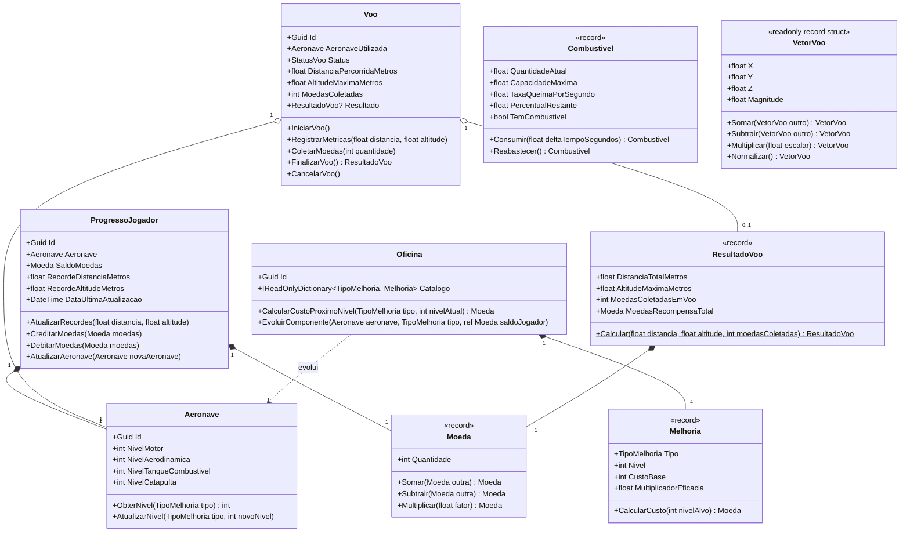

# Modelo de Dados e Entidades: Domínio Core AeroAscent

**Feature**: `001-dominio-core-aeroascent`  
**Data**: 2026-09-04  
**Status**: Concluído e Aprovado  

---

## 🏛️ Visão Geral do Modelo de Domínio

O domínio do **AeroAscent** é modelado estritamente em C# puro (.NET Standard 2.1 / .NET 8), seguindo Domain-Driven Design (DDD) e Clean Architecture. Não possui referências externas a bibliotecas de interface gráfica ou engines, sendo consumível de forma idêntica tanto em Windows quanto em Android através da Unity Engine.

---

## 📋 Entidades (Entities)

### 1. `ProgressoJogador` (Raiz de Agregação / Aggregate Root)
Consolida todo o estado persistível do jogador entre sessões de jogo.
- **Identidade:** `Guid Id` único global.
- **Propriedades:**
  - `Guid Id`: Identificador único do jogador / save local.
  - `Aeronave Aeronave`: Instância da aeronave e seus níveis de peças atuais.
  - `Moeda SaldoMoedas`: Saldo acumulado na carteira do jogador.
  - `float RecordeDistanciaMetros`: Maior distância alcançada em todos os voos (m).
  - `float RecordeAltitudeMetros`: Maior altitude já atingida (m).
  - `DateTime DataUltimaAtualizacao`: Timestamp UTC da última modificação.
- **Invariantes e Regras de Negócio:**
  - `Id != Guid.Empty`.
  - `Aeronave != null` e `SaldoMoedas != null`.
  - `RecordeDistanciaMetros >= 0f` e `RecordeAltitudeMetros >= 0f`.
  - `AtualizarRecordes(distancia, altitude)` só substitui os valores se os novos forem estritamente maiores que os recordes históricos vigentes.

### 2. `Aeronave` (Entidade)
Representa a máquina de voo do jogador e suas características mecânicas.
- **Identidade:** `Guid Id`.
- **Propriedades:**
  - `Guid Id`: Identificador único da aeronave.
  - `int NivelMotor`: Potência de aceleração e impulso (1 a 10).
  - `int NivelAerodinamica`: Redução de arrasto e coeficiente de planeio (1 a 10).
  - `int NivelTanqueCombustivel`: Volume total do reservatório (1 a 10).
  - `int NivelCatapulta`: Força de empuxo do lançamento inicial (1 a 10).
- **Invariantes e Regras de Negócio:**
  - Nível inicial padrão = 1 para todos os 4 atributos.
  - Nível mínimo = 1 (`ArgumentOutOfRangeException` caso menor que 1).
  - Nível máximo = 10 (`MelhoriaNivelMaximoException` caso maior que 10).

### 3. `Oficina` (Entidade)
Gerencia o catálogo de melhorias mecânicas e a aplicação das evoluções de peças.
- **Identidade:** `Guid Id`.
- **Propriedades:**
  - `Guid Id`: Identificador único da oficina.
  - `IReadOnlyDictionary<TipoMelhoria, Melhoria> Catalogo`: Dicionário contendo as especificações de cada tipo de melhoria.
- **Invariantes e Regras de Negócio:**
  - Fórmula de custo exponencial: $\text{Custo}(N) = \lfloor \text{CustoBase} \times (1.5)^{N-1} \rfloor$.
  - Impede evolução se o componente já estiver no nível 10 (`MelhoriaNivelMaximoException`).
  - Impede evolução e não altera estado da aeronave nem do saldo se as moedas forem insuficientes (`SaldoInsuficienteException`).

### 4. `Voo` (Entidade)
Encapsula uma rodada ativa de lançamento, trajetória aerodinâmica e finalização.
- **Identidade:** `Guid Id`.
- **Propriedades:**
  - `Guid Id`: Identificador único da sessão de voo.
  - `Aeronave AeronaveUtilizada`: Referência à aeronave que realizou o voo.
  - `StatusVoo Status`: `EmPreparacao`, `EmVoo`, `Pousado`, `Cancelado`.
  - `float DistanciaPercorridaMetros`: Distância percorrida em relação à catapulta.
  - `float AltitudeMaximaMetros`: Maior altitude atingida durante o voo atual.
  - `int MoedasColetadas`: Moedas físicas apanhadas no ar na rodada.
  - `ResultadoVoo? Resultado`: Objeto imutável preenchido no momento do pouso.
- **Máquina de Estados e Transições:**
  - `EmPreparacao` $\to$ `EmVoo` (ao acionar o disparo da catapulta).
  - `EmPreparacao` $\to$ `Cancelado` (se o jogador desistir antes da decolagem).
  - `EmVoo` $\to$ `Pousado` (ao tocar o solo e cessar movimento, gerando `ResultadoVoo`).
  - `EmVoo` $\to$ `Cancelado` (se o jogador interromper o voo sem registrar pontos).
  - Tentativas de atualizar coordenadas após transitar para `Pousado` ou `Cancelado` lançam `DominioInvalidoException`.

---

## 💎 Objetos de Valor (Value Objects)

### 1. `Moeda` (`record` imutável)
- **Campos:** `int Quantidade`
- **Regras:**
  - `Quantidade >= 0`.
  - Subtração com resultado negativo lança `SaldoInsuficienteException`.
  - Operações aritméticas seguras contra overflow numérico (`checked`).

### 2. `Combustivel` (`record` imutável)
- **Campos:** `float QuantidadeAtual`, `float CapacidadeMaxima`, `float TaxaQueimaPorSegundo`
- **Regras:**
  - `0f <= QuantidadeAtual <= CapacidadeMaxima`.
  - `Consumir(deltaTempo)` calcula queima e retorna nova instância sem mutar a anterior.
  - `TemCombustivel => QuantidadeAtual > 0.001f`.

### 3. `VetorVoo` (`readonly record struct` imutável)
- **Campos:** `float X`, `float Y`, `float Z`
- **Propriedades:** `float Magnitude => MathF.Sqrt(X*X + Y*Y + Z*Z)`
- **Regras:**
  - Alocado na stack (valor), garantindo **0 bytes de GC** no loop contínuo de simulação física.
  - Métodos imutáveis: `Somar()`, `Subtrair()`, `Multiplicar()`, `Normalizar()`.

### 4. `Melhoria` (`record` imutável)
- **Campos:** `TipoMelhoria Tipo`, `int Nivel`, `int CustoBase`, `float MultiplicadorEficacia`
- **Regras:**
  - Nível restrito de 1 a 10.
  - Multiplicador de eficácia linear ou logarítmico para física do voo.

### 5. `ResultadoVoo` (`record` imutável)
- **Campos:** `float DistanciaTotalMetros`, `float AltitudeMaximaMetros`, `int MoedasColetadasEmVoo`, `Moeda MoedasRecompensaTotal`
- **Fórmula Canônica de Recompensa:**
  $$\text{Total} = \lfloor \text{DistanciaTotalMetros} \times 0.1 \rfloor + \lfloor \text{AltitudeMaximaMetros} \times 0.05 \rfloor + \text{MoedasColetadasEmVoo}$$

---

## 🏷️ Enumerações (Enums)

### `StatusVoo`
- `EmPreparacao`: Aeronave posicionada na rampa/catapulta aguardando disparo.
- `EmVoo`: Aeronave em trajetória aerodinâmica ativa pelo cenário.
- `Pousado`: Aeronave concluiu a corrida no solo; pontuação computada.
- `Cancelado`: Voo abortado voluntariamente sem consolidação de recompensas.

### `TipoMelhoria`
- `Motor`: Potência de propulsão e aceleração do impulso (*boost*).
- `Aerodinamica`: Redução de resistência do ar e aumento da sustentação.
- `TanqueCombustivel`: Capacidade de volume de combustível.
- `Catapulta`: Velocidade e força de saída no lançamento inicial.

---

## ⚠️ Exceções de Domínio

1. **`SaldoInsuficienteException`**: Disparada quando o saldo de moedas for inferior ao custo exigido para uma evolução ou operação.
2. **`MelhoriaNivelMaximoException`**: Disparada quando houver tentativa de evoluir um componente que já atingiu o nível máximo (10).
3. **`DominioInvalidoException`**: Disparada para violações de invariantes estruturais (ex: `Guid.Empty`, transição de status de voo ilegal, métricas negativas).
