# Tasks: Domínio Core, Entidades e Objetos de Valor do AeroAscent

**Input**: Documentos de design em `specs/001-dominio-core-aeroascent/`  
**Prerequisites**: [plan.md](file:///h:/tmp/RSA/Loterias/JogosMaster/GitHub/AeroAscent/specs/001-dominio-core-aeroascent/plan.md), [spec.md](file:///h:/tmp/RSA/Loterias/JogosMaster/GitHub/AeroAscent/specs/001-dominio-core-aeroascent/spec.md), [research.md](file:///h:/tmp/RSA/Loterias/JogosMaster/GitHub/AeroAscent/specs/001-dominio-core-aeroascent/research.md), [data-model.md](file:///h:/tmp/RSA/Loterias/JogosMaster/GitHub/AeroAscent/specs/001-dominio-core-aeroascent/data-model.md), [contracts/](file:///h:/tmp/RSA/Loterias/JogosMaster/GitHub/AeroAscent/specs/001-dominio-core-aeroascent/contracts/), [quickstart.md](file:///h:/tmp/RSA/Loterias/JogosMaster/GitHub/AeroAscent/specs/001-dominio-core-aeroascent/quickstart.md)  
**Tests**: Testes unitários automatizados com xUnit são **obrigatórios** conforme Critério de Sucesso SC-001 (100% de cobertura no domínio) e SC-002 (< 500 ms de execução).  
**Organization**: As tarefas são agrupadas estritamente por fases e histórias de usuário para permitir implementação e validação independentes.

---

## Format: `[TaskID] [P?] [Story?] Description with file path`

- **[P]**: Tarefa paralelizada (arquivos diferentes, sem dependência mútua)
- **[Story]**: Identificador da história de usuário (ex: `[US1]`, `[US2]`, `[US3]`, `[US4]`, `[US5]`)
- Todos os caminhos de arquivo são especificados com precisão

---

## Phase 1: Setup (Infraestrutura de Projetos e Solução)

**Purpose**: Criação da solução e configuração dos projetos C# para Clean Architecture

- [X] T001 Criar solução `AeroAscent.sln` e estrutura de diretórios `src/` e `tests/` na raiz do repositório
- [X] T002 Criar projeto de biblioteca de classes C# (.NET Standard 2.1 / .NET 8) em `src/AeroAscent.Core.Dominio/AeroAscent.Core.Dominio.csproj`
- [X] T003 [P] Criar projeto de testes unitários xUnit em `tests/AeroAscent.Core.Dominio.Testes/AeroAscent.Core.Dominio.Testes.csproj`
- [X] T004 Adicionar referência de projeto do teste para o domínio e vincular ambos os projetos à solução `AeroAscent.sln`

---

## Phase 2: Foundational (Pré-requisitos Bloqueantes)

**Purpose**: Enumerações, exceções de domínio e contratos base necessários antes da implementação das histórias

**⚠️ CRITICAL**: Nenhuma história de usuário pode ser iniciada até a conclusão desta fase

- [X] T005 [P] Implementar enumeração `StatusVoo` em `src/AeroAscent.Core.Dominio/Enums/StatusVoo.cs`
- [X] T006 [P] Implementar enumeração `TipoMelhoria` em `src/AeroAscent.Core.Dominio/Enums/TipoMelhoria.cs`
- [X] T007 [P] Implementar exceção de domínio `SaldoInsuficienteException` em `src/AeroAscent.Core.Dominio/Excecoes/SaldoInsuficienteException.cs`
- [X] T008 [P] Implementar exceção de domínio `MelhoriaNivelMaximoException` em `src/AeroAscent.Core.Dominio/Excecoes/MelhoriaNivelMaximoException.cs`
- [X] T009 [P] Implementar exceção de domínio `DominioInvalidoException` em `src/AeroAscent.Core.Dominio/Excecoes/DominioInvalidoException.cs`
- [X] T010 [P] Implementar contrato da interface `IRepositorioProgresso` em `src/AeroAscent.Core.Dominio/Contratos/IRepositorioProgresso.cs`
- [X] T011 [P] Implementar contrato da interface `IServicoFisicaVoo` em `src/AeroAscent.Core.Dominio/Contratos/IServicoFisicaVoo.cs`
- [X] T012 [P] Implementar contrato da interface `IServicoEconomia` em `src/AeroAscent.Core.Dominio/Contratos/IServicoEconomia.cs`

**Checkpoint**: Base e contratos estabelecidos — o desenvolvimento das histórias de usuário pode começar.

---

## Phase 3: User Story 1 - Modelagem e Inicialização da Aeronave (Priority: P1) 🎯 MVP

**Goal**: Permitir que o sistema instancie uma aeronave com identificador único (`Guid`), níveis padrão iguais a 1 e invariantes de proteção contra limites ilegais (1 a 10).

**Independent Test**: Executar testes unitários validando criação padrão e rejeição de níveis menores que 1 ou maiores que 10.

### Tests for User Story 1
- [X] T013 [P] [US1] Criar testes unitários para inicialização e validação de níveis da `Aeronave` em `tests/AeroAscent.Core.Dominio.Testes/Entidades/AeronaveTestes.cs`

### Implementation for User Story 1
- [X] T014 [US1] Implementar entidade `Aeronave` com validação de níveis inteiros (1 a 10) e mutação controlada em `src/AeroAscent.Core.Dominio/Entidades/Aeronave.cs`

**Checkpoint**: User Story 1 (MVP) funcional e testável de forma 100% isolada.

---

## Phase 4: User Story 3 - Operações Monetárias, Combustível e VetorVoo (Priority: P3)

**Goal**: Garantir integridade matemática absoluta e alocação zero de memória no loop de execução através de objetos de valor imutáveis (`Moeda`, `Combustivel` e `VetorVoo`).

**Independent Test**: Testar aritmética segura de moedas (bloqueando saldos negativos), queima imutável de combustível e operações vetoriais puras 3D com `VetorVoo` na stack.

### Tests for User Story 3
- [X] T015 [P] [US3] Criar testes unitários para `Moeda` (adição, subtração protegida e operadores) em `tests/AeroAscent.Core.Dominio.Testes/ObjetosDeValor/MoedaTestes.cs`
- [X] T016 [P] [US3] Criar testes unitários para `Combustivel` (capacidade, consumo imutável e percentual) em `tests/AeroAscent.Core.Dominio.Testes/ObjetosDeValor/CombustivelTestes.cs`
- [X] T017 [P] [US3] Criar testes unitários para `VetorVoo` (álgebra vetorial 3D, magnitude e normalização) em `tests/AeroAscent.Core.Dominio.Testes/ObjetosDeValor/VetorVooTestes.cs`

### Implementation for User Story 3
- [X] T018 [P] [US3] Implementar Objeto de Valor `Moeda` como `record` imutável com `checked` arithmetic em `src/AeroAscent.Core.Dominio/ObjetosDeValor/Moeda.cs`
- [X] T019 [P] [US3] Implementar Objeto de Valor `Combustivel` como `record` imutável com métodos de consumo em `src/AeroAscent.Core.Dominio/ObjetosDeValor/Combustivel.cs`
- [X] T020 [P] [US3] Implementar Objeto de Valor `VetorVoo` como `readonly record struct` 3D com zero alocação no heap em `src/AeroAscent.Core.Dominio/ObjetosDeValor/VetorVoo.cs`

**Checkpoint**: Todos os objetos de valor atômicos implementados, testados e prontos para compor as entidades de voo, oficina e persistência.

---

## Phase 5: User Story 2 - Sessão de Voo, Ciclo de Vida e Resultado de Voo (Priority: P2)

**Goal**: Modelar a máquina de estados de uma rodada de voo (`EmPreparacao`, `EmVoo`, `Pousado`, `Cancelado`), rastrear métricas em tempo real e consolidar o encerramento com `ResultadoVoo` calculando a premiação canônica.

**Independent Test**: Testar transições de status da sessão de `Voo`, atualização de altitude máxima e distância, cálculo da fórmula de moedas ao pousar e bloqueio de dados após pouso/cancelamento.

### Tests for User Story 2
- [X] T021 [P] [US2] Criar testes unitários para a fórmula canônica de cálculo de recompensas do `ResultadoVoo` em `tests/AeroAscent.Core.Dominio.Testes/ObjetosDeValor/ResultadoVooTestes.cs`
- [X] T022 [P] [US2] Criar testes unitários para máquina de estados, transições e encerramento de `Voo` em `tests/AeroAscent.Core.Dominio.Testes/Entidades/VooTestes.cs`

### Implementation for User Story 2
- [X] T023 [P] [US2] Implementar Objeto de Valor `ResultadoVoo` com a fórmula canônica de premiação em `src/AeroAscent.Core.Dominio/ObjetosDeValor/ResultadoVoo.cs`
- [X] T024 [US2] Implementar entidade `Voo` com máquina de estados, registro de métricas e geração de encerramento em `src/AeroAscent.Core.Dominio/Entidades/Voo.cs`

**Checkpoint**: User Stories 1, 2 e 3 funcionando e testadas de forma independente e integrada.

---

## Phase 6: User Story 4 - Gestão de Oficina e Evolução de Melhorias (Priority: P2)

**Goal**: Permitir que a `Oficina` consulte custos exponenciais de melhorias ($CustoBase \times 1.5^{N-1}$), valide o teto máximo de nível 10 e aplique upgrades na `Aeronave` debitando `Moedas`.

**Independent Test**: Testar cálculo de custos por nível, evolução de componentes com saldo suficiente, bloqueio com `SaldoInsuficienteException` e bloqueio no nível 10 com `MelhoriaNivelMaximoException`.

### Tests for User Story 4
- [X] T025 [P] [US4] Criar testes unitários para cálculo de custo e multiplicador de `Melhoria` em `tests/AeroAscent.Core.Dominio.Testes/ObjetosDeValor/MelhoriaTestes.cs`
- [X] T026 [P] [US4] Criar testes unitários para catálogo, compra de upgrades e validação de teto na `Oficina` em `tests/AeroAscent.Core.Dominio.Testes/Entidades/OficinaTestes.cs`

### Implementation for User Story 4
- [X] T027 [P] [US4] Implementar Objeto de Valor `Melhoria` com dados de nível, custo base e eficácia em `src/AeroAscent.Core.Dominio/ObjetosDeValor/Melhoria.cs`
- [X] T028 [US4] Implementar entidade `Oficina` com catálogo de peças, fórmula exponencial e evolução de aeronave em `src/AeroAscent.Core.Dominio/Entidades/Oficina.cs`

**Checkpoint**: Loop completo de voo, pouso, recompensas e melhorias na oficina coberto pelo domínio.

---

## Phase 7: User Story 5 - Agregação e Persistência do Progresso do Jogador (Priority: P2)

**Goal**: Consolidar o estado persistível global do jogador (`Aeronave`, saldo total de `Moeda` e recordes de voo) sob a raiz de agregação `ProgressoJogador`, manipulável via `IRepositorioProgresso`.

**Independent Test**: Testar atualização atômica de recordes históricos, crédito/débito de moedas e substituição íntegra de aeronave na raiz de agregação.

### Tests for User Story 5
- [ ] T029 [P] [US5] Criar testes unitários para a raiz de agregação `ProgressoJogador` em `tests/AeroAscent.Core.Dominio.Testes/Entidades/ProgressoJogadorTestes.cs`

### Implementation for User Story 5
- [ ] T030 [US5] Implementar entidade raiz de agregação `ProgressoJogador` em `src/AeroAscent.Core.Dominio/Entidades/ProgressoJogador.cs`

**Checkpoint**: Todas as 5 histórias de usuário do domínio estão completas e testadas.

---

## Phase 8: Polish & Cross-Cutting Concerns

**Purpose**: Validação de qualidade, documentação XML e critérios não-funcionais

- [ ] T031 [P] Adicionar documentação XML completa (`/// 
`, `<param>`, `<returns>`) em 100% dos tipos públicos em `src/AeroAscent.Core.Dominio/`
- [ ] T032 Executar suíte completa de testes xUnit e validar tempo total de execução inferior a 500 ms via `dotnet test`
- [ ] T033 [P] Validar ausência de pacotes NuGet externos ou referências de interface gráfica em `src/AeroAscent.Core.Dominio/AeroAscent.Core.Dominio.csproj`
- [ ] T034 Validar todos os 5 cenários funcionais do guia de validação rápida em `specs/001-dominio-core-aeroascent/quickstart.md`

---

## Dependencies & Execution Order

### Phase Dependencies

```mermaid
graph TD
    A[Fase 1: Setup] --> B[Fase 2: Foundational]
    B --> C[Fase 3: US1 - Aeronave MVP]
    B --> D[Fase 4: US3 - Moeda, Combustivel, VetorVoo]
    C --> E[Fase 5: US2 - Voo e ResultadoVoo]
    D --> E
    C --> F[Fase 6: US4 - Oficina e Melhorias]
    D --> F
    E --> G[Fase 7: US5 - ProgressoJogador]
    F --> G
    G --> H[Fase 8: Polish & Validação]
```

### User Story Dependencies
- **User Story 1 (P1)**: Depende apenas da Fase 2 (Foundational). Não depende de outras histórias.
- **User Story 3 (P3)**: Depende apenas da Fase 2 (Foundational). Pode ser executada em paralelo com US1.
- **User Story 2 (P2)**: Depende de US1 (`Aeronave`) e US3 (`Moeda`, `VetorVoo`).
- **User Story 4 (P2)**: Depende de US1 (`Aeronave`) e US3 (`Moeda`).
- **User Story 5 (P2)**: Depende de US1 (`Aeronave`), US2 (`Voo`/Recordes), US3 (`Moeda`) e US4 (`Oficina`).

---

## Parallel Opportunities

- **Tarefas de Setup (Fase 1)**: `T002` e `T003` podem ser criadas em paralelo.
- **Tarefas Fundacionais (Fase 2)**: Todas as tarefas `T005` a `T012` possuem a marcação `[P]` e podem ser desenvolvidas simultaneamente pois residem em arquivos isolados.
- **Testes de Unidade**: Todos os testes com marcação `[P]` podem ser codificados antes ou em paralelo com a implementação dos modelos.
- **Objetos de Valor (Fase 4)**: `Moeda` (`T018`), `Combustivel` (`T019`) e `VetorVoo` (`T020`) são completamente desacoplados entre si e podem ser desenvolvidos em paralelo.

---

## Implementation Strategy

### MVP First (User Story 1 Only)
1. Concluir **Fase 1 (Setup)** e **Fase 2 (Foundational)**.
2. Implementar **Fase 3 (User Story 1 - Aeronave)**.
3. **Validação do MVP**: Rodar `AeronaveTestes.cs` comprovando instanciação padrão e invariantes protegidas.

### Incremental Delivery
1. **Incremento 1**: Setup + Foundational + US1 (Aeronave funcional).
2. **Incremento 2**: US3 (Objetos de Valor matemáticos: `Moeda`, `Combustivel`, `VetorVoo` sem GC).
3. **Incremento 3**: US2 (Simulação de voo, estados e premiação canônica com `ResultadoVoo`).
4. **Incremento 4**: US4 (Oficina de melhorias com fórmula exponencial e teto de nível 10).
5. **Incremento 5**: US5 (Consolidação com `ProgressoJogador` e persistência atômica).
6. **Incremento 6**: Polish, validação de 500 ms e checklist de governança.
