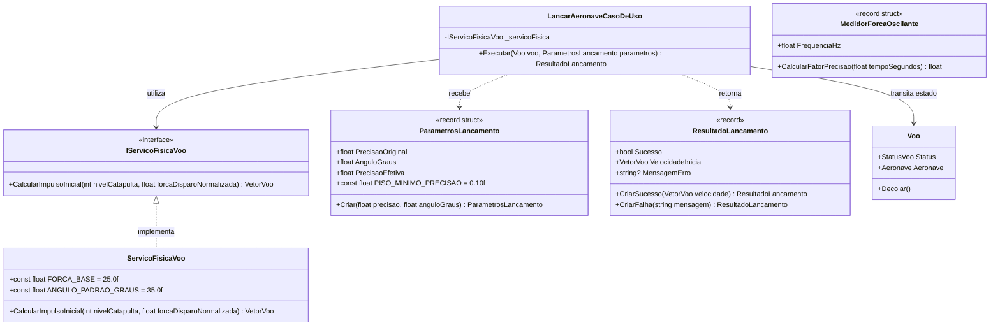

# Modelo de Dados e Estrutura de Tipos: Lançamento e Catapulta

**Feature**: `002-sistema-lancamento-catapulta`  
**Data**: 2026-09-04  
**Status**: Concluído  

---

## 1. Diagrama de Relacionamento e Fluxo

---

## 2. Especificação Detalhada dos Tipos

### 2.1 `ParametrosLancamento` (Objeto de Valor)
- **Localização**: `src/AeroAscent.Core.Dominio/ObjetosDeValor/ParametrosLancamento.cs`
- **Tipo**: `readonly record struct` (Alocação Zero na Stack)
- **Campos**:
  - `float PrecisaoOriginal`: Valor bruto de precisão informado (0.0 a 1.0).
  - `float AnguloGraus`: Ângulo da catapulta em relação ao solo (padrão: $35.0^\circ$).
  - `float PrecisaoEfetiva`: Valor normalizado aplicando o piso mínimo protetivo: $\max(0.10f, \min(1.0f, \text{PrecisaoOriginal}))$.
- **Invariantes**:
  - Ângulo deve estar no intervalo válido de inclinação da rampa ($15.0^\circ$ a $60.0^\circ$).

### 2.2 `ResultadoLancamento` (Objeto de Valor)
- **Localização**: `src/AeroAscent.Core.Dominio/ObjetosDeValor/ResultadoLancamento.cs`
- **Tipo**: `record` (Imutável)
- **Campos**:
  - `bool Sucesso`: Verdadeiro se a decolagem ocorreu com êxito.
  - `VetorVoo VelocidadeInicial`: Vetor tridimensional com a velocidade resultante aplicada.
  - `string? MensagemErro`: Mensagem descritiva caso o voo não tenha podido decolar.

### 2.3 `MedidorForcaOscilante` (Objeto de Valor)
- **Localização**: `src/AeroAscent.Core.Dominio/ObjetosDeValor/MedidorForcaOscilante.cs`
- **Tipo**: `readonly record struct`
- **Campos**:
  - `float FrequenciaHz`: Frequência de oscilação do medidor em ciclos por segundo (padrão: $1.0\text{ Hz}$).
- **Métodos**:
  - `float ObterFatorPrecisao(float tempoSegundos)`: Retorna valor contínuo no intervalo $[0.0, 1.0]$.

### 2.4 `ServicoFisicaVoo` (Serviço de Domínio)
- **Localização**: `src/AeroAscent.Core.Dominio/Servicos/ServicoFisicaVoo.cs`
- **Implementa**: `IServicoFisicaVoo`
- **Constantes**:
  - `FORCA_BASE = 25.0f` (metros por segundo no nível 1 com 100% de precisão)
  - `INCREMENTO_POR_NIVEL = 0.25f` (+25% por nível)
  - `ANGULO_PADRAO_GRAUS = 35.0f`
- **Cálculo de Impulso**:
  $$V_0 = \text{FORCA\_BASE} \times (1 + (\text{nivelCatapulta} - 1) \times 0.25) \times \text{forcaDisparoNormalizada}$$
  $$\vec{V} = (X: 0f, Y: V_0 \times \sin(35^\circ), Z: V_0 \times \cos(35^\circ))$$

### 2.5 `LancarAeronaveCasoDeUso` (Caso de Uso de Aplicação)
- **Localização**: `src/AeroAscent.Core.Aplicacao/CasosDeUso/LancarAeronaveCasoDeUso.cs`
- **Responsabilidade**: Orquestrar o fluxo de validação e lançamento:
  1. Validar se o voo está no status `EmPreparacao`.
  2. Extrair o nível da catapulta da `voo.Aeronave`.
  3. Obter o vetor inicial através de `_servicoFisica.CalcularImpulsoInicial(nivelCatapulta, parametros.PrecisaoEfetiva)`.
  4. Executar `voo.Decolar()`.
  5. Retornar `ResultadoLancamento.CriarSucesso(velocidadeInicial)`.
