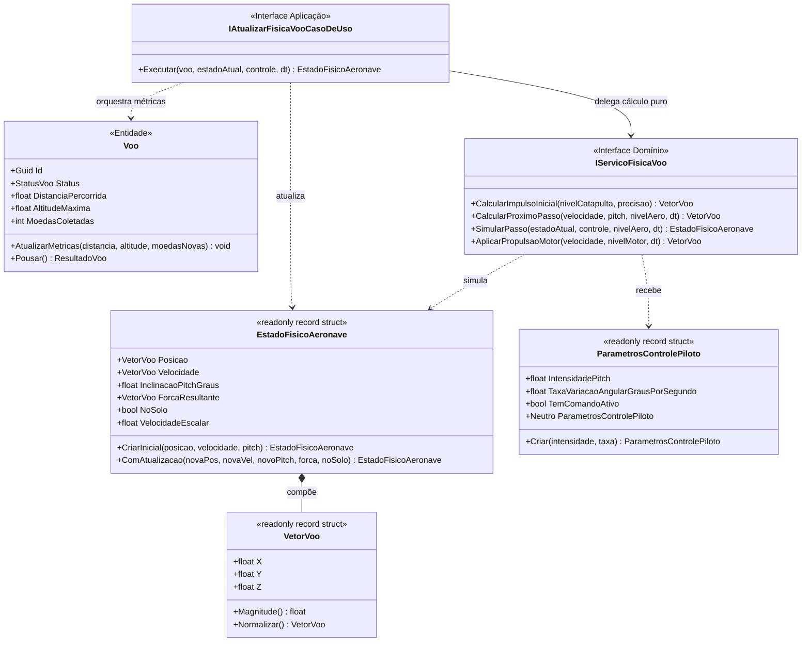
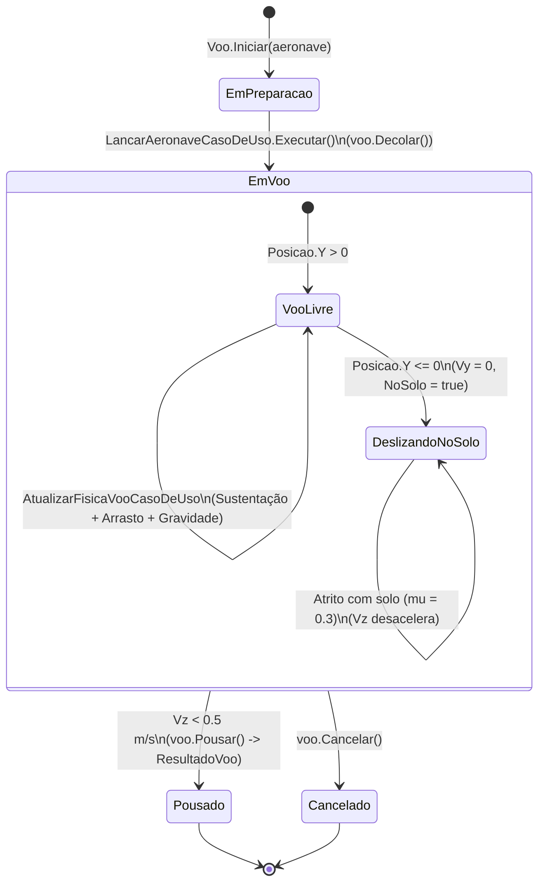

# Modelo de Dados: Simulação de Física Aerodinâmica e Controle de Pitch

> **Feature**: `003-fisica-voo-aerodinamica`  
> **Status**: Concluído (Fase 1)  
> **Idioma**: Português Brasileiro (pt-BR)  

---

## 1. Visão Geral dos Objetos e Entidades

---

## 2. Especificação Detalhada dos Tipos

### 2.1 `EstadoFisicoAeronave` (Value Object - `readonly record struct`)
Representa o estado dinâmico cinemático instantâneo da aeronave no espaço 3D (plano Y-Z), alocado exclusivamente na stack para garantir `GC Alloc = 0 bytes`.

| Propriedade | Tipo | Descrição | Regras de Invariante |
|---|---|---|---|
| `Posicao` | `VetorVoo` | Posição tridimensional em metros ($X, Y, Z$). | $X = 0$; $Y \ge 0$ (altitude nunca negativa). |
| `Velocidade` | `VetorVoo` | Vetor velocidade instantâneo em m/s ($X, Y, Z$). | $X = 0$. Se $Y \le 0$, $V_y$ é travado em 0. |
| `InclinacaoPitchGraus` | `float` | Ângulo do nariz do avião em graus. | Clamped entre $-45.0^\circ$ (mergulho) e $+60.0^\circ$ (subida). |
| `ForcaResultante` | `VetorVoo` | Força total resultante em Newtons (sustentação + arrasto + gravidade). | Vetor 3D alocado na stack. |
| `NoSolo` | `bool` | Indica se a aeronave está tocando o solo ($Y \le 0$). | `true` se $Y \le 0$, `false` caso contrário. |
| `VelocidadeEscalar` | `float` | Magnitude escalar da velocidade ($|\vec{V}|$). | $\sqrt{V_y^2 + V_z^2} \ge 0$. |

#### Métodos de Fábrica e Construtores
- `public static EstadoFisicoAeronave CriarInicial(VetorVoo posicaoInicial, VetorVoo velocidadeInicial, float inclinacaoPitchGraus)`: Valida e instancia o estado inicial do voo.
- `public static EstadoFisicoAeronave Criar(VetorVoo posicao, VetorVoo velocidade, float inclinacaoPitchGraus, VetorVoo forcaResultante, bool noSolo)`: Instancia com todas as propriedades calculadas.

---

### 2.2 `ParametrosControlePiloto` (Value Object - `readonly record struct`)
Representa o comando de arfagem transmitido pelo jogador via interface de toque ou joystick a cada frame.

| Propriedade | Tipo | Descrição | Regras de Invariante |
|---|---|---|---|
| `IntensidadePitch` | `float` | Intensidade do comando de inclinação ($-1.0$ a $+1.0$). | Clamped entre $-1.0f$ (mergulho) e $+1.0f$ (subida). |
| `TaxaVariacaoAngularGrausPorSegundo` | `float` | Taxa máxima de variação angular em graus/s. | Padrão $45.0^\circ/\text{s}$. Deve ser $> 0$. |
| `TemComandoAtivo` | `bool` | Indica se há intervenção intencional do jogador. | `MathF.Abs(IntensidadePitch) >= 0.05f`. |

#### Constantes e Instâncias Estáticas
- `public static readonly ParametrosControlePiloto Neutro = new(0f, 45.0f);`: Comando neutro com autoestabilização ativada.

---

## 3. Ciclo de Vida e Máquina de Estados da Sessão de Voo

### Transições de Estado Físico
1. **Decolagem**: A catapulta define `Posicao = (0, 0, 0)` e `Velocidade = (0, Vy, Vz)` na saída da rampa (35°).
2. **Voo Livre (`Y > 0`)**:
   - Forças atuantes: $\vec{F}_{\text{sustentacao}} + \vec{F}_{\text{arrasto}} + \vec{F}_{\text{gravidade}}$.
   - $Y$ e $Z$ atualizados via integração numérica Euler Semi-Implícito.
   - `voo.AtualizarMetricas(posicao.Z, posicao.Y, 0)` acumula distância percorrida e altitude máxima.
3. **Contato com o Solo (`Y <= 0`)**:
   - $Y$ travado em $0$, $V_y$ zerado, `NoSolo = true`.
   - Força atuante: desaceleração cinemática de atrito de solo ($a = \mu \cdot g = 2.943\text{ m/s}^2$).
   - `voo.AtualizarMetricas(posicao.Z, 0f, 0)` continua registrando o avanço do deslizamento.
4. **Repouso Final (`Vz < 0.5 m/s`)**:
   - $V_z$ zerado.
   - Chamada automática de `voo.Pousar()`.
   - Status da entidade transita para `StatusVoo.Pousado`, consolidando premiações da rodada.
