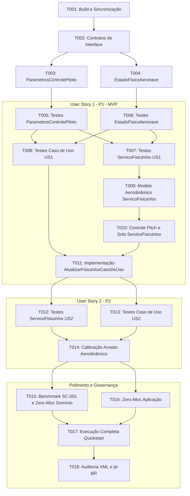

# Tasks: Simulação de Física Aerodinâmica e Controle de Pitch

**Input**: Documentos de design de `/specs/003-fisica-voo-aerodinamica/`  
**Prerequisites**: [plan.md](file:///h:/tmp/RSA/Loterias/JogosMaster/GitHub/AeroAscent/specs/003-fisica-voo-aerodinamica/plan.md), [spec.md](file:///h:/tmp/RSA/Loterias/JogosMaster/GitHub/AeroAscent/specs/003-fisica-voo-aerodinamica/spec.md), [research.md](file:///h:/tmp/RSA/Loterias/JogosMaster/GitHub/AeroAscent/specs/003-fisica-voo-aerodinamica/research.md), [data-model.md](file:///h:/tmp/RSA/Loterias/JogosMaster/GitHub/AeroAscent/specs/003-fisica-voo-aerodinamica/data-model.md), [quickstart.md](file:///h:/tmp/RSA/Loterias/JogosMaster/GitHub/AeroAscent/specs/003-fisica-voo-aerodinamica/quickstart.md), [contracts/](file:///h:/tmp/RSA/Loterias/JogosMaster/GitHub/AeroAscent/specs/003-fisica-voo-aerodinamica/contracts/)  
**Organization**: Tarefas organizadas por fases fundamentais e por histórias de usuário para permitir entrega incremental, isolada e testável.  

---

## Phase 1: Setup (Infraestrutura Compartilhada)

**Purpose**: Preparação do ambiente de trabalho e sincronização de contratos de interface

- [X] T001 Sincronizar e validar compilação da solução AeroAscent na branch `003-fisica-voo-aerodinamica` via `dotnet build AeroAscent.sln`
- [X] T002 [P] Atualizar contrato de domínio `IServicoFisicaVoo` com o método `SimularPasso` em `src/AeroAscent.Core.Dominio/Contratos/IServicoFisicaVoo.cs` e adicionar contrato de aplicação `IAtualizarFisicaVooCasoDeUso` em `src/AeroAscent.Core.Aplicacao/Contratos/IAtualizarFisicaVooCasoDeUso.cs`

---

## Phase 2: Foundational (Pré-Requisitos Bloqueantes)

**Purpose**: Criação dos Objetos de Valor (`readonly record struct`) na stack e seus respectivos testes unitários

**⚠️ CRITICAL**: Nenhuma história de usuário pode ser iniciada antes da conclusão desta fase.

- [X] T003 [P] Implementar o Objeto de Valor `ParametrosControlePiloto` (`readonly record struct`) com intensidade de arfagem ($-1.0$ a $+1.0$), taxa angular e autoestabilização em `src/AeroAscent.Core.Dominio/ObjetosDeValor/ParametrosControlePiloto.cs`
- [X] T004 [P] Implementar o Objeto de Valor `EstadoFisicoAeronave` (`readonly record struct`) com posição 3D, velocidade 3D, inclinação de pitch, força resultante e indicador de solo em `src/AeroAscent.Core.Dominio/ObjetosDeValor/EstadoFisicoAeronave.cs`
- [X] T005 [P] Criar testes unitários para `ParametrosControlePiloto` validando invariantes, clamping e comando ativo em `tests/AeroAscent.Core.Dominio.Testes/ObjetosDeValor/ParametrosControlePilotoTestes.cs`
- [X] T006 [P] Criar testes unitários para `EstadoFisicoAeronave` validando imutabilidade na stack, altitude não-negativa e clamping de pitch ($-45^\circ$ a $+60^\circ$) em `tests/AeroAscent.Core.Dominio.Testes/ObjetosDeValor/EstadoFisicoAeronaveTestes.cs`

**Checkpoint**: Estruturas de dados cinemáticos na stack validadas e prontas. O desenvolvimento das histórias de usuário pode começar.

---

## Phase 3: User Story 1 - Controle de Inclinação do Nariz (Pitch) e Balanço de Forças (Priority: P1) 🎯 MVP

**Goal**: Permitir que o jogador pilote a aeronave no ar com comandos de arfagem (pitch up/down), aplicando forças de sustentação (com estol acolhedor), arrasto induzido, gravidade, autoestabilização e dinâmica de solo com atrito cinético ($\mu = 0.3$) até o repouso e pouso regular.

**Independent Test**: Executar simulações onde pitch up gera sustentação e ganho de altitude, pitch down gera ganho de velocidade em mergulho, estol pós-20° decai suavemente sem punição abrupta, e toque no solo ($Y \le 0$) desacelera a aeronave até $V_z < 0.5\text{ m/s}$, acionando `voo.Pousar()`.

### Testes da User Story 1 ⚠️

- [X] T007 [P] [US1] Criar testes unitários em `tests/AeroAscent.Core.Dominio.Testes/Servicos/ServicoFisicaVooTestes.cs` cobrindo cálculo de sustentação positiva em subida, aceleração em mergulho, estol suave pós-20°, autoestabilização ao soltar comandos e desaceleração por atrito de solo
- [X] T008 [P] [US1] Criar testes unitários para o caso de uso `AtualizarFisicaVooCasoDeUsoTestes` em `tests/AeroAscent.Core.Aplicacao.Testes/CasosDeUso/AtualizarFisicaVooCasoDeUsoTestes.cs` cobrindo atualização de métricas (`DistanciaPercorrida`, `AltitudeMaxima`) e transição automática para `StatusVoo.Pousado`

### Implementação da User Story 1

- [X] T009 [US1] Implementar no serviço de domínio `ServicoFisicaVoo` os métodos matemáticos de coeficiente de sustentação $C_L(\alpha)$ com estol suave acolhedor, coeficiente de arrasto parabólico $C_D$, aceleração da gravidade e integração de Euler Semi-Implícito em `src/AeroAscent.Core.Dominio/Servicos/ServicoFisicaVoo.cs`
- [X] T010 [US1] Implementar no serviço de domínio `ServicoFisicaVoo` a dinâmica de variação angular do pitch por input, limites de inclinação ($-45^\circ$ a $+60^\circ$), autoestabilização e dinâmica de contato/deslizamento no solo com atrito cinético ($\mu = 0.3$) no método `SimularPasso` em `src/AeroAscent.Core.Dominio/Servicos/ServicoFisicaVoo.cs`
- [X] T011 [US1] Implementar o caso de uso `AtualizarFisicaVooCasoDeUso` em `src/AeroAscent.Core.Aplicacao/CasosDeUso/AtualizarFisicaVooCasoDeUso.cs`, orquestrando a atualização periódica do `EstadoFisicoAeronave`, alimentando as métricas da entidade `Voo` e executando `voo.Pousar()` ao parar no solo

**Checkpoint**: User Story 1 100% funcional e testável de forma independente. O loop principal de voo e pouso arcade está concluído (MVP alcançado).

---

## Phase 4: User Story 2 - Influência da Melhoria de Aerodinâmica no Arrasto (Priority: P2)

**Goal**: Garantir que as melhorias de aerodinâmica adquiridas na oficina (níveis 1 a 10) reduzam linearmente o coeficiente de arrasto sofrido pela aeronave ($C_{D\text{efetivo}} = \frac{C_D}{1 + (\text{NivelAerodinamica}-1) \times 0.20}$), proporcionando maior capacidade de planar e maior distância percorrida.

**Independent Test**: Simular duas aeronaves lançadas com o mesmo impulso da catapulta e comandos idênticos: a aeronave nível 5 deve sofrer $44\%$ menos arrasto e percorrer distância horizontal expressivamente maior antes de tocar o solo do que a aeronave nível 1.

### Testes da User Story 2 ⚠️

- [X] T012 [P] [US2] Criar testes comparativos em `tests/AeroAscent.Core.Dominio.Testes/Servicos/ServicoFisicaVooTestes.cs` comprovando a atenuação de arrasto e o ganho de alcance em níveis superiores de aerodinâmica (nível 1 vs nível 5 vs nível 10)
- [X] T013 [P] [US2] Criar testes no caso de uso `AtualizarFisicaVooCasoDeUsoTestes` em `tests/AeroAscent.Core.Aplicacao.Testes/CasosDeUso/AtualizarFisicaVooCasoDeUsoTestes.cs` validando o acúmulo de maior `DistanciaPercorrida` em aeronaves com nível aerodinâmico superior

### Implementação da User Story 2

- [X] T014 [US2] Calibrar a integração do escalonamento de arrasto por nível de aerodinâmica no método `SimularPasso` em `src/AeroAscent.Core.Dominio/Servicos/ServicoFisicaVoo.cs` e atualizar `CalcularProximoPasso` para manter consistência entre as APIs do serviço

**Checkpoint**: User Stories 1 e 2 plenamente operacionais e integradas.

---

## Phase 5: Polish & Cross-Cutting Concerns

**Purpose**: Verificação de limites de latência, conformidade com alocação zero no heap, validação do quickstart e auditoria de documentação em pt-BR.

- [ ] T015 [P] Implementar benchmark de latência de 10.000 passos ($< 0.05\text{ms}$ por passo) e validação de `GC.GetAllocatedBytesForCurrentThread() == 0` em `tests/AeroAscent.Core.Dominio.Testes/Servicos/ServicoFisicaVooTestes.cs`
- [ ] T016 [P] Implementar validação de zero alocação no heap durante a execução do caso de uso `AtualizarFisicaVooCasoDeUso` em `tests/AeroAscent.Core.Aplicacao.Testes/CasosDeUso/AtualizarFisicaVooCasoDeUsoTestes.cs`
- [ ] T017 Executar todos os 6 cenários funcionais do `quickstart.md` e a suíte completa de testes via `dotnet test`
- [ ] T018 [P] Auditar documentação XML (`///`) e mensagens de erro em 100% dos tipos públicos novos e modificados, garantindo adesão estrita ao idioma Português Brasileiro (pt-BR)

---

## Dependencies & Execution Order

---

## Parallel Execution Opportunities

- **Fase 2 (Foundational)**: `T003` (`ParametrosControlePiloto`) e `T004` (`EstadoFisicoAeronave`) podem ser implementados e testados (`T005`, `T006`) em paralelo.
- **Fase 3 (User Story 1)**: Os testes `T007` (Domínio) e `T008` (Aplicação) podem ser escritos em paralelo antes da implementação.
- **Fase 4 (User Story 2)**: Os testes comparativos de nível `T012` e `T013` podem ser criados em paralelo.
- **Fase 5 (Polish)**: `T015`, `T016` e `T018` podem ser executados em paralelo.

---

## Implementation Strategy

### MVP First (User Story 1)
1. Concluir Setup (`T001`, `T002`) e Fundamentos (`T003` a `T006`).
2. Implementar e validar a User Story 1 (`T007` a `T011`).
3. **Checkpoint MVP**: O voo livre com sustentação, mergulho, estol suave, deslizamento no solo e pouso com premiação está 100% operacional e testável.

### Entrega Incremental
1. Adicionar User Story 2 (`T012` a `T014`) para conectar as melhorias de aerodinâmica da oficina à redução de arrasto.
2. Executar polimento (`T015` a `T018`) para auditar performance, zero alocação (`GC Alloc = 0 bytes`) e qualidade de documentação.
