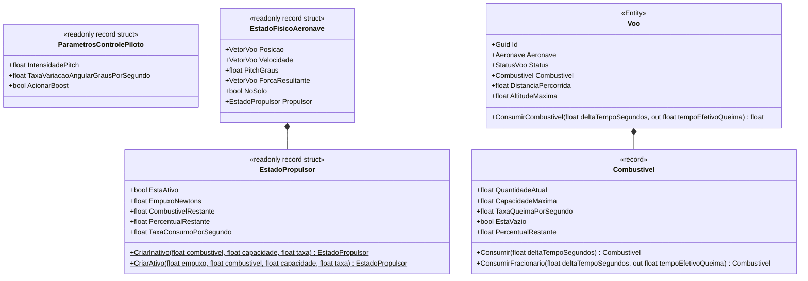
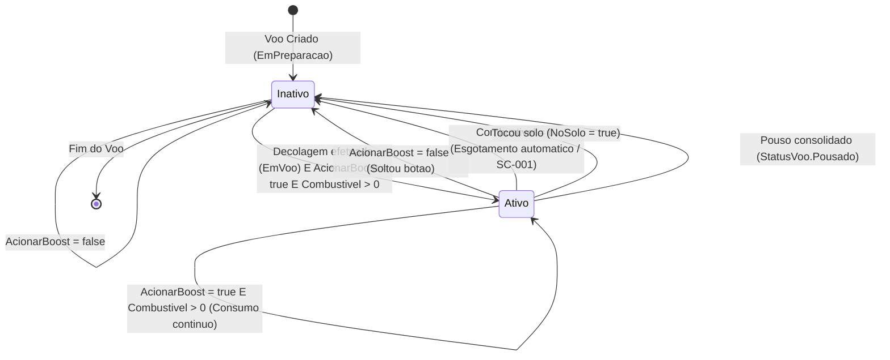

# Modelo de Dados e Ciclo de Estados: Feature 004 (Propulsão, Boost e Combustível)

**Branch**: `004-propulsao-boost-combustivel`  
**Data**: 2026-09-05  
**Documento de Especificação**: [spec.md](file:///h:/tmp/RSA/Loterias/JogosMaster/GitHub/AeroAscent/specs/004-propulsao-boost-combustivel/spec.md)

---

## 1. Visão Geral das Estruturas de Dados

A Feature 004 opera dentro dos princípios de **Domain-Driven Design (DDD)** e **Clean Architecture**, com tipos modelados como `readonly record struct` na stack para garantir alocação zero no heap (`GC Alloc = 0 bytes`) durante a execução do loop contínuo de simulação física (Artigo III.4 da Constituição e SC-002).

---

## 2. Detalhamento dos Objetos de Valor e Entidades

### 2.1. `EstadoPropulsor` (`readonly record struct`)

Representa a telemetria e o estado instantâneo do sistema de propulsão a cada ciclo de simulação física.

- **Namespace**: `AeroAscent.Core.Dominio.ObjetosDeValor`
- **Campos/Propriedades**:
  - `EstaAtivo` (`bool`): `true` se o propulsor estiver gerando empuxo $> 0$ no passo atual; caso contrário, `false`.
  - `EmpuxoNewtons` (`float`): Magnitude instantânea da força de empuxo gerada pelo motor em Newtons ($N$).
  - `CombustivelRestante` (`float`): Volume de combustível restante no tanque em unidades físicas.
  - `PercentualRestante` (`float`): Fração normalizada de combustível restante no tanque ($0.0$ a $1.0$).
  - `TaxaConsumoPorSegundo` (`float`): Taxa de queima configurada ($5.0\text{ un/s}$).
- **Invariantes e Regras**:
  - `EmpuxoNewtons >= 0.0f`.
  - `CombustivelRestante >= 0.0f`.
  - `PercentualRestante` fixado no intervalo $[0.0, 1.0]$.
  - Se `CombustivelRestante == 0.0f`, então `EstaAtivo == false` e `EmpuxoNewtons == 0.0f`.

---

### 2.2. `ParametrosControlePiloto` (`readonly record struct`)

Encapsula todas as entradas de controle informadas pelo jogador a cada frame/passo de simulação.

- **Namespace**: `AeroAscent.Core.Dominio.ObjetosDeValor`
- **Campos/Propriedades**:
  - `IntensidadePitch` (`float`): Entrada normalizada de inclinação do nariz ($-1.0$ a $+1.0$).
  - `TaxaVariacaoAngularGrausPorSegundo` (`float`): Sensibilidade de resposta angular (padrão $45.0^\circ/\text{s}$).
  - `AcionarBoost` (`bool`): Indicador de acionamento do botão de aceleração pelo jogador.
- **Invariantes e Regras**:
  - `IntensidadePitch` clampeada entre $-1.0$ e $+1.0$.
  - `TaxaVariacaoAngularGrausPorSegundo > 0.0f`.

---

### 2.3. `Combustivel` (`record` / `readonly record struct`)

Objeto de valor que representa o reservatório e o consumo de energia propelente da aeronave.

- **Namespace**: `AeroAscent.Core.Dominio.ObjetosDeValor`
- **Campos/Propriedades**:
  - `QuantidadeAtual` (`float`): Litros/unidades atuais disponíveis.
  - `CapacidadeMaxima` (`float`): Limite volumétrico total do tanque.
  - `TaxaQueimaPorSegundo` (`float`): Consumo por segundo de boost ligado ($5.0\text{ un/s}$).
- **Métodos**:
  - `ConsumirFracionario(float deltaTempoSegundos, out float tempoEfetivoQueima)`:
    - Se `EstaVazio` ou `deltaTempoSegundos <= 0f`: `tempoEfetivoQueima = 0f`, retorna `this`.
    - Se `QuantidadeAtual >= TaxaQueimaPorSegundo * deltaTempoSegundos`:
      - `tempoEfetivoQueima = deltaTempoSegundos`.
      - `novaQuantidade = QuantidadeAtual - (TaxaQueimaPorSegundo * deltaTempoSegundos)`.
    - Se `QuantidadeAtual < TaxaQueimaPorSegundo * deltaTempoSegundos`:
      - `tempoEfetivoQueima = QuantidadeAtual / TaxaQueimaPorSegundo`.
      - `novaQuantidade = 0.0f`.
    - Retorna `new Combustivel(novaQuantidade, CapacidadeMaxima, TaxaQueimaPorSegundo)`.

---

### 2.4. `EstadoFisicoAeronave` (`readonly record struct`)

Objeto de valor cinemático estendido com o estado instantâneo da propulsão.

- **Novos Campos**:
  - `Propulsor` (`EstadoPropulsor`): Telemetria e estado atual do boost no término do passo de tempo.

---

### 2.5. `Voo` (`Entity`)

Entidade raiz agregada da sessão de voo ativa.

- **Novos Métodos**:
  - `ConsumirCombustivel(float deltaTempoSegundos, out float tempoEfetivoQueima)`:
    - Valida se `Status == StatusVoo.EmVoo`. Se não estiver (ex: `EmPreparacao`, `Pousado`), define `tempoEfetivoQueima = 0f` e não consome.
    - Executa o consumo fracionário em `Combustivel` e atualiza a propriedade.
    - Retorna `tempoEfetivoQueima`.

---

## 3. Diagrama de Transição de Estados do Propulsor

---

## 4. Fórmulas de Escalonamento e Parâmetros Físicos

| Parâmetro | Símbolo / Expressão | Nível 1 | Nível 5 | Nível 10 (Max) |
|---|---|---|---|---|
| **Empuxo Escalar ($T$)** | $120.0 \times (1 + (\text{NivelMotor} - 1) \times 0.30)$ | $120.0\text{ N}$ | $264.0\text{ N}$ | $444.0\text{ N}$ |
| **Capacidade do Tanque** | $20.0 \times (1 + (\text{NivelTanque} - 1) \times 0.25)$ | $20.0\text{ un}$ | $40.0\text{ un}$ | $65.0\text{ un}$ |
| **Taxa de Consumo** | $5.0\text{ un/s}$ | $5.0\text{ un/s}$ | $5.0\text{ un/s}$ | $5.0\text{ un/s}$ |
| **Tempo Total de Queima** | $\text{Capacidade} / \text{TaxaConsumo}$ | $4.00\text{ s}$ | $8.00\text{ s}$ | $13.00\text{ s}$ |
| **Aceleração Max Longitudinal** | $T / \text{Massa}$ ($m = 10.0\text{ kg}$) | $12.0\text{ m/s}^2$ | $26.4\text{ m/s}^2$ | $44.4\text{ m/s}^2$ |
