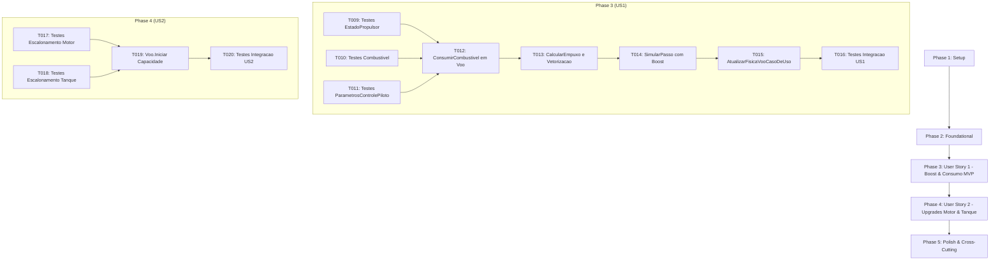

# Tarefas de Implementação (Tasks): Sistema de Propulsão (Boost) e Queima de Combustível

**Feature**: `004-propulsao-boost-combustivel`  
**Data**: 2026-09-05  
**Documento de Especificação**: [spec.md](file:///h:/tmp/RSA/Loterias/JogosMaster/GitHub/AeroAscent/specs/004-propulsao-boost-combustivel/spec.md)  
**Plano de Implementação**: [plan.md](file:///h:/tmp/RSA/Loterias/JogosMaster/GitHub/AeroAscent/specs/004-propulsao-boost-combustivel/plan.md)  
**Modelo de Dados**: [data-model.md](file:///h:/tmp/RSA/Loterias/JogosMaster/GitHub/AeroAscent/specs/004-propulsao-boost-combustivel/data-model.md)  
**Guia de Validação Rápida**: [quickstart.md](file:///h:/tmp/RSA/Loterias/JogosMaster/GitHub/AeroAscent/specs/004-propulsao-boost-combustivel/quickstart.md)  

---

## Formato dos Itens: `- [ ] [TaskID] [P?] [Story?] Descrição com caminho do arquivo`

- **[P]**: Tarefa paralelizada (arquivos distintos, sem dependência de tarefas incompletas).
- **[Story]**: Rótulo da história de usuário correspondente (`[US1]`, `[US2]`). Apenas fases de histórias de usuário possuem este identificador.
- Todas as tarefas especificam o caminho relativo do arquivo no repositório.

---

## Phase 1: Setup (Infraestrutura Compartilhada)

**Propósito**: Validação da solução .NET e preparação de utilitários e fixtures de teste para propulsão.

- [x] T001 Verificar compatibilidade da solução e alinhamento de referências em `AeroAscent.slnx`
- [x] T002 [P] Configurar fixtures de teste e dados de apoio para simulação de boost e combustível em `tests/AeroAscent.Core.Dominio.Testes/Fixtures/`

---

## Phase 2: Foundational (Pré-requisitos Bloqueantes)

**Propósito**: Criação e enriquecimento das estruturas de dados base e contratos que suportam todas as histórias de usuário.

**⚠️ CRÍTICO**: Nenhuma implementação de história de usuário pode começar antes da conclusão desta fase.

- [ ] T003 [P] Criar o objeto de valor `EstadoPropulsor` (`readonly record struct`) na stack em `src/AeroAscent.Core.Dominio/ObjetosDeValor/EstadoPropulsor.cs`
- [ ] T004 [P] Enriquecer `ParametrosControlePiloto` com a propriedade `bool AcionarBoost` e construtores compatíveis em `src/AeroAscent.Core.Dominio/ObjetosDeValor/ParametrosControlePiloto.cs`
- [ ] T005 [P] Enriquecer `Combustivel` com o método `ConsumirFracionario(float deltaTempoSegundos, out float tempoEfetivoQueima)` em `src/AeroAscent.Core.Dominio/ObjetosDeValor/Combustivel.cs`
- [ ] T006 Enriquecer `EstadoFisicoAeronave` para incorporar a propriedade `EstadoPropulsor Propulsor` com zero alocação no heap em `src/AeroAscent.Core.Dominio/ObjetosDeValor/EstadoFisicoAeronave.cs`
- [ ] T007 Atualizar o contrato `IServicoFisicaVoo` com sobrecargas de propulsão e método `CalcularEmpuxoMotor` em `src/AeroAscent.Core.Dominio/Contratos/IServicoFisicaVoo.cs`
- [ ] T008 Atualizar o contrato `IAtualizarFisicaVooCasoDeUso` com documentação da propulsão e boost em `src/AeroAscent.Core.Aplicacao/Contratos/IAtualizarFisicaVooCasoDeUso.cs`

**Ponto de Verificação**: Estruturas de dados de domínio e contratos prontos. A implementação das histórias de usuário pode ser iniciada.

---

## Phase 3: User Story 1 - Acionamento de Impulso Extra (Boost) com Consumo de Combustível (Priority: P1) 🎯 MVP

**Objetivo**: Permitir ao jogador em voo ativo acionar e manter o botão de boost para acelerar a aeronave na direção de seu nariz (ângulo de pitch), consumindo combustível à taxa contínua de $5.0\text{ un/s}$ e cortando instantaneamente o empuxo ao esgotar.

**Critério de Teste Independente**: Em simulação com tanque cheio por 2.0s, verificar consumo exato de $10.0\text{ un}$ de combustível e aceleração longitudinal/vertical alinhada ao pitch; com tanque zerado, comprovar corte imediato de empuxo.

### Testes da User Story 1

- [ ] T009 [P] [US1] Criar testes unitários para `EstadoPropulsor` (criação ativo/inativo, invariantes e limites) em `tests/AeroAscent.Core.Dominio.Testes/ObjetosDeValor/EstadoPropulsorTestes.cs`
- [ ] T010 [P] [US1] Criar testes unitários para `Combustivel.ConsumirFracionario` cobrindo queima normal e queima residual em `tests/AeroAscent.Core.Dominio.Testes/ObjetosDeValor/CombustivelTestes.cs`
- [ ] T011 [P] [US1] Criar testes unitários para `ParametrosControlePiloto` validando a flag `AcionarBoost` em `tests/AeroAscent.Core.Dominio.Testes/ObjetosDeValor/ParametrosControlePilotoTestes.cs`

### Implementação da User Story 1

- [ ] T012 [US1] Implementar o método `ConsumirCombustivel` com validação estrita de status `EmVoo` na entidade `Voo` em `src/AeroAscent.Core.Dominio/Entidades/Voo.cs`
- [ ] T013 [US1] Implementar os métodos `CalcularEmpuxoMotor`, `AplicarPropulsaoMotor` e decomposição trigonométrica no pitch em `src/AeroAscent.Core.Dominio/Servicos/ServicoFisicaVoo.cs`
- [ ] T014 [US1] Implementar a sobrecarga de `SimularPasso` integrando forças aerodinâmicas e empuxo de queima fracionária em `src/AeroAscent.Core.Dominio/Servicos/ServicoFisicaVoo.cs`
- [ ] T015 [US1] Integrar o consumo de combustível e a simulação de boost no caso de uso `AtualizarFisicaVooCasoDeUso` em `src/AeroAscent.Core.Aplicacao/CasosDeUso/AtualizarFisicaVooCasoDeUso.cs`
- [ ] T016 [US1] Criar testes de integração cobrindo o acionamento de boost, queima e corte por esgotamento em `tests/AeroAscent.Core.Aplicacao.Testes/CasosDeUso/AtualizarFisicaVooCasoDeUsoTestes.cs`

**Ponto de Verificação**: User Story 1 (MVP) 100% funcional e testável de forma independente.

---

## Phase 4: User Story 2 - Impacto dos Upgrades de Motor e Tanque (Priority: P2)

**Objetivo**: Garantir que as melhorias de motor aumentem a força de empuxo ($120.0 \times [1 + (N-1) \times 0.30]\text{ N}$) e melhorias de tanque aumentem a capacidade total de combustível ($20.0 \times [1 + (N-1) \times 0.25]\text{ un}$), estendendo a autonomia de boost.

**Critério de Teste Independente**: Comparar a aceleração de aeronaves com motor nível 1 vs nível 3 e a duração total de queima de tanques nível 1 vs nível 3, validando ganhos proporcionais exatos.

### Testes da User Story 2

- [ ] T017 [P] [US2] Criar testes unitários para escalonamento da força de empuxo por nível de motor em `tests/AeroAscent.Core.Dominio.Testes/Servicos/ServicoFisicaVooTestes.cs`
- [ ] T018 [P] [US2] Criar testes unitários para escalonamento da capacidade volumétrica do tanque por nível em `tests/AeroAscent.Core.Dominio.Testes/Entidades/VooTestes.cs`

### Implementação da User Story 2

- [ ] T019 [US2] Atualizar o método fábrica `Voo.Iniciar` para inicializar `Combustivel` com capacidade calculada por $20.0 \times (1 + (\text{NivelTanque}-1) \times 0.25)$ em `src/AeroAscent.Core.Dominio/Entidades/Voo.cs`
- [ ] T020 [US2] Criar testes de integração validando o escalonamento conjunto de aceleração e duração de boost via caso de uso em `tests/AeroAscent.Core.Aplicacao.Testes/CasosDeUso/AtualizarFisicaVooCasoDeUsoTestes.cs`

**Ponto de Verificação**: User Stories 1 e 2 plenamente operacionais e integradas.

---

## Phase 5: Polish & Cross-Cutting Concerns

**Propósito**: Validação dos requisitos de qualidade, critérios de sucesso mensuráveis, casos de borda e documentação técnica.

- [ ] T021 [P] Criar teste automatizado de queima fracionária com asserção de erro temporal de corte $< 1\text{ms}$ (SC-001) em `tests/AeroAscent.Core.Aplicacao.Testes/CasosDeUso/AtualizarFisicaVooCasoDeUsoTestes.cs`
- [ ] T022 [P] Criar teste de benchmark de 10.000 passos com validação de `GC.GetAllocatedBytesForCurrentThread() == 0` (SC-002) em `tests/AeroAscent.Core.Aplicacao.Testes/CasosDeUso/AtualizarFisicaVooCasoDeUsoTestes.cs`
- [ ] T023 [P] Criar testes cobrindo bloqueio de boost na catapulta (`EmPreparacao`), no solo (`NoSolo = true`), em status `Pousado` e pulsos intermitentes em `tests/AeroAscent.Core.Aplicacao.Testes/CasosDeUso/AtualizarFisicaVooCasoDeUsoTestes.cs`
- [ ] T024 Executar suíte completa de testes automatizados com `dotnet test AeroAscent.slnx` garantindo 100% de sucesso e zero regressões (SC-003) em `tests/`
- [ ] T025 Revisar documentação XML (`///`) de todas as novas classes, métodos, structs e propriedades públicas em pt-BR conforme GEMINI.md

---

## Dependências entre Fases e Histórias de Usuário

---

## Oportunidades de Execução Paralela

- **Foundational**: T003 (`EstadoPropulsor`), T004 (`ParametrosControlePiloto`) e T005 (`Combustivel`) operam em arquivos isolados e podem ser construídos simultaneamente.
- **Testes US1**: T009, T010 e T011 testam objetos de valor distintos e podem ser implementados em paralelo.
- **Testes US2**: T017 e T018 cobrem motor e tanque em arquivos separados e podem ser implementados em paralelo.
- **Polish / Qualidade**: T021 (SC-001), T022 (SC-002) e T023 (Casos de borda) exercitam aspectos complementares de validação.

---

## Estratégia de Implementação e MVP

1. **Incremento MVP (Fases 1, 2 e 3)**:
   - Entrega a mecânica central: jogador ativa o boost em voo, consome combustível contínuo ($5.0\text{ un/s}$) e acelera com base na inclinação do nariz, com corte automático ao esgotar.
   - Fornece valor de gameplay completo e imediato para a experiência de voo.
2. **Incremento de Progressão (Fase 4)**:
   - Conecta a economia de melhorias da oficina com a potência do motor e a durabilidade do tanque de combustível.
3. **Incremento de Rigor e Qualidade (Fase 5)**:
   - Blinda o sistema com benchmarks de zero alocação (`GC Alloc = 0 bytes`), erro temporal $< 1\text{ms}$ e bloqueios contra abusos em solo e na catapulta.
