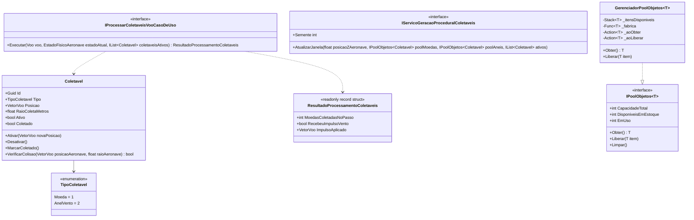

# Modelo de Dados: Feature 005 — Coletáveis em Voo e Object Pooling

## 🗺️ Diagrama de Relacionamento de Entidades e Tipos

---

## 📦 Detalhamento dos Componentes de Domínio

### 1. Enum `TipoColetavel`
- **Camada**: `AeroAscent.Core.Dominio.Enums`
- **Valores**:
  - `Moeda = 1`: Moeda dourada flutuante que acrescenta recursos à pontuação da sessão de voo.
  - `AnelVento = 2`: Anel aerodinâmico de ar pressurizado (*Air Boost Ring*) que confere impulso instantâneo de velocidade para frente.

---

### 2. Entidade `Coletavel`
- **Camada**: `AeroAscent.Core.Dominio.Entidades`
- **Responsabilidade**: Representa uma instância física de coletável no mundo 3D (plano $Y-Z$) reutilizável via pooling.
- **Campos e Propriedades**:
  | Campo / Propriedade | Tipo | Descrição |
  |---|---|---|
  | `Id` | `Guid` | Identificador único da entidade. |
  | `Tipo` | `TipoColetavel` | Tipo de coletável (`Moeda` ou `AnelVento`). |
  | `Posicao` | `VetorVoo` | Posição tridimensional ($X=0$, $Y=\text{altitude}$, $Z=\text{avanço}$). |
  | `RaioColetaMetros` | `float` | Raio esférico/circular de detecção ($1.5\text{m}$ para moeda, $3.5\text{m}$ para anel). |
  | `Ativo` | `bool` | Indica se o objeto está visível e ativo no mundo de jogo. |
  | `Coletado` | `bool` | Indica se o coletável já foi capturado e aguarda reciclagem. |
- **Métodos**:
  - `void Ativar(VetorVoo novaPosicao)`: Posiciona o coletável e reseta flags (`Ativo = true`, `Coletado = false`).
  - `void Desativar()`: Desativa o coletável (`Ativo = false`).
  - `void MarcarColetado()`: Registra a captura (`Coletado = true`, `Ativo = false`).
  - `bool VerificarColisao(VetorVoo posicaoAeronave, float raioAeronave = 0.5f)`: Calcula em $O(1)$ sem raiz quadrada se a aeronave tocou o coletável.
- **Fábricas**:
  - `Coletavel.CriarMoeda(VetorVoo posicao)` (raio $1.5\text{m}$)
  - `Coletavel.CriarAnelVento(VetorVoo posicao)` (raio $3.5\text{m}$)

---

### 3. Struct `ResultadoProcessamentoColetaveis`
- **Camada**: `AeroAscent.Core.Dominio.ObjetosDeValor`
- **Responsabilidade**: Struct imutável alocado exclusivamente na stack (`readonly record struct`, `GC Alloc = 0 bytes`) encapsulando as consequências imediatas da interação da aeronave com os coletáveis naquele frame.
- **Propriedades**:
  - `int MoedasColetadasNoPasso`: Quantidade de moedas capturadas no frame (ex: 0, 1, 2...).
  - `bool RecebeuImpulsoVento`: Indica se pelo menos um anel de vento foi atravessado.
  - `VetorVoo ImpulsoAplicado`: Vetor de velocidade instantâneo adicionado (ex: $+10.0\text{ m/s}$ na direção de $\vec{V}$).
  - `EstadoFisicoAeronave NovoEstadoFisico`: Estado cinemático da aeronave após a aplicação do impulso.

---

### 4. Interface e Classe Genérica de Pooling (`IPoolObjetos<T>` & `GerenciadorPoolObjetos<T>`)
- **Camada**: `AeroAscent.Core.Dominio.Comum` (ou `Infraestrutura`)
- **Responsabilidade**: Gerenciamento de reciclagem e reaproveitamento de instâncias com $O(1)$ e alocação zero no loop contínuo.
- **Propriedades**:
  - `int CapacidadeTotal { get; }`
  - `int DisponiveisEmEstoque { get; }`
  - `int EmUso { get; }`
- **Métodos**:
  - `T Obter()`: Retira um objeto disponível do topo da pilha e invoca o callback de ativação.
  - `void Liberar(T item)`: Invoca o callback de desativação e devolve o objeto à pilha.
  - `void Limpar()`: Esvazia e reseta o pool.

---

### 5. Serviço de Geração Procedural (`IServicoGeracaoProceduralColetaveis`)
- **Camada**: `AeroAscent.Core.Dominio.Contratos`
- **Responsabilidade**: Determina o spawn e reciclagem de coletáveis na janela espacial dinâmica:
  - Janela ativa: $[Z_{\text{aeronave}} + 30\text{ m}, Z_{\text{aeronave}} + 150\text{ m}]$;
  - Altitude navegável: $[5\text{ m}, 120\text{ m}]$;
  - Reciclagem automática: $Z < Z_{\text{aeronave}} - 20\text{ m}$.

---

### 6. Caso de Uso de Aplicação (`IProcessarColetaveisVooCasoDeUso`)
- **Camada**: `AeroAscent.Core.Aplicacao.Contratos`
- **Responsabilidade**: Orquestra a detecção de colisões, o incremento de saldo na entidade `Voo`, o impulso no `EstadoFisicoAeronave` e a reciclagem de instâncias no pool.
