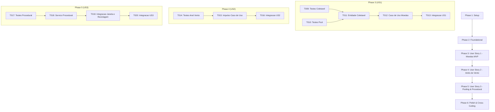

# Tasks: Feature 005 — Sistema de Coletáveis em Voo e Object Pooling

**Input**: Documentos de design em `/specs/005-coletaveis-ambiente-pooling/` (`spec.md`, `plan.md`, `research.md`, `data-model.md`, `contracts/`, `quickstart.md`)  
**Prerequisites**: `plan.md` e `spec.md` concluídos; branch ativa: `005-coletaveis-ambiente-pooling`  
**Tests**: Testes automatizados obrigatórios com xUnit e asserção de memória estrita (`GC Alloc = 0 bytes`).  
**Organization**: Tarefas agrupadas por fases e histórias de usuário para entrega incremental e teste independente.

---

## Formato das Tarefas: `- [ ] [ID] [P?] [Story] Descrição com caminho do arquivo`

- **[P]**: Tarefa paralelizada (arquivos independentes, sem dependência de tarefa anterior incompleta).
- **[Story]**: História de usuário à qual a tarefa pertence ([US1], [US2], [US3]).
- Todas as tarefas possuem caminhos de arquivo absolutos ou relativos à raiz do projeto.

---

## Phase 1: Setup (Shared Infrastructure)

**Propósito**: Preparação do ambiente de testes e estruturas compartilhadas da Feature 005.

- [ ] T001 Validar a integridade da solução e compilação de todas as camadas em `AeroAscent.slnx`
- [ ] T002 [P] Criar fixtures e utilitários de teste de coletáveis e pooling em `tests/AeroAscent.Core.Dominio.Testes/Fixtures/ColetaveisTestFixture.cs`

---

## Phase 2: Foundational (Blocking Prerequisites)

**Propósito**: Modelos fundamentais, enums, structs na stack e contratos essenciais antes das histórias de usuário.

**⚠️ CRÍTICO**: Nenhuma implementação de história de usuário pode começar sem concluir esta fase.

- [ ] T003 [P] Criar o enum `TipoColetavel` (`Moeda = 1`, `AnelVento = 2`) em `src/AeroAscent.Core.Dominio/Enums/TipoColetavel.cs`
- [ ] T004 [P] Criar a interface genérica `IPoolObjetos<T>` com zero alocação no heap em `src/AeroAscent.Core.Dominio/Comum/IPoolObjetos.cs`
- [ ] T005 [P] Implementar a classe genérica `GerenciadorPoolObjetos<T>` com pilha O(1) e expansão elástica de segurança em `src/AeroAscent.Core.Dominio/Comum/GerenciadorPoolObjetos.cs`
- [ ] T006 [P] Criar a struct imutável `ResultadoProcessamentoColetaveis` (`readonly record struct` na stack) em `src/AeroAscent.Core.Dominio/ObjetosDeValor/ResultadoProcessamentoColetaveis.cs`
- [ ] T007 [P] Criar a interface `IServicoGeracaoProceduralColetaveis` em `src/AeroAscent.Core.Dominio/Contratos/IServicoGeracaoProceduralColetaveis.cs`
- [ ] T008 [P] Criar a interface `IProcessarColetaveisVooCasoDeUso` em `src/AeroAscent.Core.Aplicacao/Contratos/IProcessarColetaveisVooCasoDeUso.cs`

**Ponto de Verificação**: Estruturas de dados, contratos e gerenciador de pool de objetos prontos para as histórias de usuário.

---

## Phase 3: User Story 1 - Coleta de Moedas Flutuantes Durante o Voo (Priority: P1) 🎯 MVP

**Objetivo**: Permitir ao jogador em voo colidir com moedas suspensas no ar (raio de 1.5m), somando moedas ao saldo da sessão de `Voo` e reciclando as moedas no pool sem gerar lixo no GC.

**Critério de Teste Independente**: Instanciar uma moeda na coordenada $Z=100\text{ m}, Y=25\text{ m}$, mover a aeronave através da posição e comprovar que `voo.MoedasColetadas` é incrementado em 1 e que a moeda é desativada e devolvida ao pool sem nova coleta na mesma coordenada.

### Testes da User Story 1

- [ ] T009 [P] [US1] Criar testes unitários para a entidade `Coletavel` (moeda, raio 1.5m, colisão O(1) sem raiz quadrada e desativação) em `tests/AeroAscent.Core.Dominio.Testes/Entidades/ColetavelTestes.cs`
- [ ] T010 [P] [US1] Criar testes unitários para `GerenciadorPoolObjetos<Coletavel>` (obtenção, liberação e estoque) em `tests/AeroAscent.Core.Dominio.Testes/Comum/GerenciadorPoolObjetosTestes.cs`

### Implementação da User Story 1

- [ ] T011 [US1] Implementar a entidade `Coletavel` com métodos `Ativar`, `Desativar`, `MarcarColetado` e `VerificarColisao` em `src/AeroAscent.Core.Dominio/Entidades/Coletavel.cs`
- [ ] T012 [US1] Implementar o caso de uso `ProcessarColetaveisVooCasoDeUso` com suporte à coleta de moedas, pontuação em `Voo` e liberação no pool em `src/AeroAscent.Core.Aplicacao/CasosDeUso/ProcessarColetaveisVooCasoDeUso.cs`
- [ ] T013 [US1] Criar testes de integração validando coleta de moeda e incremento no saldo de `Voo` via caso de uso em `tests/AeroAscent.Core.Aplicacao.Testes/CasosDeUso/ProcessarColetaveisVooCasoDeUsoTestes.cs`

**Ponto de Verificação**: User Story 1 (MVP) plenamente funcional e testável de forma independente.

---

## Phase 4: User Story 2 - Atravessar Anéis de Impulso de Vento (Priority: P2)

**Objetivo**: Permitir à aeronave atravessar anéis de vento (*Air Boost Rings*, raio 3.5m) para receber um impulso instantâneo de $+10.0\text{ m/s}$ projetado no vetor velocidade sem consumir combustível.

**Critério de Teste Independente**: Aeronave voando a $15.0\text{ m/s}$ atravessa anel de vento em $Z=80\text{ m}, Y=30\text{ m}$ e sua velocidade atinge instantaneamente $25.0\text{ m/s}$, mantendo intacto o combustível.

### Testes da User Story 2

- [ ] T014 [P] [US2] Criar testes unitários para `Coletavel.CriarAnelVento` com raio de 3.5m e injeção do vetor de impulso em `tests/AeroAscent.Core.Dominio.Testes/Entidades/ColetavelTestes.cs`

### Implementação da User Story 2

- [ ] T015 [US2] Atualizar o caso de uso `ProcessarColetaveisVooCasoDeUso` para aplicar o impulso de $+10.0\text{ m/s}$ na direção de velocidade da aeronave em `src/AeroAscent.Core.Aplicacao/CasosDeUso/ProcessarColetaveisVooCasoDeUso.cs`
- [ ] T016 [US2] Criar testes de integração para passagem pelo anel com acréscimo de $+10.0\text{ m/s}$ e preservação de combustível em `tests/AeroAscent.Core.Aplicacao.Testes/CasosDeUso/ProcessarColetaveisVooCasoDeUsoTestes.cs`

**Ponto de Verificação**: User Stories 1 e 2 funcionando de forma integrada.

---

## Phase 5: User Story 3 - Reutilização de Objetos via Pooling com Zero GC e Geração Procedural (Priority: P3)

**Objetivo**: Gerar proceduralmente moedas e anéis em janela ativa ($+30\text{ m}$ a $+150\text{ m}$ à frente) e reciclar automaticamente coletáveis quando $Z < Z_{\text{aeronave}} - 20\text{ m}$ sem alocação contínua no heap (`GC Alloc = 0 bytes`).

**Critério de Teste Independente**: Avanço da aeronave de $Z=0$ para $Z=100\text{ m}$ recicla 100% dos coletáveis com $Z < 80\text{ m}$ e mantém zero alocações no heap durante 1.000 reciclagens.

### Testes da User Story 3

- [ ] T017 [P] [US3] Criar testes unitários para `ServicoGeracaoProceduralColetaveis` validando janelas de spawn, faixas de altitude e determinismo em `tests/AeroAscent.Core.Dominio.Testes/Servicos/ServicoGeracaoProceduralColetaveisTestes.cs`

### Implementação da User Story 3

- [ ] T018 [US3] Implementar o serviço `ServicoGeracaoProceduralColetaveis` com spawn e reciclagem em janela dinâmica em `src/AeroAscent.Core.Dominio/Servicos/ServicoGeracaoProceduralColetaveis.cs`
- [ ] T019 [US3] Integrar a geração e reciclagem automática no fluxo de simulação do caso de uso em `src/AeroAscent.Core.Aplicacao/CasosDeUso/ProcessarColetaveisVooCasoDeUso.cs`
- [ ] T020 [US3] Criar testes de integração para geração procedural contínua e reciclagem traseira (SC-003) em `tests/AeroAscent.Core.Aplicacao.Testes/CasosDeUso/ProcessarColetaveisVooCasoDeUsoTestes.cs`

**Ponto de Verificação**: Geração procedural, janelas dinâmicas e pooling 100% integrados.

---

## Phase 6: Polish & Cross-Cutting Concerns

**Propósito**: Validação dos critérios de sucesso mensuráveis, benchmarks de alocação zero, limites de latência e documentação técnica.

- [ ] T021 [P] Criar teste automatizado de benchmark de 10.000 iterações de pooling com validação de `GC.GetAllocatedBytesForCurrentThread() == 0` (SC-001) em `tests/AeroAscent.Core.Dominio.Testes/Comum/GerenciadorPoolObjetosTestes.cs`
- [ ] T022 [P] Criar teste automatizado de benchmark de latência com detecção de proximidade em tela em menos de 0.1ms por frame (SC-002) em `tests/AeroAscent.Core.Aplicacao.Testes/CasosDeUso/ProcessarColetaveisVooCasoDeUsoTestes.cs`
- [ ] T023 [P] Criar testes para casos de borda (múltiplas moedas no mesmo passo, pool vazio com expansão elástica e aeronave em solo) em `tests/AeroAscent.Core.Aplicacao.Testes/CasosDeUso/ProcessarColetaveisVooCasoDeUsoTestes.cs`
- [ ] T024 Executar suíte completa de testes automatizados com `dotnet test AeroAscent.slnx` garantindo 100% de sucesso e zero regressões em `tests/`
- [ ] T025 Revisar documentação XML (`///`) de todas as novas classes, métodos, structs e propriedades públicas em pt-BR conforme GEMINI.md

---

## Dependências entre Fases e Histórias de Usuário

---

## Estratégia de Execução Paralela

- **Paralelo 1 (Setup e Fundações)**: `T002`, `T003`, `T004`, `T006`, `T007`, `T008` podem ser implementados e testados simultaneamente.
- **Paralelo 2 (Testes de US1)**: `T009` e `T010` podem ser construídos em paralelo antes de `T011`.
- **Paralelo 3 (Fase de Qualidade)**: `T021`, `T022`, `T023` podem ser executados concorrentemente antes de `T024`.
