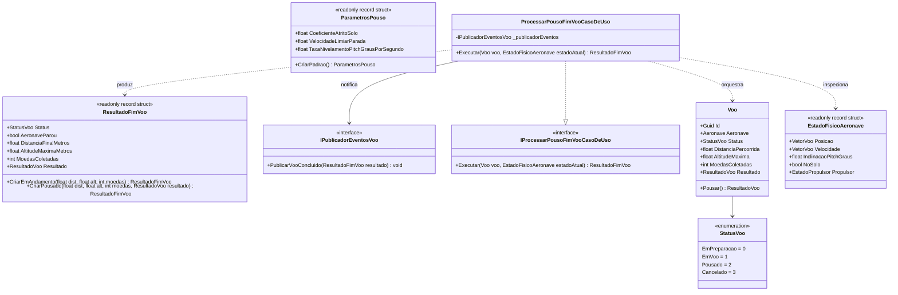

# Modelo de Dados e Arquitetura de Domínio: Feature 006 — Detecção de Pouso e Transição de Fim de Voo

**Branch**: `006-deteccao-pouso-fim-voo` | **Data**: 2026-09-05  
**Spec**: [spec.md](./spec.md) | **Pesquisa**: [research.md](./research.md)

---

## 🏛️ Diagrama de Entidades e Relacionamentos

---

## 📦 Detalhamento dos Componentes de Domínio

### 1. Struct na Stack `ParametrosPouso`
- **Camada**: `AeroAscent.Core.Dominio.ObjetosDeValor`
- **Responsabilidade**: Struct imutável na stack (`readonly record struct`, `GC Alloc = 0 bytes`) encapsulando as propriedades físicas da interação com a superfície de pouso.
- **Campos e Propriedades**:
  | Campo / Propriedade | Tipo | Descrição |
  |---|---|---|
  | `CoeficienteAtritoSolo` | `float` | Coeficiente de atrito cinético de deslizamento ($\mu = 0.3\text{f}$). |
  | `VelocidadeLimiarParada` | `float` | Limiar inferior de velocidade horizontal para congelamento ($0.15\text{ m/s}$). |
  | `TaxaNivelamentoPitchGrausPorSegundo` | `float` | Velocidade angular de restauração horizontal do nariz da aeronave ($15.0^\circ/\text{s}$). |
- **Fábrica**:
  - `ParametrosPouso.CriarPadrao()`: Retorna os parâmetros com $\mu = 0.3$, limiar $= 0.15\text{ m/s}$ e taxa de nivelamento $= 15.0^\circ/\text{s}$.

---

### 2. Struct na Stack `ResultadoFimVoo`
- **Camada**: `AeroAscent.Core.Dominio.ObjetosDeValor`
- **Responsabilidade**: Struct imutável alocado exclusivamente na stack (`readonly record struct`, `GC Alloc = 0 bytes`) encapsulando o veredito instantâneo do pouso e as métricas finais consolidadas da sessão.
- **Campos e Propriedades**:
  | Campo / Propriedade | Tipo | Descrição |
  |---|---|---|
  | `Status` | `StatusVoo` | Status atual da sessão de voo (`EmVoo` ou `Pousado`). |
  | `AeronaveParou` | `bool` | Indica se a aeronave já atingiu repouso absoluto no solo ($V_z == 0$). |
  | `DistanciaFinalMetros` | `float` | Distância final percorrida no eixo horizontal Z em metros. |
  | `AltitudeMaximaMetros` | `float` | Maior altitude vertical alcançada pela aeronave durante todo o voo. |
  | `MoedasColetadas` | `int` | Total de moedas capturadas no percurso da sessão. |
  | `Resultado` | `ResultadoVoo?` | Instância imutável do cálculo final de premiação e experiência (se pousado). |
- **Fábricas**:
  - `ResultadoFimVoo.CriarEmAndamento(float distancia, float altitude, int moedas)`: Sessão ainda ativa ou em deslizamento.
  - `ResultadoFimVoo.CriarPousado(float distancia, float altitude, int moedas, ResultadoVoo resultado)`: Pouso consumado com sucesso.

---

### 3. Interface de Contrato `IPublicadorEventosVoo`
- **Camada**: `AeroAscent.Core.Dominio.Contratos`
- **Responsabilidade**: Abstração pura para emissão desacoplada de eventos de domínio relacionados ao ciclo de vida do voo.
- **Métodos**:
  - `void PublicarVooConcluido(ResultadoFimVoo resultado)`: Notifica os ouvintes (UI Canvas, Gerenciador de Áudio, Salvamento de Progresso) sobre a conclusão regular do voo.

---

### 4. Caso de Uso de Aplicação `IProcessarPousoFimVooCasoDeUso`
- **Camada**: `AeroAscent.Core.Aplicacao.Contratos`
- **Responsabilidade**: Contrato do caso de uso de aplicação que avalia o estado cinemático da aeronave no solo, comanda a finalização de `Voo` e notifica observadores.
- **Método**:
  - `ResultadoFimVoo Executar(Voo voo, EstadoFisicoAeronave estadoAtual)`: Executa a validação de repouso e a transição atômica.

---

### 5. Atualizações no Serviço de Domínio `ServicoFisicaVoo`
- **Camada**: `AeroAscent.Core.Dominio.Servicos`
- **Constantes**:
  - `VELOCIDADE_LIMIAR_PARADA_SOLO = 0.15f;`
  - `TAXA_NIVELAMENTO_PITCH_SOLO_GRAUS = 15.0f;`
- **Regras Físicas Atualizadas**:
  - **Absorção de Impacto**: No solo ($Y \le 0$), $Y$ é clampado em $0.0\text{ m}$ e $V_y$ em $0.0\text{ m/s}$.
  - **Desaceleração por Atrito**: $a_{\text{atrito}} = \mu \cdot g = 0.3 \cdot 9.81 = 2.943\text{ m/s}^2$.
  - **Parada e Congelamento**: Se $V_z < 0.15\text{ m/s}$, $V_z$ é forçado a $0.0\text{ m/s}$, o pitch torna-se $0.0^\circ$, o propulsor permanece inativo e a força resultante é nula.
  - **Bloqueio de Comandos no Solo**: Não há aplicação de empuxo (boost) nem torque de arfagem enquanto `NoSolo == true`.
