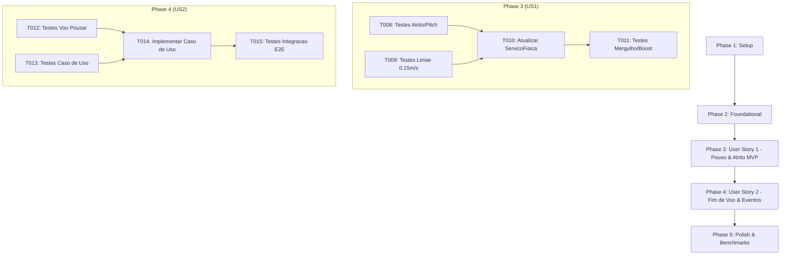

# Tasks: Feature 006 — Detecção de Pouso e Transição de Fim de Voo

**Input**: Documentos de design em `/specs/006-deteccao-pouso-fim-voo/` (`spec.md`, `plan.md`, `research.md`, `data-model.md`, `contracts/`, `quickstart.md`)  
**Prerequisites**: `plan.md` e `spec.md` concluídos; branch ativa: `006-deteccao-pouso-fim-voo`  
**Tests**: Testes automatizados obrigatórios com xUnit e asserções estritas de memória (`GC Alloc = 0 bytes`).  
**Organization**: Tarefas agrupadas por fases e histórias de usuário para entrega incremental e teste independente.

---

## Formato das Tarefas: `- [ ] [ID] [P?] [Story] Descrição com caminho do arquivo`

- **[P]**: Tarefa paralelizada (arquivos independentes, sem dependência de tarefa anterior incompleta).
- **[Story]**: História de usuário à qual a tarefa pertence ([US1], [US2]).
- Todas as tarefas possuem caminhos de arquivo absolutos ou relativos à raiz do projeto.

---

## Phase 1: Setup (Shared Infrastructure)

**Propósito**: Preparação do ambiente de testes e estruturas compartilhadas da Feature 006.

- [x] T001 Validar a integridade da solução e compilação de todas as camadas em `AeroAscent.slnx`
- [x] T002 [P] Criar fixtures e utilitários de teste de pouso e física de solo em `tests/AeroAscent.Core.Dominio.Testes/Fixtures/PousoTestFixture.cs`

---

## Phase 2: Foundational (Blocking Prerequisites)

**Propósito**: Modelos fundamentais, structs na stack e contratos essenciais antes das histórias de usuário.

**⚠️ CRÍTICO**: Nenhuma implementação de história de usuário pode começar sem concluir esta fase.

- [x] T003 [P] Criar o objeto de valor na stack `ParametrosPouso` (`readonly record struct`) em `src/AeroAscent.Core.Dominio/ObjetosDeValor/ParametrosPouso.cs`
- [x] T004 [P] Criar o objeto de valor na stack `ResultadoFimVoo` (`readonly record struct`) em `src/AeroAscent.Core.Dominio/ObjetosDeValor/ResultadoFimVoo.cs`
- [x] T005 [P] Criar a interface de contrato `IPublicadorEventosVoo` em `src/AeroAscent.Core.Dominio/Contratos/IPublicadorEventosVoo.cs`
- [x] T006 [P] Criar a interface de contrato `IProcessarPousoFimVooCasoDeUso` em `src/AeroAscent.Core.Aplicacao/Contratos/IProcessarPousoFimVooCasoDeUso.cs`
- [x] T007 [P] Criar testes unitários para `ParametrosPouso` e `ResultadoFimVoo` em `tests/AeroAscent.Core.Dominio.Testes/ObjetosDeValor/ParametrosPousoTestes.cs` e `tests/AeroAscent.Core.Dominio.Testes/ObjetosDeValor/ResultadoFimVooTestes.cs`

**Ponto de Verificação**: Estruturas de dados na stack e contratos de aplicação prontos para as histórias de usuário.

---

## Phase 3: User Story 1 - Contato com o Solo e Desaceleração por Atrito (Priority: P1) 🎯 MVP

**Objetivo**: Detectar o toque no solo ($Y \le 0$), absorver a velocidade vertical ($V_y = 0, Y = 0$), aplicar atrito contínuo ($\mu \cdot g$), nivelar o pitch suavemente até $0^\circ$ e congelar o movimento no limiar canônico de $0.15\text{ m/s}$.

**Critério de Teste Independente**: Iniciar a aeronave descendente em $Y=0.5\text{ m}, V_y=-3.0\text{ m/s}, V_z=10.0\text{ m/s}$, executar o loop físico e comprovar que $Y$ não fica negativo, $V_z$ decresce continuamente por atrito até $V_z < 0.15\text{ m/s}$ e a velocidade zera completamente no repouso absoluto.

### Testes da User Story 1

- [x] T008 [P] [US1] Criar testes unitários para resposta física no solo (absorção $Y=0, V_y=0$, desaceleração por atrito $\mu \cdot g$ e nivelamento suave de pitch) em `tests/AeroAscent.Core.Dominio.Testes/Servicos/ServicoFisicaVooTestes.cs`
- [x] T009 [P] [US1] Criar testes unitários para o limiar canônico de parada ($V_z < 0.15\text{ m/s} \to V_z = 0$) e congelamento cinemático em `tests/AeroAscent.Core.Dominio.Testes/Servicos/ServicoFisicaVooTestes.cs`

### Implementação da User Story 1

- [x] T010 [US1] Atualizar `ServicoFisicaVoo.cs` com a constante canônica `VELOCIDADE_LIMIAR_PARADA_SOLO = 0.15f;`, taxa de nivelamento de pitch no solo e corte de boost quando `NoSolo == true` em `src/AeroAscent.Core.Dominio/Servicos/ServicoFisicaVoo.cs`
- [x] T011 [US1] Criar testes para casos de borda de queda em mergulho severo (sem penetração de solo) e corte de queima de combustível no solo em `tests/AeroAscent.Core.Dominio.Testes/Servicos/ServicoFisicaVooTestes.cs`

**Ponto de Verificação**: Física de pouso, deslizamento e parada suave no solo 100% testada e funcional.

---

## Phase 4: User Story 2 - Transição de Estado para Fim de Voo e Eventos (Priority: P2)

**Objetivo**: Ao detectar a parada total ($NoSolo = true, V_z = 0$), transitar o status da sessão para `StatusVoo.Pousado`, travar as métricas finais em `Voo`, gerar `ResultadoVoo` e notificar observadores via `IPublicadorEventosVoo`.

**Critério de Teste Independente**: Com a aeronave em repouso no solo, invocar `ProcessarPousoFimVooCasoDeUso.Executar`, validando a transição para `StatusVoo.Pousado`, o preenchimento de `voo.Resultado` e a chamada ao publicador de eventos em menos de 10ms.

### Testes da User Story 2

- [ ] T012 [P] [US2] Criar testes unitários para transição de `StatusVoo.Pousado` e consolidação de métricas finais em `tests/AeroAscent.Core.Dominio.Testes/Entidades/VooTestes.cs`
- [ ] T013 [P] [US2] Criar testes unitários para o caso de uso `ProcessarPousoFimVooCasoDeUso` com validação de parada, atualização de métricas e despacho ao publicador em `tests/AeroAscent.Core.Aplicacao.Testes/CasosDeUso/ProcessarPousoFimVooCasoDeUsoTestes.cs`

### Implementação da User Story 2

- [ ] T014 [US2] Implementar o caso de uso `ProcessarPousoFimVooCasoDeUso` na camada de Aplicação em `src/AeroAscent.Core.Aplicacao/CasosDeUso/ProcessarPousoFimVooCasoDeUso.cs`
- [ ] T015 [US2] Criar testes de integração ponta a ponta simulando voo, toque no solo, deslizamento até parar e emissão do evento em `tests/AeroAscent.Core.Aplicacao.Testes/CasosDeUso/ProcessarPousoFimVooCasoDeUsoTestes.cs`

**Ponto de Verificação**: User Stories 1 e 2 funcionando de forma totalmente integrada.

---

## Phase 5: Polish & Cross-Cutting Concerns

**Propósito**: Validação dos critérios de sucesso mensuráveis, benchmarks de alocação zero, limites de latência e documentação técnica.

- [ ] T016 [P] Criar teste automatizado de benchmark de 10.000 iterações de deslizamento e teste de pouso com validação de `GC.GetAllocatedBytesForCurrentThread() == 0` (SC-003) em `tests/AeroAscent.Core.Aplicacao.Testes/CasosDeUso/ProcessarPousoFimVooCasoDeUsoTestes.cs`
- [ ] T017 [P] Criar teste automatizado de benchmark de latência de disparo do evento em menos de 10ms (SC-002) em `tests/AeroAscent.Core.Aplicacao.Testes/CasosDeUso/ProcessarPousoFimVooCasoDeUsoTestes.cs`
- [ ] T018 [P] Criar testes para casos de borda (tentativa de acionar boost ou pitch após `StatusVoo.Pousado` e chamadas idempotentes a `Executar`) em `tests/AeroAscent.Core.Aplicacao.Testes/CasosDeUso/ProcessarPousoFimVooCasoDeUsoTestes.cs`
- [ ] T019 Executar suíte completa de testes automatizados com `dotnet test AeroAscent.slnx` garantindo 100% de sucesso e zero regressões em `tests/`
- [ ] T020 Revisar documentação XML (`///`) de todas as novas classes, métodos, structs e propriedades públicas em pt-BR conforme GEMINI.md

---

## Dependências entre Fases e Histórias de Usuário

---

## Exemplos de Execução Paralela

- **Paralelismo em Foundational**: `T003` (`ParametrosPouso.cs`), `T004` (`ResultadoFimVoo.cs`), `T005` (`IPublicadorEventosVoo.cs`) e `T006` (`IProcessarPousoFimVooCasoDeUso.cs`) podem ser implementados simultaneamente.
- **Paralelismo em Testes**: `T008` (testes de atrito) e `T009` (testes do limiar de parada) podem ser escritos em paralelo.
- **Paralelismo em Polish**: `T016` (benchmark SC-003), `T017` (benchmark SC-002) e `T018` (casos de borda) são testes em métodos independentes.

---

## Estratégia de Implementação e MVP

1. **Abordagem MVP**:
   - Concluir as Fases 1, 2 e 3 entrega o **MVP imediato da física de solo**: a aeronave toca o chão, desliza por atrito realista e para suavemente no limiar de $0.15\text{ m/s}$.
2. **Entrega Incremental**:
   - A Fase 4 adiciona a camada de fluxo de jogo: encerramento formal da sessão `Voo` e notificação de eventos.
   - A Fase 5 consolida a robustez com validações de memória (`GC Alloc = 0 bytes`) e latência máxima de 10ms.
