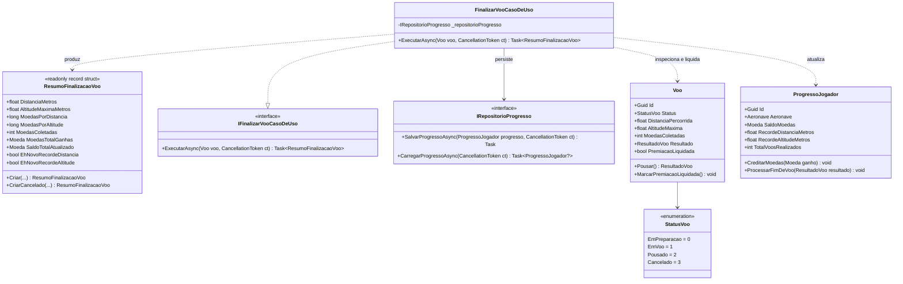

# Modelo de Dados e Arquitetura de Domínio: Feature 007 — Cálculo de Recompensas, Conversão de Moedas e Recordes

**Branch**: `007-calculo-recompensas-pontuacao` | **Data**: 2026-09-05  
**Spec**: [spec.md](./spec.md) | **Pesquisa**: [research.md](./research.md)

---

## 🏛️ Diagrama de Classes e Relacionamentos

---

## 📦 Detalhamento dos Componentes

### 1. Struct na Stack `ResumoFinalizacaoVoo`
- **Camada**: `AeroAscent.Core.Dominio.ObjetosDeValor`
- **Responsabilidade**: Struct imutável na stack (`readonly record struct`, `GC Alloc = 0 bytes`) encapsulando o extrato financeiro detalhado de encerramento do voo.
- **Campos e Propriedades**:
  | Campo / Propriedade | Tipo | Descrição |
  |---|---|---|
  | `DistanciaMetros` | `float` | Distância horizontal total percorrida no voo em metros. |
  | `AltitudeMaximaMetros` | `float` | Maior altitude vertical atingida pela aeronave em metros. |
  | `MoedasPorDistancia` | `long` | Moedas oriundas da distância ($\lfloor \text{Distancia} \times 0.1 \rfloor$). |
  | `MoedasPorAltitude` | `long` | Moedas oriundas da altitude ($\lfloor \text{Altitude} \times 0.05 \rfloor$). |
  | `MoedasColetadas` | `int` | Moedas físicas coletadas durante o percurso no ar. |
  | `MoedasTotalGanhas` | `Moeda` | Soma total das três fontes de moedas concedidas na sessão. |
  | `SaldoTotalAtualizado` | `Moeda` | Saldo global da carteira do jogador após a concessão dos créditos. |
  | `EhNovoRecordeDistancia` | `bool` | `true` se este voo superou a marca histórica de distância anterior. |
  | `EhNovoRecordeAltitude` | `bool` | `true` se este voo superou a marca histórica de altitude anterior. |

- **Fábricas**:
  - `ResumoFinalizacaoVoo.Criar(...)`: Constrói o extrato completo validando não negatividade.
  - `ResumoFinalizacaoVoo.CriarCancelado(float distancia, float altitude, Moeda saldoAtual)`: Gera resumo com 0 moedas ganhas e sem recordes para voos abortados.

---

### 2. Extensão na Entidade `Voo`
- **Camada**: `AeroAscent.Core.Dominio.Entidades`
- **Nova Propriedade**:
  - `public bool PremiacaoLiquidada { get; private set; }`
- **Novo Método**:
  - `public void MarcarPremiacaoLiquidada()`: Marca o voo como faturado/liquidado. Lança `DominioInvalidoException` se o voo não estiver em `StatusVoo.Pousado` ou `StatusVoo.Cancelado`.

---

### 3. Caso de Uso de Aplicação `FinalizarVooCasoDeUso`
- **Camada**: `AeroAscent.Core.Aplicacao.CasosDeUso`
- **Contrato**: `IFinalizarVooCasoDeUso`
- **Dependências Injetadas**: `IRepositorioProgresso`
- **Regras de Negócio**:
  1. **Validação de Entrada**: Se `voo == null`, lança `DominioInvalidoException`.
  2. **Validação de Ciclo de Vida**: Se `voo.Status` for `EmPreparacao` ou `EmVoo`, lança `DominioInvalidoException`.
  3. **Carregamento / Criação**: Invoca `_repositorioProgresso.CarregarProgressoAsync`. Se `null`, cria via `ProgressoJogador.CriarNovo()`.
  4. **Idempotência**: Se `voo.PremiacaoLiquidada == true`, calcula o resumo com os ganhos originais do voo, mas com `SaldoTotalAtualizado = progresso.SaldoMoedas`, `EhNovoRecordeDistancia = false` e `EhNovoRecordeAltitude = false`, sem creditar nem salvar novamente.
  5. **Processamento Pousado**:
     - Avalia se `voo.DistanciaPercorrida > progresso.RecordeDistanciaMetros` (`ehNovoRecordeDistancia`).
     - Avalia se `voo.AltitudeMaxima > progresso.RecordeAltitudeMetros` (`ehNovoRecordeAltitude`).
     - Invoca `progresso.ProcessarFimDeVoo(voo.Resultado!)`.
     - Invoca `voo.MarcarPremiacaoLiquidada()`.
     - Invoca `await _repositorioProgresso.SalvarProgressoAsync(progresso, cancelamento)`.
     - Retorna `ResumoFinalizacaoVoo` preenchido.
  6. **Processamento Cancelado**:
     - Invoca `voo.MarcarPremiacaoLiquidada()`.
     - Retorna `ResumoFinalizacaoVoo.CriarCancelado(voo.DistanciaPercorrida, voo.AltitudeMaxima, progresso.SaldoMoedas)`.
