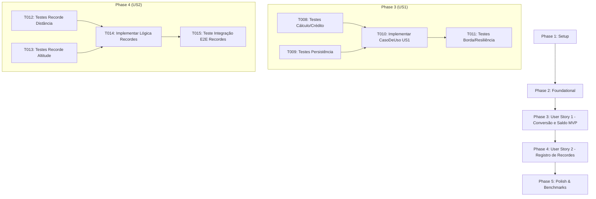

# Tarefas de Implementação: Feature 007 — Cálculo de Recompensas, Conversão de Moedas e Recordes

**Branch**: `007-calculo-recompensas-pontuacao` | **Data**: 2026-09-05  
**Spec**: [spec.md](./spec.md) | **Plano**: [plan.md](./plan.md) | **Modelo de Dados**: [data-model.md](./data-model.md) | **Cenários**: [quickstart.md](./quickstart.md)

---

## Formato das Tarefas: `- [ ] [TaskID] [P?] [Story?] Descrição com caminho do arquivo`

- **[P]**: Tarefa paralelizável (opera em arquivos distintos sem dependência direta de tarefas em andamento).
- **[Story]**: Identificador da história de usuário associada ([US1], [US2]).
- Padrão de idioma: **100% em Português Brasileiro (pt-BR)** conforme `GEMINI.md` e Constituição do projeto.

---

## Phase 1: Setup (Infraestrutura Compartilhada)

**Objetivo**: Preparação e validação do ambiente de compilação e criação de fixtures de suporte a testes para persistência simulada.

- [X] T001 Validar integridade da solução e compilação do projeto com `dotnet build AeroAscent.slnx`
- [X] T002 [P] Criar mock/repositório em memória para `IRepositorioProgresso` em `tests/AeroAscent.Core.Aplicacao.Testes/Fixtures/ProgressoRepositorioMock.cs`

**Ponto de Verificação**: Ambiente compilando limpo e mocks de repositório prontos para uso nos testes de aplicação.

---

## Phase 2: Foundational (Pré-requisitos Bloqueantes)

**Objetivo**: Implementar a struct na stack `ResumoFinalizacaoVoo`, os contratos de aplicação e estender a entidade `Voo` com suporte a controle de liquidação financeira idempotente.

**⚠️ CRÍTICO**: Nenhuma implementação de história de usuário pode começar sem concluir esta fase.

- [X] T003 [P] Criar o objeto de valor na stack `ResumoFinalizacaoVoo` (`readonly record struct`) em `src/AeroAscent.Core.Dominio/ObjetosDeValor/ResumoFinalizacaoVoo.cs`
- [X] T004 [P] Criar testes unitários para a struct `ResumoFinalizacaoVoo` em `tests/AeroAscent.Core.Dominio.Testes/ObjetosDeValor/ResumoFinalizacaoVooTestes.cs`
- [X] T005 [P] Criar a interface de contrato `IFinalizarVooCasoDeUso` em `src/AeroAscent.Core.Aplicacao/Contratos/IFinalizarVooCasoDeUso.cs`
- [X] T006 Adicionar a propriedade `PremiacaoLiquidada` e o método `MarcarPremiacaoLiquidada()` na entidade `Voo` em `src/AeroAscent.Core.Dominio/Entidades/Voo.cs`
- [X] T007 [P] Criar testes unitários para a propriedade e travamento de `PremiacaoLiquidada` em `tests/AeroAscent.Core.Dominio.Testes/Entidades/VooTestes.cs`

**Ponto de Verificação**: Estruturas de dados de extrato e contratos de aplicação prontos para orquestrar a finalização de voo.

---

## Phase 3: User Story 1 - Conversão de Métricas de Voo em Moedas de Recompensa (Priority: P1) 🎯 MVP

**Objetivo**: Calcular as recompensas matemáticas de moedas por distância ($\lfloor D \times 0.1 \rfloor$), altitude ($\lfloor H \times 0.05 \rfloor$) e coletáveis, creditar diretamente na carteira do `ProgressoJogador`, persistir atomicamente via `IRepositorioProgresso.SalvarProgressoAsync` e retornar o `ResumoFinalizacaoVoo` discriminado.

**Critério de Teste Independente**: Executar `FinalizarVooCasoDeUso.ExecutarAsync` para um voo com 250m de distância, 80m de altitude e 5 moedas coletadas, comprovando que o jogador recebe exatamente 34 moedas e o saldo total é incrementado no repositório.

### Testes da User Story 1

- [X] T008 [P] [US1] Criar testes unitários para o cálculo e crédito da premiação financeira por distância, altitude e coletáveis em `tests/AeroAscent.Core.Aplicacao.Testes/CasosDeUso/FinalizarVooCasoDeUsoTestes.cs`
- [X] T009 [P] [US1] Criar testes unitários para a persistência atômica do saldo atualizado via `IRepositorioProgresso.SalvarProgressoAsync` em `tests/AeroAscent.Core.Aplicacao.Testes/CasosDeUso/FinalizarVooCasoDeUsoTestes.cs`

### Implementação da User Story 1

- [X] T010 [US1] Implementar o caso de uso `FinalizarVooCasoDeUso` com injeção de `IRepositorioProgresso`, cálculo discriminado e crédito de moedas em `src/AeroAscent.Core.Aplicacao/CasosDeUso/FinalizarVooCasoDeUso.cs`
- [X] T011 [US1] Criar testes para casos de borda de voos muito curtos (concedendo 0 moedas) e resiliência na primeira execução quando o repositório retorna null em `tests/AeroAscent.Core.Aplicacao.Testes/CasosDeUso/FinalizarVooCasoDeUsoTestes.cs`

**Ponto de Verificação**: Core Loop financeiro de conversão de métricas e persistência de moedas 100% funcional e testado.

---

## Phase 4: User Story 2 - Verificação e Atualização de Recorde Pessoal (Priority: P2)

**Objetivo**: Comparar a distância e altitude do voo com os recordes históricos do jogador, sinalizar novos recordes em `ResumoFinalizacaoVoo` (`EhNovoRecordeDistancia` e `EhNovoRecordeAltitude`), atualizar os valores salvos e preservar marcas anteriores caso não superadas.

**Critério de Teste Independente**: Executar a finalização de um voo que superou o recorde anterior (ex: 350m vs 300m) comprovando que `EhNovoRecordeDistancia == true` e o novo valor é salvo no repositório; e para um voo inferior (280m vs 300m), comprovando que `EhNovoRecordeDistancia == false` e o valor original permanece intacto.

### Testes da User Story 2

- [X] T012 [P] [US2] Criar testes unitários para identificação e sinalização de novo recorde de distância (`EhNovoRecordeDistancia == true`) em `tests/AeroAscent.Core.Aplicacao.Testes/CasosDeUso/FinalizarVooCasoDeUsoTestes.cs`
- [X] T013 [P] [US2] Criar testes unitários para identificação de novo recorde de altitude (`EhNovoRecordeAltitude == true`) e preservação de recordes anteriores superiores em `tests/AeroAscent.Core.Aplicacao.Testes/CasosDeUso/FinalizarVooCasoDeUsoTestes.cs`

### Implementação da User Story 2

- [X] T014 [US2] Atualizar `FinalizarVooCasoDeUso.cs` para comparar métricas com `progresso.RecordeDistanciaMetros` e `progresso.RecordeAltitudeMetros`, alimentando as flags do extrato em `src/AeroAscent.Core.Aplicacao/CasosDeUso/FinalizarVooCasoDeUso.cs`
- [X] T015 [US2] Criar testes de integração ponta a ponta simulando voo pousado com quebra de recorde histórico e persistência no repositório em `tests/AeroAscent.Core.Aplicacao.Testes/CasosDeUso/FinalizarVooCasoDeUsoTestes.cs`

**Ponto de Verificação**: User Stories 1 e 2 funcionando de forma integrada com recompensas financeiras e registro de recordes.

---

## Phase 5: Polish & Cross-Cutting Concerns

**Objetivo**: Validação dos critérios de sucesso mensuráveis, garantia de idempotência (SC-003), validação estrita de ciclo de vida do voo, benchmarks de performance (SC-002) e revisão de documentação.

- [ ] T016 [P] Criar testes automatizados de idempotência comprovando que invocações repetidas de `FinalizarVooCasoDeUso.ExecutarAsync` para o mesmo voo não duplicam saldo nem contagem de voos (SC-003) em `tests/AeroAscent.Core.Aplicacao.Testes/CasosDeUso/FinalizarVooCasoDeUsoTestes.cs`
- [ ] T017 [P] Criar testes automatizados para validação do status da sessão de voo (concessão de 0 moedas quando `StatusVoo.Cancelado` e lançamento de `DominioInvalidoException` se `EmPreparacao` ou `EmVoo`) em `tests/AeroAscent.Core.Aplicacao.Testes/CasosDeUso/FinalizarVooCasoDeUsoTestes.cs`
- [ ] T018 [P] Criar teste automatizado de benchmark comprovando tempo total de execução do caso de uso inferior a 2 milissegundos (SC-002) em `tests/AeroAscent.Core.Aplicacao.Testes/CasosDeUso/FinalizarVooCasoDeUsoTestes.cs`
- [ ] T019 Executar suíte completa de testes automatizados com `dotnet test AeroAscent.slnx` garantindo 100% de sucesso e zero regressões em `tests/`
- [ ] T020 Revisar documentação XML (`///`) de todas as novas classes, métodos, structs e propriedades públicas em pt-BR conforme GEMINI.md

---

## Dependências entre Fases e Histórias de Usuário

---

## Oportunidades de Execução Paralela

- **Fase 2**: `T003` (`ResumoFinalizacaoVoo.cs`), `T004` (`ResumoFinalizacaoVooTestes.cs`), `T005` (`IFinalizarVooCasoDeUso.cs`) e `T007` (`VooTestes.cs`) podem ser desenvolvidos em paralelo após `T006`.
- **Fase 3**: `T008` e `T009` podem ser escritos simultaneamente antes de `T010`.
- **Fase 4**: `T012` e `T013` podem ser desenvolvidos em paralelo antes de `T014`.
- **Fase 5**: `T016`, `T017` e `T018` podem ser executados em paralelo.

---

## Estratégia de Implementação (Incrementos Fatiados)

1. **Incremento 1 (Foundational)**: Structs de extrato na stack e extensões de controle em `Voo`.
2. **Incremento 2 (🎯 MVP - US1)**: Conversão exata de moedas e crédito na carteira do jogador com salvamento no repositório.
3. **Incremento 3 (US2)**: Verificação comparativa e atualização persistida de novos recordes de distância e altitude.
4. **Incremento 4 (Polish & Benchmarks)**: Garantia de idempotência com zero duplicações, proteção de status, benchmark $< 2\text{ms}$ e documentação XML 100% pt-BR.
