# Modelo de Dados e Arquitetura de Domínio: Feature 008 — Loja e Oficina de Upgrades

**Branch**: `008-oficina-loja-upgrades` | **Data**: 2026-09-05  
**Spec**: [spec.md](./spec.md) | **Pesquisa**: [research.md](./research.md)

---

## 🏛️ Diagrama de Classes e Relacionamentos

```mermaid
classDiagram
    class TipoMelhoria {
        <<enumeration>>
        Motor = 0
        Aerodinamica = 1
        TanqueCombustivel = 2
        Catapulta = 3
    }

    class ItemOficinaDTO {
        <<readonly record struct>>
        +TipoMelhoria Tipo
        +string NomeAmigavel
        +int NivelAtual
        +Moeda? CustoProximoNivel
        +bool PodeComprar
        +bool EstaNoNivelMaximo
    }

    class ResultadoCompraMelhoria {
        <<readonly record struct>>
        +TipoMelhoria Tipo
        +int NivelAnterior
        +int NovoNivel
        +Moeda CustoPago
        +Moeda SaldoRestante
        +bool AtingiuNivelMaximo
        +Moeda? ProximoCusto
    }

    class IComprarMelhoriaCasoDeUso {
        <<interface>>
        +ExecutarAsync(TipoMelhoria tipo, CancellationToken ct) Task~ResultadoCompraMelhoria~
    }

    class IConsultarOficinaCasoDeUso {
        <<interface>>
        +ExecutarAsync(CancellationToken ct) Task~IReadOnlyList~ItemOficinaDTO~~
    }

    class ComprarMelhoriaCasoDeUso {
        -IRepositorioProgresso _repositorioProgresso
        -Oficina _oficina
        +ExecutarAsync(TipoMelhoria tipo, CancellationToken ct) Task~ResultadoCompraMelhoria~
    }

    class ConsultarOficinaCasoDeUso {
        -IRepositorioProgresso _repositorioProgresso
        -Oficina _oficina
        +ExecutarAsync(CancellationToken ct) Task~IReadOnlyList~ItemOficinaDTO~~
    }

    class Oficina {
        +const long CUSTO_BASE_MOTOR = 50
        +const long CUSTO_BASE_AERODINAMICA = 40
        +const long CUSTO_BASE_TANQUE = 30
        +const long CUSTO_BASE_CATAPULTA = 60
        +CalcularCustoMelhoria(TipoMelhoria tipo, int nivelAtual) Moeda
        +EvoluirComponente(Aeronave aeronave, Moeda saldoAtual, TipoMelhoria tipo) Moeda
    }

    class Aeronave {
        +const int NIVEL_MINIMO = 1
        +const int NIVEL_MAXIMO = 10
        +int NivelMotor
        +int NivelAerodinamica
        +int NivelTanqueCombustivel
        +int NivelCatapulta
        +AtualizarNivel(TipoMelhoria tipo, int novoNivel) void
        +ObterNivel(TipoMelhoria tipo) int
    }

    class ProgressoJogador {
        +Aeronave Aeronave
        +Moeda SaldoMoedas
        +DebitarMoedas(Moeda custo) void
    }

    class IRepositorioProgresso {
        <<interface>>
        +CarregarProgressoAsync(CancellationToken ct) Task~ProgressoJogador?~
        +SalvarProgressoAsync(ProgressoJogador progresso, CancellationToken ct) Task
    }

    ComprarMelhoriaCasoDeUso ..|> IComprarMelhoriaCasoDeUso
    ConsultarOficinaCasoDeUso ..|> IConsultarOficinaCasoDeUso
    ComprarMelhoriaCasoDeUso --> IRepositorioProgresso : persiste
    ConsultarOficinaCasoDeUso --> IRepositorioProgresso : consulta
    ComprarMelhoriaCasoDeUso --> Oficina : delega regras
    ConsultarOficinaCasoDeUso --> Oficina : delega cálculos
    ComprarMelhoriaCasoDeUso ..> ResultadoCompraMelhoria : produz
    ConsultarOficinaCasoDeUso ..> ItemOficinaDTO : projeta
    ProgressoJogador *-- Aeronave
    ItemOficinaDTO --> TipoMelhoria
    ResultadoCompraMelhoria --> TipoMelhoria
```

---

## 📦 Detalhamento das Entidades e Objetos de Valor

### 1. Objeto de Valor `ResultadoCompraMelhoria`
- **Camada**: `AeroAscent.Core.Dominio.ObjetosDeValor` (ou contratos da aplicação)
- **Tipo**: `readonly record struct` na stack (`GC Alloc = 0 bytes`)
- **Propriedades**:
  - `TipoMelhoria Tipo`: Componente evoluído.
  - `int NivelAnterior`: Nível do componente antes da transação.
  - `int NovoNivel`: Nível atualizado (NivelAnterior + 1).
  - `Moeda CustoPago`: Quantia monetária debitada da carteira.
  - `Moeda SaldoRestante`: Saldo final de moedas do jogador após o débito.
  - `bool AtingiuNivelMaximo`: Indica se agora a peça atingiu o nível 10.
  - `Moeda? ProximoCusto`: Custo para o nível seguinte ou `null` se atingiu o teto.

---

### 2. DTO de Projeção `ItemOficinaDTO`
- **Camada**: `AeroAscent.Core.Aplicacao.DTOs`
- **Tipo**: `readonly record struct` imutável
- **Propriedades**:
  - `TipoMelhoria Tipo`: Chave técnica do componente.
  - `string NomeAmigavel`: Nome em pt-BR (ex: "Motor Turbo", "Fuselagem Aerodinâmica", "Tanque Expandido", "Catapulta Reforçada").
  - `int NivelAtual`: Nível numérico atual (1 a 10).
  - `Moeda? CustoProximoNivel`: Custo monetário para evoluir para NivelAtual + 1, ou `null` se nível 10.
  - `bool PodeComprar`: `true` se o saldo do jogador cobrir o custo e `NivelAtual < 10`.
  - `bool EstaNoNivelMaximo`: `true` se `NivelAtual >= 10`.

---

## 📈 Tabela de Custos Canônica por Nível ($\lfloor \text{CustoBase} \times 1.5^{N-1} \rfloor$)

| Transição de Nível | Motor (Base: 50) | Aerodinâmica (Base: 40) | Tanque (Base: 30) | Catapulta (Base: 60) |
|---|:---:|:---:|:---:|:---:|
| **Nível 1 $\to$ 2** | 50 moedas | 40 moedas | 30 moedas | 60 moedas |
| **Nível 2 $\to$ 3** | 75 moedas | 60 moedas | 45 moedas | 90 moedas |
| **Nível 3 $\to$ 4** | 112 moedas | 90 moedas | 67 moedas | 135 moedas |
| **Nível 4 $\to$ 5** | 168 moedas | 135 moedas | 101 moedas | 202 moedas |
| **Nível 5 $\to$ 6** | 253 moedas | 202 moedas | 151 moedas | 303 moedas |
| **Nível 6 $\to$ 7** | 379 moedas | 303 moedas | 227 moedas | 455 moedas |
| **Nível 7 $\to$ 8** | 569 moedas | 455 moedas | 341 moedas | 683 moedas |
| **Nível 8 $\to$ 9** | 854 moedas | 683 moedas | 512 moedas | 1.025 moedas |
| **Nível 9 $\to$ 10** | 1.281 moedas | 1.025 moedas | 768 moedas | 1.537 moedas |
| **Nível 10 (MÁX)** | *Teto Atingido* | *Teto Atingido* | *Teto Atingido* | *Teto Atingido* |
