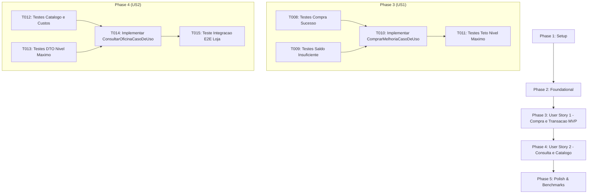

# Tarefas de Implementação: Feature 008 — Loja e Oficina de Upgrades da Aeronave

**Branch**: `008-oficina-loja-upgrades` | **Data**: 2026-09-05  
**Spec**: [spec.md](./spec.md) | **Plano**: [plan.md](./plan.md) | **Modelo de Dados**: [data-model.md](./data-model.md) | **Cenários**: [quickstart.md](./quickstart.md)

---

## Formato das Tarefas: `- [ ] [TaskID] [P?] [Story?] Descrição com caminho do arquivo`

- **[P]**: Tarefa paralelizável (opera em arquivos distintos sem dependência direta de tarefas em andamento).
- **[Story]**: Identificador da história de usuário associada ([US1], [US2]).
- Padrão de idioma: **100% em Português Brasileiro (pt-BR)** conforme `GEMINI.md` e Constituição do projeto.

---

## Phase 1: Setup (Infraestrutura Compartilhada)

**Objetivo**: Preparação e validação do ambiente de compilação e criação/adequação de fixtures de testes de aplicação para persistência do progresso.

- [X] T001 Validar integridade da solução e compilação do projeto com `dotnet build AeroAscent.slnx`
- [X] T002 [P] Validar e estender a fixture de repositório em memória `ProgressoRepositorioMock` para suporte à oficina em `tests/AeroAscent.Core.Aplicacao.Testes/Fixtures/ProgressoRepositorioMock.cs`

**Ponto de Verificação**: Ambiente compilando limpo e mocks prontos para simular leituras e gravações do `ProgressoJogador`.

---

## Phase 2: Foundational (Pré-requisitos Bloqueantes)

**Objetivo**: Implementar o objeto de valor na stack `ResultadoCompraMelhoria`, o DTO imutável `ItemOficinaDTO` e os contratos de interface de aplicação para compra e consulta.

**⚠️ CRÍTICO**: Nenhuma implementação de história de usuário pode começar sem concluir esta fase.

- [ ] T003 [P] Criar o objeto de valor na stack `ResultadoCompraMelhoria` (`readonly record struct`) em `src/AeroAscent.Core.Dominio/ObjetosDeValor/ResultadoCompraMelhoria.cs`
- [ ] T004 [P] Criar testes unitários para a struct `ResultadoCompraMelhoria` em `tests/AeroAscent.Core.Dominio.Testes/ObjetosDeValor/ResultadoCompraMelhoriaTestes.cs`
- [ ] T005 [P] Criar o DTO `ItemOficinaDTO` (`readonly record struct`) em `src/AeroAscent.Core.Aplicacao/DTOs/ItemOficinaDTO.cs`
- [ ] T006 [P] Criar a interface de contrato `IComprarMelhoriaCasoDeUso` em `src/AeroAscent.Core.Aplicacao/Contratos/IComprarMelhoriaCasoDeUso.cs`
- [ ] T007 [P] Criar a interface de contrato `IConsultarOficinaCasoDeUso` em `src/AeroAscent.Core.Aplicacao/Contratos/IConsultarOficinaCasoDeUso.cs`

**Ponto de Verificação**: Estruturas de dados de transferência e contratos de interface prontos para a camada de aplicação.

---

## Phase 3: User Story 1 - Compra de Melhorias Mecânicas com Saldo de Moedas (Priority: P1) 🎯 MVP

**Objetivo**: Implementar a transação atômica de compra de melhoria para os 4 componentes (`Motor`, `Aerodinamica`, `TanqueCombustivel`, `Catapulta`), debitando o custo em `Moeda`, evoluindo a `Aeronave` no `ProgressoJogador`, persistindo via `IRepositorioProgresso.SalvarProgressoAsync` e rejeitando com `SaldoInsuficienteException` caso o saldo seja insuficiente.

**Critério de Teste Independente**: Executar `ComprarMelhoriaCasoDeUso.ExecutarAsync(TipoMelhoria.Motor)` para um jogador com saldo de 200 moedas e Motor no nível 1, comprovando que o Motor evolui para o nível 2, o saldo passa para 150 moedas e o repositório é persistido atomicamente; e para um jogador com 20 moedas tentando comprar Tanque de 30 moedas, comprovando o lançamento de `SaldoInsuficienteException` e preservação do saldo em 20.

### Testes da User Story 1

- [ ] T008 [P] [US1] Criar testes unitários para compra bem-sucedida de melhoria com saldo suficiente e persistência no repositório em `tests/AeroAscent.Core.Aplicacao.Testes/CasosDeUso/ComprarMelhoriaCasoDeUsoTestes.cs`
- [ ] T009 [P] [US1] Criar testes unitários para rejeição de compra por saldo insuficiente lançando `SaldoInsuficienteException` e mantendo saldo inalterado em `tests/AeroAscent.Core.Aplicacao.Testes/CasosDeUso/ComprarMelhoriaCasoDeUsoTestes.cs`

### Implementação da User Story 1

- [ ] T010 [US1] Implementar o caso de uso `ComprarMelhoriaCasoDeUso` com injeção de `IRepositorioProgresso`, validação de saldo e persistência atômica em `src/AeroAscent.Core.Aplicacao/CasosDeUso/ComprarMelhoriaCasoDeUso.cs`
- [ ] T011 [US1] Criar testes unitários para bloqueio no teto máximo com `MelhoriaNivelMaximoException` ao tentar comprar componente no nível 10 em `tests/AeroAscent.Core.Aplicacao.Testes/CasosDeUso/ComprarMelhoriaCasoDeUsoTestes.cs`

**Ponto de Verificação**: Transação de compra de upgrades 100% funcional, testada e persistida atomicamente (MVP pronto).

---

## Phase 4: User Story 2 - Consulta do Catálogo e Cálculo Escalonado Exponencial (Priority: P2)

**Objetivo**: Consultar o catálogo consolidado da oficina através de `ConsultarOficinaCasoDeUso`, calculando os custos para o próximo nível pela fórmula exponencial canônica ($\lfloor \text{CustoBase} \times 1.5^{N-1} \rfloor$), projetando `ItemOficinaDTO` com flag `PodeComprar` de acordo com o saldo do jogador e marcando `EstaNoNivelMaximo = true` e `CustoProximoNivel = null` quando no nível 10.

**Critério de Teste Independente**: Executar `ConsultarOficinaCasoDeUso.ExecutarAsync()` e verificar se os custos retornados para o nível 1 dos 4 componentes correspondem exatamente a 50 (Motor), 40 (Aerodinâmica), 30 (Tanque) e 60 (Catapulta); e verificar que um componente no nível 10 exibe `EstaNoNivelMaximo = true`, `CustoProximoNivel = null` e `PodeComprar = false`.

### Testes da User Story 2

- [ ] T012 [P] [US2] Criar testes unitários para consulta do catálogo com custos exponenciais calibrados e flag `PodeComprar` baseada no saldo em `tests/AeroAscent.Core.Aplicacao.Testes/CasosDeUso/ConsultarOficinaCasoDeUsoTestes.cs`
- [ ] T013 [P] [US2] Criar testes unitários para sinalização declarativa de componentes no nível máximo (`CustoProximoNivel = null`, `PodeComprar = false`, `EstaNoNivelMaximo = true`) em `tests/AeroAscent.Core.Aplicacao.Testes/CasosDeUso/ConsultarOficinaCasoDeUsoTestes.cs`

### Implementação da User Story 2

- [ ] T014 [US2] Implementar o caso de uso `ConsultarOficinaCasoDeUso` com injeção de `IRepositorioProgresso`, projeção de DTOs e identificação de teto máximo em `src/AeroAscent.Core.Aplicacao/CasosDeUso/ConsultarOficinaCasoDeUso.cs`
- [ ] T015 [US2] Criar testes de integração ponta a ponta simulando consulta inicial $\to$ compra de melhoria $\to$ nova consulta com níveis e custos atualizados em `tests/AeroAscent.Core.Aplicacao.Testes/CasosDeUso/ConsultarOficinaCasoDeUsoTestes.cs`

**Ponto de Verificação**: Consulta de catálogo e cálculo exponencial integrados ao fluxo de compra e exibição.

---

## Phase 5: Polish & Cross-Cutting Concerns

**Objetivo**: Validação dos critérios de sucesso mensuráveis, resiliência na 1ª execução, benchmarks de performance (SC-002), validação de tipos inválidos e revisão de documentação.

- [ ] T016 [P] Criar testes de resiliência na primeira execução (quando o repositório retorna null) para compra e consulta inicializando `ProgressoJogador.CriarNovo()` em `tests/AeroAscent.Core.Aplicacao.Testes/CasosDeUso/ComprarMelhoriaCasoDeUsoTestes.cs`
- [ ] T017 [P] Criar teste automatizado de benchmark comprovando tempo total de execução da compra inferior a 5 milissegundos (SC-002) em `tests/AeroAscent.Core.Aplicacao.Testes/CasosDeUso/ComprarMelhoriaCasoDeUsoTestes.cs`
- [ ] T018 [P] Criar testes para validação de tipo de melhoria inválido lançando `DominioInvalidoException` em `tests/AeroAscent.Core.Aplicacao.Testes/CasosDeUso/ComprarMelhoriaCasoDeUsoTestes.cs`
- [ ] T019 Executar suíte completa de testes automatizados com `dotnet test AeroAscent.slnx` garantindo 100% de sucesso e zero regressões em `tests/`
- [ ] T020 Revisar documentação XML (`///`) de todas as novas classes, métodos, structs e propriedades públicas em pt-BR conforme GEMINI.md

---

## Dependências entre Fases e Histórias de Usuário

---

## Oportunidades de Execução Paralela

- **Fase 2**: `T003` (`ResultadoCompraMelhoria.cs`), `T004` (`ResultadoCompraMelhoriaTestes.cs`), `T005` (`ItemOficinaDTO.cs`), `T006` (`IComprarMelhoriaCasoDeUso.cs`) e `T007` (`IConsultarOficinaCasoDeUso.cs`) podem ser desenvolvidos simultaneamente.
- **Fase 3**: `T008` e `T009` podem ser desenvolvidos em paralelo antes de `T010`.
- **Fase 4**: `T012` e `T013` podem ser desenvolvidos em paralelo antes de `T014`.
- **Fase 5**: `T016`, `T017` e `T018` podem ser executados em paralelo.

---

## Estratégia de Implementação (Incrementos Fatiados)

1. **Incremento 1 (Foundational)**: Structs imutáveis na stack e contratos de interface de aplicação.
2. **Incremento 2 (🎯 MVP - US1)**: Orquestração de compra de melhorias mecânicas com débito de moedas, evolução de aeronave e persistência atômica.
3. **Incremento 3 (US2)**: Consulta do catálogo consolidado da oficina com projeção de DTOs e cálculo exponencial.
4. **Incremento 4 (Polish & Benchmarks)**: Resiliência na 1ª execução sem perfil prévio, benchmark $< 5\text{ms}$ e documentação XML 100% pt-BR.
