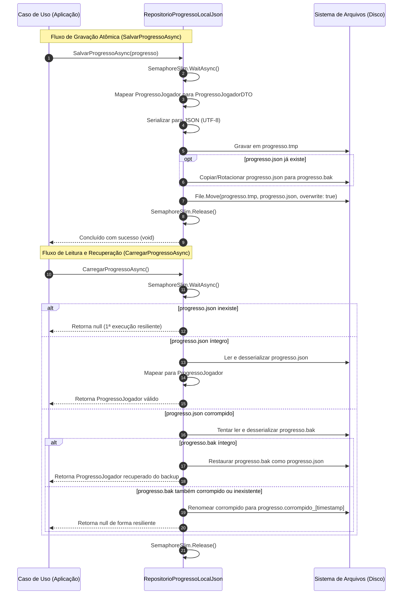

# Modelo de Dados: Feature 009 — Persistência de Dados Local Offline First (JSON)

**Branch**: `009-persistencia-local-json` | **Data**: 2026-09-05 | **Spec**: [spec.md](./spec.md)

---

## 🏛️ Entidades e Estruturas de Dados

### 1. `ProgressoJogadorDTO` (Objeto de Transferência para JSON)
Estrutura plana, imutável e serializável via `System.Text.Json` para persistência em disco.

| Campo | Tipo C# | Tipo JSON | Descrição / Invariante |
|---|---|---|---|
| `VersaoSchema` | `int` | `number` | Versão do schema de persistência (fixo em `1`). |
| `DataHoraSalvamentoUtc` | `DateTime` | `string (ISO 8601)` | Timestamp UTC da gravação em disco. |
| `Id` | `Guid` | `string (GUID)` | Identificador único do registro de progresso do jogador. |
| `SaldoMoedas` | `long` | `number` | Quantidade total de moedas acumuladas ($\ge 0$). |
| `NivelMotor` | `int` | `number` | Nível do motor da aeronave (1 a 10). |
| `NivelAerodinamica` | `int` | `number` | Nível de aerodinâmica da fuselagem (1 a 10). |
| `NivelTanqueCombustivel` | `int` | `number` | Nível de capacidade do tanque de combustível (1 a 10). |
| `NivelCatapulta` | `int` | `number` | Nível de força da catapulta (1 a 10). |
| `RecordeDistanciaMetros` | `float` | `number` | Maior distância horizontal atingida em metros ($\ge 0$). |
| `RecordeAltitudeMetros` | `float` | `number` | Maior altitude máxima atingida em metros ($\ge 0$). |
| `TotalVoosRealizados` | `int` | `number` | Quantidade acumulada de voos finalizados ($\ge 0$). |

---

### 2. `ConfiguracaoPersistenciaLocal` (Configuração de Caminhos)
Objeto de configuração imutável para desacoplar caminhos de sistema operacional e da engine Unity.

| Propriedade | Tipo C# | Descrição |
|---|---|---|
| `DiretorioBase` | `string` | Caminho absoluto da pasta de dados (`Application.persistentDataPath` em produção ou pasta de teste). |
| `NomeArquivoPrincipal` | `string` | Nome do arquivo principal (padrão: `progresso.json`). |
| `NomeArquivoBackup` | `string` | Nome do arquivo de backup redundante (padrão: `progresso.bak`). |
| `NomeArquivoTemporario` | `string` | Nome do arquivo de gravação atômica (padrão: `progresso.tmp`). |
| `CaminhoCompletoPrincipal` | `string` | Caminho completo resolvido para o arquivo principal. |
| `CaminhoCompletoBackup` | `string` | Caminho completo resolvido para o arquivo de backup. |
| `CaminhoCompletoTemporario` | `string` | Caminho completo resolvido para o arquivo temporário. |

---

## 🔄 Mapeamento Bidirecional

```text
Entidade de Domínio                                      DTO de Infraestrutura
┌───────────────────────────┐                           ┌───────────────────────────┐
│     ProgressoJogador      │                           │    ProgressoJogadorDTO    │
│───────────────────────────│                           │───────────────────────────│
│ Guid Id                   │◄──── [Mapeamento] ───────►│ Guid Id                   │
│ Moeda SaldoMoedas         │                           │ long SaldoMoedas          │
│ Aeronave Aeronave:        │                           │ int NivelMotor            │
│   int NivelMotor          │                           │ int NivelAerodinamica     │
│   int NivelAerodinamica   │                           │ int NivelTanqueCombustivel│
│   int NivelTanqueCombust. │                           │ int NivelCatapulta        │
│   int NivelCatapulta      │                           │ float RecordeDistancia    │
│ float RecordeDistancia    │                           │ float RecordeAltitude     │
│ float RecordeAltitude     │                           │ int TotalVoosRealizados   │
│ int TotalVoosRealizados   │                           │ int VersaoSchema = 1      │
│                           │                           │ DateTime DataHoraUtc      │
└───────────────────────────┘                           └───────────────────────────┘
```

---

## 🗄️ Ciclo de Vida e Protocolo de I/O Atômico


