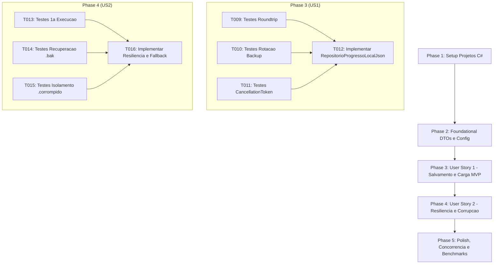

# Tarefas de Implementação: Feature 009 — Persistência de Dados Local Offline First (JSON)

**Branch**: `009-persistencia-local-json` | **Data**: 2026-09-05  
**Spec**: [spec.md](./spec.md) | **Plano**: [plan.md](./plan.md) | **Modelo de Dados**: [data-model.md](./data-model.md) | **Cenários**: [quickstart.md](./quickstart.md)

---

## Formato das Tarefas: `- [ ] [TaskID] [P?] [Story?] Descrição com caminho do arquivo`

- **[P]**: Tarefa paralelizável (opera em arquivos distintos sem dependência direta de tarefas em andamento).
- **[Story]**: Identificador da história de usuário associada ([US1], [US2]).
- Padrão de idioma: **100% em Português Brasileiro (pt-BR)** conforme `GEMINI.md` e Constituição do projeto.

---

## Phase 1: Setup (Infraestrutura Compartilhada)

**Objetivo**: Criação dos projetos C# `AeroAscent.Infraestrutura` e `AeroAscent.Infraestrutura.Testes`, vinculação na solução `AeroAscent.slnx` e validação da compilação inicial.

- [X] T001 Criar o projeto de infraestrutura `AeroAscent.Infraestrutura.csproj` com suporte a `netstandard2.1` e `net8.0` em `src/AeroAscent.Infraestrutura/AeroAscent.Infraestrutura.csproj`
- [X] T002 Criar o projeto de testes unitários `AeroAscent.Infraestrutura.Testes.csproj` em `tests/AeroAscent.Infraestrutura.Testes/AeroAscent.Infraestrutura.Testes.csproj`
- [X] T003 Adicionar os projetos `AeroAscent.Infraestrutura` e `AeroAscent.Infraestrutura.Testes` à solução `AeroAscent.slnx`
- [X] T004 Validar integridade e compilação limpa da solução com `dotnet build AeroAscent.slnx`

**Ponto de Verificação**: Solução compilando limpa com os novos projetos de infraestrutura e testes integrados.

---

## Phase 2: Foundational (Pré-requisitos Bloqueantes)

**Objetivo**: Implementar a configuração de diretórios `ConfiguracaoPersistenciaLocal` e o DTO imutável `ProgressoJogadorDTO` com versionamento de schema e mapeamento bidirecional.

**⚠️ CRÍTICO**: Nenhuma implementação de história de usuário pode começar sem concluir esta fase.

- [X] T005 [P] Implementar a classe de configuração `ConfiguracaoPersistenciaLocal` em `src/AeroAscent.Infraestrutura/Configuracao/ConfiguracaoPersistenciaLocal.cs`
- [X] T006 [P] Criar testes unitários para a classe `ConfiguracaoPersistenciaLocal` em `tests/AeroAscent.Infraestrutura.Testes/Configuracao/ConfiguracaoPersistenciaLocalTestes.cs`
- [X] T007 [P] Implementar a estrutura `ProgressoJogadorDTO` (`readonly record struct`) com mapeamento bidirecional e `VersaoSchema = 1` em `src/AeroAscent.Infraestrutura/DTOs/ProgressoJogadorDTO.cs`
- [X] T008 [P] Criar testes unitários de serialização e mapeamento para `ProgressoJogadorDTO` em `tests/AeroAscent.Infraestrutura.Testes/DTOs/ProgressoJogadorDTOTestes.cs`

**Ponto de Verificação**: Estruturas de configuração e DTO prontas, testadas e integradas.

---

## Phase 3: User Story 1 - Salvamento Automático e Seguro do Progresso Localmente (Priority: P1) 🎯 MVP

**Objetivo**: Implementar o salvamento atômico e seguro de `ProgressoJogador` em arquivo temporário `.tmp` com rotação de backup `.bak` e promoção para `.json` via `File.Move`, e carregamento completo com integridade garantida.

**Critério de Teste Independente**: Salvar um progresso com 500 moedas e Motor nível 4 em diretório temporário isolado, reinicializar a instância e carregar com `CarregarProgressoAsync()`, comprovando a igualdade estrita dos dados (roundtrip) e inexistência de arquivo `.tmp` residual.

### Testes da User Story 1

- [ ] T009 [P] [US1] Criar testes de unidade e integração para salvamento atômico, carregamento íntegro (roundtrip) e persistência de todas as propriedades em `tests/AeroAscent.Infraestrutura.Testes/Persistencia/RepositorioProgressoLocalJsonTestes.cs`
- [ ] T010 [P] [US1] Criar testes unitários para validação de criação e rotação do arquivo de backup `.bak` durante o salvamento atômico em `tests/AeroAscent.Infraestrutura.Testes/Persistencia/RepositorioProgressoLocalJsonTestes.cs`
- [ ] T011 [P] [US1] Criar testes para validação de cancelamento assíncrono via `CancellationToken` no salvamento e carregamento em `tests/AeroAscent.Infraestrutura.Testes/Persistencia/RepositorioProgressoLocalJsonTestes.cs`

### Implementação da User Story 1

- [ ] T012 [US1] Implementar a classe `RepositorioProgressoLocalJson` com suporte a gravação em `.tmp`, rotação `.bak`, `File.Move(..., overwrite: true)` e desserialização `System.Text.Json` em `src/AeroAscent.Infraestrutura/Persistencia/RepositorioProgressoLocalJson.cs`

**Ponto de Verificação**: Salvamento e carregamento atômicos 100% funcionais, testados e persistidos localmente (MVP pronto).

---

## Phase 4: User Story 2 - Recuperação Graciosa de Falhas e Arquivo Inexistente (Priority: P2)

**Objetivo**: Implementar a tolerância a falhas para primeira execução (retornando `null` quando o arquivo ainda não existir no disco) e recuperação transparente via backup `.bak` ou isolamento `.corrompido_[timestamp]` caso o arquivo principal esteja danificado.

**Critério de Teste Independente**: Carregar em diretório limpo (sem arquivo prévio) e comprovar retorno de `null` sem exceções; corromper o arquivo principal e comprovar restauração a partir do backup `.bak`; corromper ambos e comprovar isolamento do arquivo danificado e retorno seguro de `null` sem travamentos.

### Testes da User Story 2

- [ ] T013 [P] [US2] Criar testes de primeira execução comprovando retorno de `null` quando o arquivo JSON não existir em `tests/AeroAscent.Infraestrutura.Testes/Persistencia/RepositorioProgressoLocalJsonTestes.cs`
- [ ] T014 [P] [US2] Criar testes de recuperação automática a partir do arquivo `.bak` quando o arquivo principal estiver com JSON mutilado ou corrompido em `tests/AeroAscent.Infraestrutura.Testes/Persistencia/RepositorioProgressoLocalJsonTestes.cs`
- [ ] T015 [P] [US2] Criar testes para isolamento de arquivo corrompido com renomeação para `.corrompido_[timestamp]` quando não houver backup recuperável em `tests/AeroAscent.Infraestrutura.Testes/Persistencia/RepositorioProgressoLocalJsonTestes.cs`

### Implementação da User Story 2

- [ ] T016 [US2] Implementar na classe `RepositorioProgressoLocalJson` a lógica de recuperação por `.bak`, isolamento de arquivos corrompidos e tratamento resiliente de leitura em `src/AeroAscent.Infraestrutura/Persistencia/RepositorioProgressoLocalJson.cs`

**Ponto de Verificação**: Sistema imune a travamentos por corrupção e resiliente na primeira execução.

---

## Phase 5: Polish & Cross-Cutting Concerns

**Objetivo**: Controle de concorrência assíncrona (`SemaphoreSlim`), benchmark de performance $< 15\text{ms}$ (SC-001), validação de estresse (SC-002) e revisão de documentação.

- [ ] T017 [P] Criar testes de estresse de concorrência assíncrona comprovando exclusão mútua segura via `SemaphoreSlim(1, 1)` sem colisão de I/O (SC-002) em `tests/AeroAscent.Infraestrutura.Testes/Persistencia/RepositorioProgressoConcorrenciaTestes.cs`
- [ ] T018 [P] Criar teste automatizado de benchmark comprovando latência de salvamento assíncrono inferior a 15 milissegundos (SC-001) em `tests/AeroAscent.Infraestrutura.Testes/Persistencia/RepositorioProgressoLocalJsonTestes.cs`
- [ ] T019 Executar suíte completa de testes automatizados com `dotnet test AeroAscent.slnx` garantindo 100% de sucesso e zero regressões em `tests/`
- [ ] T020 Revisar documentação XML (`///`) de todas as novas classes, métodos, structs e propriedades públicas em pt-BR conforme GEMINI.md e Constituição

---

## Dependências entre Fases e Histórias de Usuário

---

## Oportunidades de Execução Paralela

- **Fase 2**: `T005` (`ConfiguracaoPersistenciaLocal.cs`), `T006` (testes de config), `T007` (`ProgressoJogadorDTO.cs`) e `T008` (testes de DTO) podem ser desenvolvidos simultaneamente.
- **Fase 3**: `T009`, `T010` e `T011` podem ser desenvolvidos em paralelo antes de `T012`.
- **Fase 4**: `T013`, `T014` e `T015` podem ser desenvolvidos em paralelo antes de `T016`.
- **Fase 5**: `T017` e `T018` podem ser executados em paralelo.

---

## Estratégia de Implementação (Incrementos Fatiados)

1. **Incremento 1 (Setup & Foundational)**: Estruturação dos novos projetos `AeroAscent.Infraestrutura` e `AeroAscent.Infraestrutura.Testes`, DTOs e configurações.
2. **Incremento 2 (🎯 MVP - US1)**: Repositório com gravação atômica via `.tmp`, promoção com `File.Move`, rotação `.bak` e carga desserializada via `System.Text.Json`.
3. **Incremento 3 (US2)**: Tolerância a falhas na primeira execução (retorno de `null`) e auto-recuperação por `.bak` ou isolamento `.corrompido`.
4. **Incremento 4 (Polish & Benchmarks)**: Semáforo assíncrono `SemaphoreSlim`, teste de estresse concorrente, benchmark $< 15\text{ms}$ e revisão XML 100% pt-BR.
