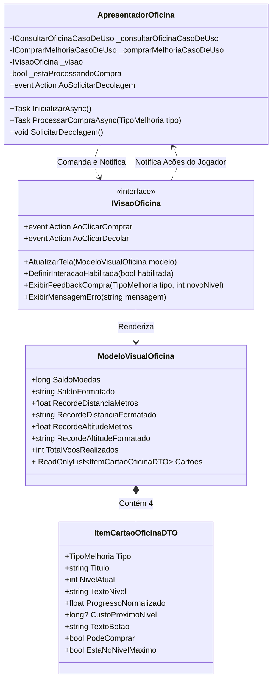
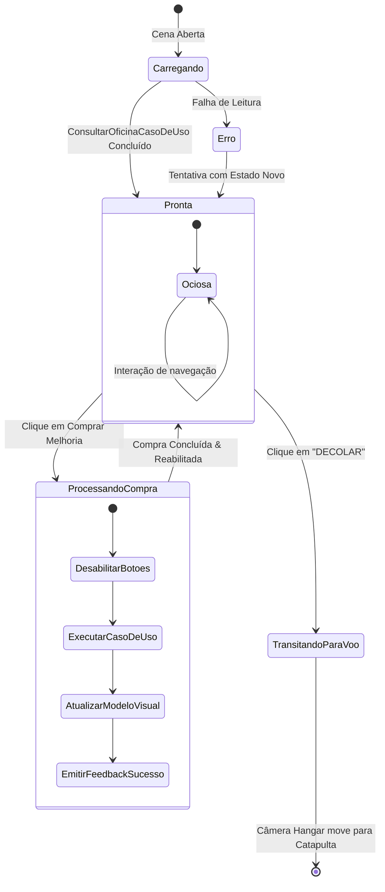

# Modelo de Dados de Apresentação: Interface da Oficina e Hangar 3D (Feature 010)

## Visão Geral

Os modelos de apresentação são estruturas imutáveis em C# puro (`readonly record struct` ou `class` sem dependências do Unity) que encapsulam as informações já formatadas para renderização direta pela visão passiva (`IVisaoOficina`), garantindo `GC Alloc = 0 bytes` no loop de renderização e facilitando asserções em testes de unidade xUnit.

---

## Estruturas de Dados

### 1. `ItemCartaoOficinaDTO` (Apresentação do Cartão de Melhoria)

Representa o estado visual de um dos 4 cartões de upgrade da oficina.

| Campo | Tipo | Descrição | Exemplo |
|---|---|---|---|
| `Tipo` | `TipoMelhoria` | Enum indicando o componente (Motor, Aerodinâmica, Tanque, Catapulta). | `TipoMelhoria.Motor` |
| `Titulo` | `string` | Nome amigável e localizado do componente. | `"Motor"` |
| `NivelAtual` | `int` | Nível atual do componente (1 a 10). | `4` |
| `TextoNivel` | `string` | Texto formatado para exibição do nível. | `"Nível 4"` ou `"Nível 10 (MAX)"` |
| `ProgressoNormalizado` | `float` | Valor de 0.0f a 1.0f para preenchimento de slider/barra. | `0.4f` (40%) |
| `CustoProximoNivel` | `long?` | Valor numérico em moedas para a próxima evolução (`null` se nível 10). | `150` ou `null` |
| `TextoBotao` | `string` | Texto exibido dentro do botão de ação. | `"💰 150"` ou `"MÁXIMO"` |
| `PodeComprar` | `bool` | Flag calculada indicando se o botão deve estar habilitado (`Saldo >= Custo && !EstaNoNivelMaximo`). | `true` |
| `EstaNoNivelMaximo` | `bool` | Flag indicando se atingiu o ápice mecânico (`NivelAtual == 10`). | `false` |

---

### 2. `ModeloVisualOficina` (Estado Consolidado da Interface)

Encapsula todas as informações necessárias para preencher a tela completa da oficina em um único frame.

| Campo | Tipo | Descrição | Exemplo |
|---|---|---|---|
| `SaldoMoedas` | `long` | Saldo bruto de moedas do jogador. | `1250` |
| `SaldoFormatado` | `string` | Saldo formatado com ícone e separador de milhar pt-BR. | `"💰 1.250"` |
| `RecordeDistanciaMetros` | `float` | Maior distância horizontal atingida em metros. | `240.5f` |
| `RecordeDistanciaFormatado` | `string` | Texto amigável de recorde de distância. | `"Recorde: 240,5 m"` |
| `RecordeAltitudeMetros` | `float` | Maior altitude vertical atingida em metros. | `112.0f` |
| `RecordeAltitudeFormatado` | `string` | Texto amigável de recorde de altitude. | `"Altitude Máx: 112,0 m"` |
| `TotalVoosRealizados` | `int` | Quantidade total de lançamentos concluídos. | `15` |
| `Cartoes` | `IReadOnlyList<ItemCartaoOficinaDTO>` | Lista contendo exatamente os 4 cartões da oficina. | `[Motor, Aerodinamica, Tanque, Catapulta]` |

---

## Diagrama de Relacionamento de Entidades e Fluxo

---

## Máquina de Estados da Tela de Apresentação

