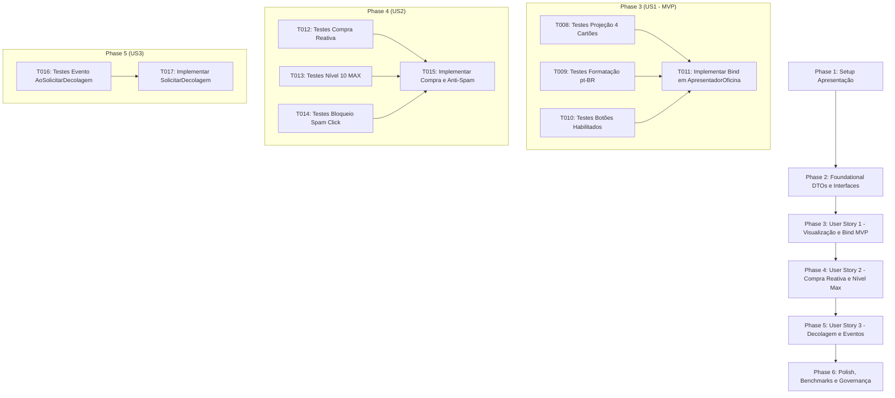

# Tarefas de Implementação: Interface do Menu Principal, Hangar 3D e Oficina (Feature 010)

**Branch**: `010-ui-menu-principal-oficina` | **Data**: 2026-09-05 | **Spec**: [specs/010-ui-menu-principal-oficina/spec.md](file:///h:/tmp/RSA/Loterias/JogosMaster/GitHub/AeroAscent/specs/010-ui-menu-principal-oficina/spec.md) | **Plano**: [specs/010-ui-menu-principal-oficina/plan.md](file:///h:/tmp/RSA/Loterias/JogosMaster/GitHub/AeroAscent/specs/010-ui-menu-principal-oficina/plan.md)

---

## Phase 1: Setup (Estrutura e Contratos de Apresentação)

**Objetivo**: Preparação das pastas de apresentação na camada de Aplicação e na suíte de testes automatizados.

- [X] T001 Estruturar diretórios de contratos e apresentadores em `src/AeroAscent.Core.Aplicacao/Contratos/` e `src/AeroAscent.Core.Aplicacao/Apresentadores/`
- [X] T002 Estruturar diretório de testes de apresentação em `tests/AeroAscent.Core.Aplicacao.Testes/Apresentadores/`

---

## Phase 2: Foundational (Modelos de Apresentação e Interfaces da Visão)

**Objetivo**: Criação dos DTOs imutáveis de apresentação e das interfaces desacopladas da visão e do apresentador (`GC Alloc = 0 bytes`).

- [ ] T003 [P] Implementar o DTO imutável `ItemCartaoOficinaDTO` em `src/AeroAscent.Core.Aplicacao/DTOs/ItemCartaoOficinaDTO.cs`
- [ ] T004 [P] Implementar o modelo de dados imutável `ModeloVisualOficina` em `src/AeroAscent.Core.Aplicacao/DTOs/ModeloVisualOficina.cs`
- [ ] T005 [P] Implementar o contrato da visão passiva `IVisaoOficina` em `src/AeroAscent.Core.Aplicacao/Contratos/IVisaoOficina.cs`
- [ ] T006 [P] Implementar o contrato do apresentador `IApresentadorOficina` em `src/AeroAscent.Core.Aplicacao/Contratos/IApresentadorOficina.cs`
- [ ] T007 [P] Criar testes unitários para verificação de inicialização e integridade dos DTOs de apresentação em `tests/AeroAscent.Core.Aplicacao.Testes/DTOs/ModeloVisualOficinaTestes.cs`

**Ponto de Verificação**: Modelos de dados e contratos de interface prontos, testados e disponíveis para implementação do apresentador.

---

## Phase 3: User Story 1 - Visualização e Navegação na Oficina / Hangar (Priority: P1) 🎯 MVP

**Objetivo**: Implementar o carregamento da oficina via `IConsultarOficinaCasoDeUso`, projeção de 4 cartões com formatação monetária em pt-BR (`💰 1.250`) e cálculo do estado dos botões de compra conforme saldo.

**Critério de Teste Independente**: Simular inicialização do apresentador com saldo de 300 moedas e verificar que a visão recebe modelo com saldo formatado, 4 cartões de melhoria e botões com custo $\le 300$ habilitados e $> 300$ desabilitados.

### Testes da User Story 1

- [ ] T008 [P] [US1] Criar testes unitários para inicialização da oficina e projeção de exatamente 4 cartões mecânicos com dados consistentes em `tests/AeroAscent.Core.Aplicacao.Testes/Apresentadores/ApresentadorOficinaTestes.cs`
- [ ] T009 [P] [US1] Criar testes unitários para validação de formatação de moedas em pt-BR com separador de milhar por ponto (formato `N0`, ex: `💰 1.250`) em `tests/AeroAscent.Core.Aplicacao.Testes/Apresentadores/ApresentadorOficinaTestes.cs`
- [ ] T010 [P] [US1] Criar testes unitários para cálculo dinâmico de habilitação do botão de compra baseado na capacidade financeira do jogador em `tests/AeroAscent.Core.Aplicacao.Testes/Apresentadores/ApresentadorOficinaTestes.cs`

### Implementação da User Story 1

- [ ] T011 [US1] Implementar a classe `ApresentadorOficina` com suporte a inicialização assíncrona, consulta de catálogo e atualização da visão passiva em `src/AeroAscent.Core.Aplicacao/Apresentadores/ApresentadorOficina.cs`

**Ponto de Verificação**: Oficina carrega e renderiza perfeitamente o estado inicial do jogador com visualização e formatação corretas (MVP concluído).

---

## Phase 4: User Story 2 - Compra Reativa de Melhoria, Nível Máximo e Bloqueio de Concorrência (Priority: P2)

**Objetivo**: Implementar a compra de melhorias com atualização imediata de saldo e níveis, feedback comemorativo, comportamento de componente no Nível Máximo 10 e bloqueio atômico de *spam click*.

**Critério de Teste Independente**: Disparar compra de upgrade, comprovar dedução de saldo e avanço de nível na visão; simular nível 10 e comprovar texto "MÁXIMO" com botão desabilitado; disparar 5 cliques concorrentes e comprovar descarte de reentrância com apenas 1 requisição despachada.

### Testes da User Story 2

- [ ] T012 [P] [US2] Criar testes unitários para processamento reativo de compra com emissão de feedback de sucesso e recálculo da tela em `tests/AeroAscent.Core.Aplicacao.Testes/Apresentadores/ApresentadorOficinaTestes.cs`
- [ ] T013 [P] [US2] Criar testes unitários para validação de apresentação de componente no nível máximo 10 ("Nível 10 (MAX)", barra 100%, botão "MÁXIMO" desabilitado) em `tests/AeroAscent.Core.Aplicacao.Testes/Apresentadores/ApresentadorOficinaTestes.cs`
- [ ] T014 [P] [US2] Criar testes unitários de prevenção de concorrência (*spam click*) comprovando desativação temporária da visão e bloqueio de reentrância durante o salvamento assíncrono em `tests/AeroAscent.Core.Aplicacao.Testes/Apresentadores/ApresentadorOficinaTestes.cs`

### Implementação da User Story 2

- [ ] T015 [US2] Implementar na classe `ApresentadorOficina` o método `ProcessarCompraAsync`, flag `_estaProcessandoCompra`, controle de `IVisaoOficina.DefinirInteracaoHabilitada` e emissão de `IVisaoOficina.ExibirFeedbackCompra` em `src/AeroAscent.Core.Aplicacao/Apresentadores/ApresentadorOficina.cs`

**Ponto de Verificação**: Compra funcional, reativa, imune a toques repetidos e com tratamento completo de nível máximo.

---

## Phase 5: User Story 3 - Transição para a Decolagem (Priority: P3)

**Objetivo**: Implementar o disparo do evento desacoplado `AoSolicitarDecolagem` para orquestração da saída do menu e movimentação da câmera do Hangar 3D para a catapulta.

**Critério de Teste Independente**: Disparar o comando `SolicitarDecolagem()` no apresentador e comprovar invocação do ouvinte do evento exatamente uma vez.

### Testes da User Story 3

- [ ] T016 [P] [US3] Criar testes unitários para disparo do evento `AoSolicitarDecolagem` ao receber o comando de decolagem em `tests/AeroAscent.Core.Aplicacao.Testes/Apresentadores/ApresentadorOficinaTestes.cs`

### Implementação da User Story 3

- [ ] T017 [US3] Implementar o método `SolicitarDecolagem()` e o evento `AoSolicitarDecolagem` na classe `ApresentadorOficina` em `src/AeroAscent.Core.Aplicacao/Apresentadores/ApresentadorOficina.cs`

**Ponto de Verificação**: Integração de decolagem pronta para conexão com orquestradores de cena da Unity.

---

## Phase 6: Polish & Cross-Cutting Concerns

**Objetivo**: Benchmarks de performance $< 5\text{ms}$ (SC-001), garantia de zero alocação no loop, suíte completa de regressão e documentação XML integral em pt-BR.

- [ ] T018 [P] Criar teste automatizado de benchmark comprovando tempo de processamento e projeção do modelo de apresentação inferior a 5 milissegundos (SC-001) em `tests/AeroAscent.Core.Aplicacao.Testes/Apresentadores/ApresentadorOficinaTestes.cs`
- [ ] T019 Executar suíte completa de testes automatizados com `dotnet test AeroAscent.slnx` garantindo 100% de sucesso e zero regressões em toda a solução
- [ ] T020 Revisar documentação XML (`///`) de todas as novas classes, interfaces, métodos e structs públicas em pt-BR conforme GEMINI.md e Constituição

---

## Dependências entre Fases e Histórias de Usuário

---

## Oportunidades de Execução Paralela

- Na **Fase 2 (Foundational)**: `T003`, `T004`, `T005`, `T006` e `T007` podem ser criados em paralelo (arquivos separados).
- Na **Fase 3 (User Story 1)**: `T008`, `T009` e `T010` podem ser desenvolvidos em paralelo no arquivo de testes antes da implementação `T011`.
- Na **Fase 4 (User Story 2)**: `T012`, `T013` e `T014` podem ser desenvolvidos em paralelo antes de `T015`.

---

## Estratégia de Implementação e Entrega

1. **Ciclo Estrito por Fase**: Geração de código $\to$ compilação com `dotnet build` $\to$ testes com `dotnet test` $\to$ correção de eventuais erros $\to$ marcação de tasks em `tasks.md` $\to$ commit semântico $\to$ push remoto.
2. **Entrega Incremental**:
   - Fase 1 + Fase 2: Fundação e contratos prontos.
   - Fase 3: **MVP funcional da Oficina** — tela carrega, exibe moedas formatadas e estado dos 4 componentes.
   - Fase 4: Compras em tempo real, proteção contra spam click e fechamento de ciclo no nível máximo.
   - Fase 5: Conexão do botão Decolar com o orquestrador de voo do jogo.
   - Fase 6: Validação de performance, governança XML e integridade da solução com zero regressões.
