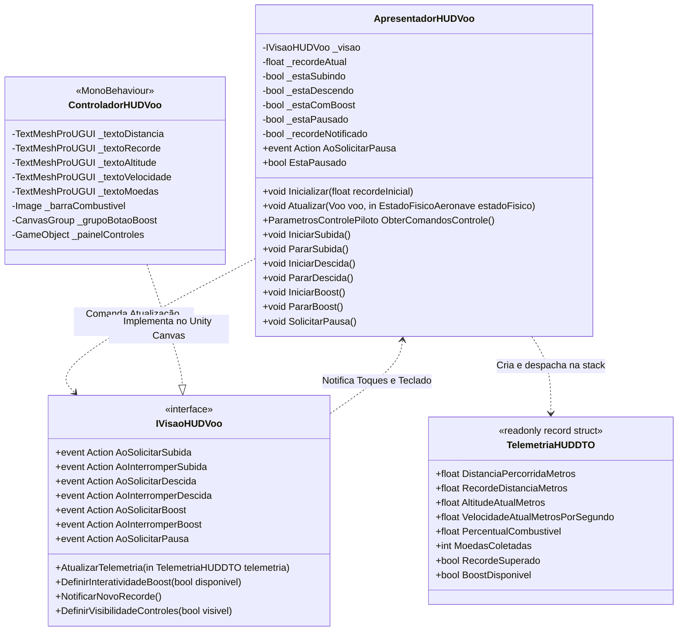
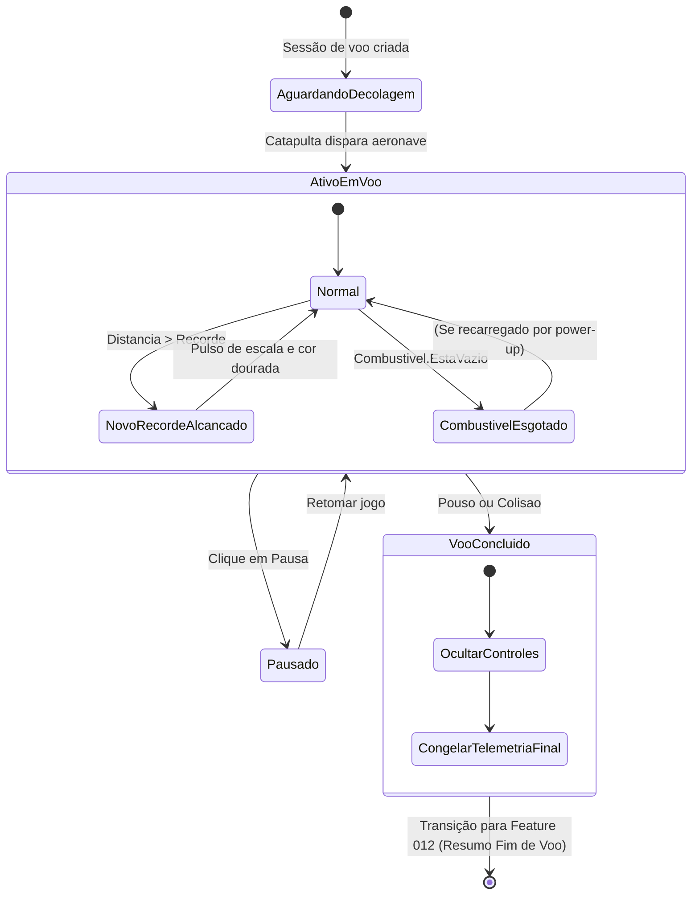

# Modelo de Dados de Apresentação: Interface HUD de Voo e Controles Táteis (Feature 011)

## Visão Geral

Os modelos de dados de apresentação para o HUD de voo foram projetados para garantir **zero alocação no heap (`GC Alloc = 0 bytes`)** no loop contínuo de simulação a 60 FPS, desacoplamento absoluto da Unity Engine e testabilidade direta através de testes unitários xUnit no .NET 8.

---

## Estruturas de Dados

### 1. `TelemetriaHUDDTO` (Dados de Voo na Stack)

Estrutura imutável (`readonly record struct`) passada preferencialmente por referência (`in TelemetriaHUDDTO`) que consolida todas as informações necessárias para atualização dos marcadores visuais do HUD a cada passo de tempo.

| Campo | Tipo | Descrição | Exemplo |
|---|---|---|---|
| `DistanciaPercorridaMetros` | `float` | Distância horizontal percorrida em metros desde a catapulta. | `125.4f` |
| `RecordeDistanciaMetros` | `float` | Melhor marca histórica a ser superada na sessão. | `200.0f` |
| `AltitudeAtualMetros` | `float` | Altitude instantânea da aeronave em relação ao nível do solo. | `45.2f` |
| `VelocidadeAtualMetrosPorSegundo` | `float` | Módulo da velocidade vetorial da aeronave em metros por segundo. | `28.5f` |
| `PercentualCombustivel` | `float` | Fração normalizada de combustível no tanque (0.0f a 1.0f). | `0.75f` (75%) |
| `MoedasColetadas` | `int` | Total de moedas coletadas durante a sessão de voo atual. | `8` |
| `RecordeSuperado` | `bool` | Flag indicando se a distância atual ultrapassou o recorde da partida. | `false` |
| `BoostDisponivel` | `bool` | Indica se há combustível suficiente e aeronave no ar para acionar propulsor. | `true` |

#### Invariantes e Regras de Validação:
- `DistanciaPercorridaMetros >= 0f`
- `RecordeDistanciaMetros >= 0f`
- `AltitudeAtualMetros >= 0f`
- `VelocidadeAtualMetrosPorSegundo >= 0f`
- `PercentualCombustivel` mantido estritamente no intervalo `[0.0f, 1.0f]` via `Math.Clamp`
- `MoedasColetadas >= 0`

---

### 2. `EstadoControlesHUD` (Estado Interno de Entrada do Apresentador)

Mantido privadamente no `ApresentadorHUDVoo` para sintetizar a estrutura de domínio `ParametrosControlePiloto` sem gerar alocações no heap.

| Campo Interno | Tipo | Descrição |
|---|---|---|
| `_estaSubindo` | `bool` | `true` enquanto o botão/tecla de inclinação para cima estiver pressionado. |
| `_estaDescendo` | `bool` | `true` enquanto o botão/tecla de inclinação para baixo estiver pressionado. |
| `_estaComBoost` | `bool` | `true` enquanto o botão/tecla de Boost estiver pressionado. |
| `_estaPausado` | `bool` | `true` se o jogo estiver com a simulação pausada pelo botão de pausa do HUD. |
| `_recordeNotificado` | `bool` | Evita disparar o evento de celebração de novo recorde mais de uma vez por voo. |

---

## Diagrama de Relacionamento e Fluxo Arquitetural

---

## Máquina de Estados de Apresentação do HUD

