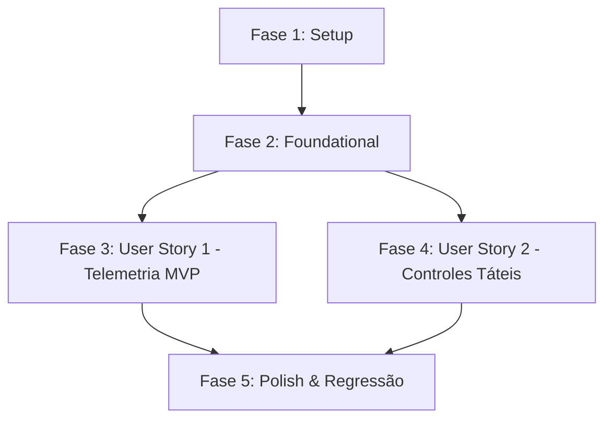

# Tarefas de Implementação: Interface HUD de Voo e Controles de Toque Mobile (Feature 011)

**Branch**: `011-ui-hud-voo` | **Data**: 2026-09-05 | **Spec**: [specs/011-ui-hud-voo/spec.md](file:///h:/tmp/RSA/Loterias/JogosMaster/GitHub/AeroAscent/specs/011-ui-hud-voo/spec.md) | **Plano**: [specs/011-ui-hud-voo/plan.md](file:///h:/tmp/RSA/Loterias/JogosMaster/GitHub/AeroAscent/specs/011-ui-hud-voo/plan.md)

---

## Phase 1: Setup (Estrutura e Contratos de Apresentação)

**Objetivo**: Preparação das pastas de apresentação do HUD na camada de Aplicação e na suíte de testes unitários.

- [X] T001 Estruturar diretórios de contratos, DTOs e apresentadores do HUD em `src/AeroAscent.Core.Aplicacao/Contratos/`, `src/AeroAscent.Core.Aplicacao/DTOs/` e `src/AeroAscent.Core.Aplicacao/Apresentadores/`

---

## Phase 2: Foundational (Modelos de Apresentação e Interfaces da Visão)

**Objetivo**: Criação do DTO imutável de telemetria na stack (`GC Alloc = 0 bytes`), contratos desacoplados da visão/apresentador e fixture de testes.

- [X] T002 [P] Implementar o DTO imutável `TelemetriaHUDDTO` em `src/AeroAscent.Core.Aplicacao/DTOs/TelemetriaHUDDTO.cs`
- [X] T003 [P] Implementar o contrato da visão passiva `IVisaoHUDVoo` em `src/AeroAscent.Core.Aplicacao/Contratos/IVisaoHUDVoo.cs`
- [X] T004 [P] Implementar o contrato do apresentador `IApresentadorHUDVoo` em `src/AeroAscent.Core.Aplicacao/Contratos/IApresentadorHUDVoo.cs`
- [X] T005 [P] Implementar a fixture/mock `VisaoHUDVooFalsa` para testes em `tests/AeroAscent.Core.Aplicacao.Testes/Fixtures/VisaoHUDVooFalsa.cs`
- [X] T006 [P] Criar testes unitários de integridade e imutabilidade para `TelemetriaHUDDTO` em `tests/AeroAscent.Core.Aplicacao.Testes/DTOs/TelemetriaHUDDTOTestes.cs`

**Ponto de Verificação**: Contratos e DTOs prontos, testados e disponíveis para a implementação do apresentador de voo.

---

## Phase 3: User Story 1 - Exibição de Telemetria e Indicadores de Voo em Tempo Real (Priority: P1) 🎯 MVP

**Objetivo**: Implementar o cálculo e projeção de telemetria em tempo real (distância, recorde, altitude, velocímetro, combustível, moedas) com zero alocação no heap (`GC Alloc = 0 bytes`) e detecção de quebra de recorde pessoal com pulso comemorativo.

**Critério de Teste Independente**: Fornecer uma sessão de voo e estado físico para o apresentador e comprovar que a visão recebe os dados exatos na stack via `TelemetriaHUDDTO`; ao ultrapassar a marca histórica, verificar disparo único de `NotificarNovoRecorde()`.

### Testes da User Story 1

- [X] T007 [P] [US1] Criar testes unitários para inicialização do HUD e projeção exata de telemetria (distância, altitude, velocidade, combustível, moedas) em `tests/AeroAscent.Core.Aplicacao.Testes/Apresentadores/ApresentadorHUDVooTestes.cs`
- [X] T008 [P] [US1] Criar testes unitários para verificação de quebra de recorde histórico e disparo único de notificação comemorativa em `tests/AeroAscent.Core.Aplicacao.Testes/Apresentadores/ApresentadorHUDVooTestes.cs`
- [X] T009 [P] [US1] Criar testes unitários comprovando que o ciclo de atualização de telemetria não aloca memória no heap (`GC Alloc = 0 bytes`) em `tests/AeroAscent.Core.Aplicacao.Testes/Apresentadores/ApresentadorHUDVooTestes.cs`

### Implementação da User Story 1

- [X] T010 [US1] Implementar a classe `ApresentadorHUDVoo` com suporte a inicialização, projeção de telemetria, detecção de recorde e atualização da visão passiva em `src/AeroAscent.Core.Aplicacao/Apresentadores/ApresentadorHUDVoo.cs`

**Ponto de Verificação**: Telemetria do voo projetada com precisão, sem alocações de memória e com sinalização de recorde (MVP concluído).

---

## Phase 4: User Story 2 - Controles Táteis Mobile Responsivos e Ergonômicos (Priority: P2)

**Objetivo**: Implementar o despacho de comandos contínuos de pilotagem (subir, descer, boost), síntese de `ParametrosControlePiloto`, desativação automática do propulsor ao esgotar combustível, suporte ao botão de pausa e ocultação imediata de controles ao pousar/colidir.

**Critério de Teste Independente**: Disparar comandos contínuos de subida/descida e boost no apresentador e conferir o `ParametrosControlePiloto` resultante; simular fim de combustível e comprovar cancelamento do boost e esmaecimento do botão; acionar pausa e conferir cancelamento de toques sustentados; simular pouso e conferir ocultação de controles.

### Testes da User Story 2

- [X] T011 [P] [US2] Criar testes unitários para comandos contínuos de inclinação (subir, descer, neutro e anulação de multitoque conflitante) e geração de `ParametrosControlePiloto` em `tests/AeroAscent.Core.Aplicacao.Testes/Apresentadores/ApresentadorHUDVooTestes.cs`
- [X] T012 [P] [US2] Criar testes unitários para sustentação de Boost, cancelamento automático e desativação do botão na visão ao esgotar combustível em `tests/AeroAscent.Core.Aplicacao.Testes/Apresentadores/ApresentadorHUDVooTestes.cs`
- [X] T013 [P] [US2] Criar testes unitários para acionamento de pausa (`SolicitarPausa`), emissão de evento e liberação imediata de comandos sustentados em `tests/AeroAscent.Core.Aplicacao.Testes/Apresentadores/ApresentadorHUDVooTestes.cs`
- [X] T014 [P] [US2] Criar testes unitários para detecção de término de voo (`StatusVoo.Pousado` e `StatusVoo.Colidido`) com comando de ocultação imediata dos controles táteis em `tests/AeroAscent.Core.Aplicacao.Testes/Apresentadores/ApresentadorHUDVooTestes.cs`

### Implementação da User Story 2

- [X] T015 [US2] Implementar na classe `ApresentadorHUDVoo` os métodos `IniciarSubida`, `PararSubida`, `IniciarDescida`, `PararDescida`, `IniciarBoost`, `PararBoost`, `SolicitarPausa`, `ObterComandosControle` e o evento `AoSolicitarPausa` em `src/AeroAscent.Core.Aplicacao/Apresentadores/ApresentadorHUDVoo.cs`

**Ponto de Verificação**: Controles táteis e de teclado totalmente integrados, com tratamento de combustível, pausa e ocultação no pouso.

---

## Phase 5: Polish & Cross-Cutting Concerns

**Objetivo**: Garantir conformidade com os critérios de sucesso mensuráveis (`SC-001`, `SC-002`), validação integral da suíte de testes e documentação XML em pt-BR.

- [X] T016 [P] Criar teste automatizado de benchmark comprovando tempo de processamento de comandos inferior a 16 milissegundos (SC-002) em `tests/AeroAscent.Core.Aplicacao.Testes/Apresentadores/ApresentadorHUDVooTestes.cs`
- [X] T017 Executar suíte completa de testes automatizados com `dotnet test AeroAscent.slnx` garantindo 100% de sucesso e zero regressões em toda a solução
- [X] T018 Revisar documentação XML (`///`) de todas as novas classes, interfaces, métodos e structs públicas em pt-BR conforme GEMINI.md e Constituição

---

## Dependências entre Fases e Histórias de Usuário

---

## Oportunidades de Execução Paralela

- **Fase 2 (Foundational)**: `T002`, `T003`, `T004`, `T005` e `T006` podem ser desenvolvidos em paralelo por operarem em arquivos distintos.
- **Fase 3 (User Story 1)**: Testes `T007`, `T008` e `T009` podem ser concebidos em paralelo antes da implementação em `T010`.
- **Fase 4 (User Story 2)**: Testes `T011`, `T012`, `T013` e `T014` cobrem fluxos complementares e podem ser escritos em paralelo antes de `T015`.
- **Fase 5 (Polish)**: `T016` e `T018` podem ser executados concorrentemente antes da validação geral em `T017`.

---

## Estratégia de Implementação Incremental

1. **Ciclo MVP (Fases 1, 2 e 3)**: Entrega inicial da infraestrutura, DTOs e apresentação da telemetria de voo com zero alocação de memória no heap (`GC Alloc = 0 bytes`).
2. **Ciclo Completo (Fase 4)**: Adição da máquina de estados de controle do piloto, suporte a toques contínuos móveis, teclado no Windows, bloqueio sem combustível e encerramento de partida.
3. **Ciclo de Polimento (Fase 5)**: Validação de benchmarks de latência (< 16ms), integridade total da suíte e revisão XML em pt-BR.
