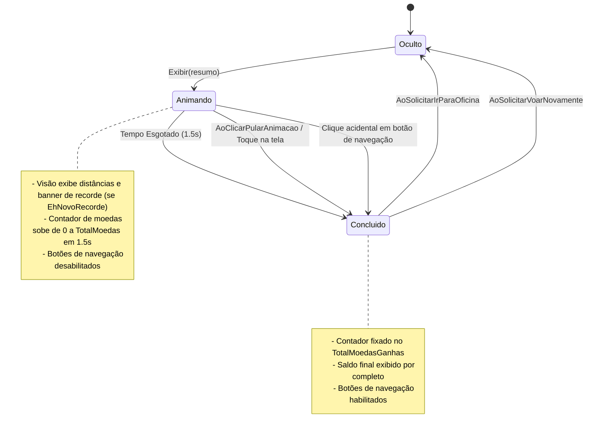

# Modelo de Dados: Interface de Resumo de Voo e Celebração de Recorde (Feature 012)

## Visão Geral

Este documento descreve as estruturas de dados, DTOs imutáveis, mapeamentos e máquina de estados para a tela de finalização de voo da Feature 012. Todas as estruturas de transferência entre o domínio/aplicação e a visão passiva são projetadas para alocação zero no heap (`GC Alloc = 0 bytes`).

---

## 1. DTO de Projeção Visual (`ModeloVisualResumoVoo`)

Estrutura alocada na stack (`readonly record struct`) utilizada pelo `ApresentadorResumoVoo` para transmitir os dados consolidados e formatados para a `IVisaoResumoVoo`.

### Definição

```csharp
namespace AeroAscent.Core.Aplicacao.DTOs;

/// <summary>
/// Estrutura imutável alocada na stack (<c>readonly record struct</c>, <c>GC Alloc = 0 bytes</c>)
/// contendo os dados formatados e flags visuais para renderização na tela de resumo de voo.
/// </summary>
public readonly record struct ModeloVisualResumoVoo
{
    /// <summary>Distância total percorrida em metros.</summary>
    public float DistanciaMetros { get; }

    /// <summary>Distância percorrida formatada em pt-BR (ex: "125,4 m").</summary>
    public string DistanciaFormatada { get; }

    /// <summary>Altitude máxima atingida em metros.</summary>
    public float AltitudeMaximaMetros { get; }

    /// <summary>Altitude máxima formatada em pt-BR (ex: "45,2 m").</summary>
    public string AltitudeFormatada { get; }

    /// <summary>Moedas obtidas pela distância horizontal.</summary>
    public long MoedasDistancia { get; }

    /// <summary>Moedas obtidas pela altitude máxima vertical.</summary>
    public long MoedasAltitude { get; }

    /// <summary>Quantidade de moedas coletadas fisicamente durante o voo.</summary>
    public int MoedasColetadas { get; }

    /// <summary>Total de moedas ganhas na sessão.</summary>
    public long TotalMoedasGanhas { get; }

    /// <summary>Total de moedas ganhas formatado (ex: "+34 moedas").</summary>
    public string TotalMoedasFormatado { get; }

    /// <summary>Saldo total acumulado na carteira do jogador após a finalização.</summary>
    public long SaldoFinal { get; }

    /// <summary>Saldo final formatado com símbolo (ex: "💰 1.250").</summary>
    public string SaldoFinalFormatado { get; }

    /// <summary>Indica se houve quebra do recorde pessoal de distância.</summary>
    public bool EhNovoRecordeDistancia { get; }

    /// <summary>Indica se houve quebra do recorde pessoal de altitude.</summary>
    public bool EhNovoRecordeAltitude { get; }

    /// <summary>Indica se qualquer novo recorde pessoal foi superado nesta sessão.</summary>
    public bool EhNovoRecorde => EhNovoRecordeDistancia || EhNovoRecordeAltitude;

    /// <summary>Duração nominal padrão da contagem animada de moedas em segundos.</summary>
    public const float DURACAO_ANIMACAO_PADRAO_SEGUNDOS = 1.5f;
}
```

### Regras de Validação e Formatação

1. **Cultura pt-BR**: Formatação numérica obrigatória usando a cultura brasileira (`new CultureInfo("pt-BR")`):
   - Decimais: separador por vírgula (ex: `125,4 m`, `45,2 m`).
   - Milhares: separador por ponto (ex: `1.250`, `10.500`).
2. **Moedas e Saldo**:
   - `TotalMoedasFormatado`: prefixo `+` seguido do valor e sufixo `" moedas"` (ex: `"+34 moedas"`).
   - `SaldoFinalFormatado`: ícone ou símbolo de moeda seguido do valor formatado (ex: `"💰 1.250"`).
3. **Consistência de Valores**:
   - `TotalMoedasGanhas` deve ser rigorosamente igual a `MoedasDistancia + MoedasAltitude + MoedasColetadas`.
   - Nenhum valor monetário ou de distância pode ser negativo.

---

## 2. Estrutura de Entrada do Domínio (`ResumoFinalizacaoVoo`)

Já existente no núcleo do domínio (`AeroAscent.Core.Dominio.ObjetosDeValor.ResumoFinalizacaoVoo`), produzida por `IFinalizarVooCasoDeUso`:

| Campo | Tipo | Descrição |
|---|---|---|
| `DistanciaMetros` | `float` | Distância horizontal atingida em metros. |
| `AltitudeMaximaMetros` | `float` | Altitude máxima vertical atingida em metros. |
| `MoedasPorDistancia` | `long` | Moedas calculadas por distância (`floor(dist * 0.1)`). |
| `MoedasPorAltitude` | `long` | Moedas calculadas por altitude (`floor(alt * 0.05)`). |
| `MoedasColetadas` | `int` | Quantidade de moedas físicas coletadas em voo. |
| `MoedasTotalGanhas` | `Moeda` | Value object com a soma total das recompensas. |
| `SaldoTotalAtualizado` | `Moeda` | Value object com o saldo já gravado em disco. |
| `EhNovoRecordeDistancia` | `bool` | Flag indicando se a distância superou o recorde anterior. |
| `EhNovoRecordeAltitude` | `bool` | Flag indicando se a altitude superou o recorde anterior. |

---

## 3. Máquina de Estados do Apresentador de Resumo



### Transições de Estado

1. **`Oculto` $\to$ `Animando`**:
   - Disparada pela chamada a `ApresentadorResumoVoo.Exibir(resumo)`.
   - Gera o `ModeloVisualResumoVoo` e passa para `_visao.ExibirResumo(in modelo)`.
   - `_visao.HabilitarBotoesNavegacao(false)`.
   - Estado interno: `AnimacaoEmAndamento = true`.
2. **`Animando` $\to$ `Concluido`**:
   - Disparada por:
     - Notificação de término natural da animação pela visão (`AoConcluirAnimacaoMoedas`).
     - Toque de pulo do jogador (`AoClicarPularAnimacao`).
     - Clique em qualquer botão de navegação durante a animação (força conclusão imediata).
   - Ação executada: `_visao.ConcluirAnimacaoMoedas()` e `_visao.HabilitarBotoesNavegacao(true)`.
   - Estado interno: `AnimacaoEmAndamento = false`.
3. **`Concluido` $\to$ `Oculto`**:
   - Disparada ao clicar em "Oficina" ou "Voar Novamente":
     - `AoSolicitarIrParaOficina?.Invoke()` ou `AoSolicitarVoarNovamente?.Invoke()`.
     - `_visao.Ocultar()`.
